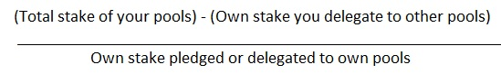

# The general perspective on staking in Cardano
### **Advice for Stakeholders - Delegators and Stake Pool Operators.**
 13 November 2020[ Prof Aggelos Kiayias](tmp//en/blog/authors/aggelos-kiayias/page-1/) 13 mins read

### [**Prof Aggelos Kiayias**](tmp//en/blog/authors/aggelos-kiayias/page-1/)
Chief Scientist

Academic Research

- 
- 

Your browser does not support the audio element.

As a project, decentralization remains arguably our most important and fundamental goal for Cardano. Protocols and parameters provide the foundations for any blockchain. Last week, we outlined some of the planned [changes around Cardano parameters](https://iohk.io/en/blog/posts/2020/11/05/parameters-and-decentralization-the-way-ahead/) and how these will impact the staking ecosystem and thus accelerate our decentralization mission.

Yet the community itself – how it sees itself, how it behaves, and how it sets common standards – is a key factor in the pace of this success. Cardano has been very carefully engineered to provide “by design” all the necessary properties for a blockchain system to operate successfully. However, Cardano is also a *social* construct, and as such, observance, interpretation, and social norms play a crucial role in shaping its resilience and longevity.

So in anticipation of the *k*-parameter adjustment on December 6th, I would like to give a broader perspective on staking, highlighting some of the innovative features of the [rewards sharing scheme](https://arxiv.org/abs/1807.11218) used in Cardano. 
### **Principles & practical intent**
As well as outlining some of the key principles, this piece has a clear practical intent; to provide guidance and some recommendations to stakeholders so that they engage meaningfully with the mechanism, and support the project’s longer-term strategic goals through their actions.

Consensus based on a *resource* that is dispersed somehow across a population of users – as opposed to identity-based participation – has been the hallmark of the blockchain space since the launch of the Bitcoin blockchain. In this domain, proof-of-stake systems are distinguished in the sense that they use a virtual resource, *stake*, which is recorded in the blockchain itself. 

Pooling resources for participation is something that is inevitable; some level of pooling is typically beneficial in the economic sense and hence resource holders will find a way to make it happen. Given this inevitability, the question arises: how does a system prevent a dictatorship or an oligarchy from emerging?
### **The objectives of the reward sharing scheme**
Contrary to other blockchain systems, Cardano uses a reward sharing scheme that (1) facilitates staking with *minimum friction as well* as (2) it incentivizes pooling resources in a way that *system-wide decentralization* emerges naturally from the rational engagement of the resource holders.

The mechanism has the following two broad objectives:

1. **Engage *all* stakeholders** - This is important since the more stakeholders are engaged in the system, the more *secure* the distributed ledger will be. This also means that the system should have no barriers for participation, nor should impose friction by requiring off-chain coordination between stakeholders to engage with the mechanism. 
1. **Keep the leverage of individual stakeholders low** -. Pooling resources leads to increased leverage for some stakeholders. Pool operators exert an influence in the system proportional to the resources controlled by their pool, *not to their own* resources. Without pooling, all resource holders have leverage of exactly 1; contrast this e.g., to a pool operator, owning, say 100K ada, who controls a pool of total delegated stake of 200M ada; that operator has leverage of 2,000. The higher the leverage of the system, the worse its security (to see this, consider that with leverage above 50, launching a 51% attack requires a mere 1% of the total resources!).

It should also be stressed that a disproportionately large pool size is not the only reason for increased leverage; stakeholders creating multiple pools, either openly or covertly (what is known as a Sybil attack) can also lead to increased leverage. The lower the leverage of a blockchain system, the higher its degree of decentralization.
### **Putting this into practice**
So how does the reward sharing scheme used in Cardano meet the above objectives? Staking via our scheme facilitates two different paths: *pledging* and *delegating*. Pledging applies to stake pool operators; pledged stake is committed to a stake pool and is supposed to stay put for as long as the pool is operating. Think of pledge as a ‘commitment’ to the network – ‘locking up’ a certain amount of stake in order to help safeguard and secure the protocol. Delegating on the other hand, is for those who do not wish to be involved as operators. Instead, they are invited to assess the offerings the stake pool operators provide, and delegate their stake to one or more pools that, in their opinion, best serve their interests and the interest of the community at large. Given that delegation does not require locking up funds, there is no reason to abstain from staking in Cardano; all stakeholders can and are encouraged to engage in staking.

Central to the mechanism’s behavior are two parameters: *k* and a0. The k-parameter caps the rewards of pools to 1/*k* of the total available. The a0 parameter creates a benefit for pledging more stake into a single pool; adding X amount of pledge to a pool increases its rewards additively by up to a0\*X. This is not to the detriment of other pools; any rewards left unclaimed due to insufficient pledging will be returned to the Cardano’s reserves and allocated in the future. 

Beyond deciding on an amount to pledge, creating a stake pool requires that operators declare their profit margin and operational costs. When the pool rewards are allocated at the end of each epoch, the operational costs are withheld first, ensuring that stake pools remain viable. Subsequently, operator profit is calculated, and all pool delegators are rewarded in ada proportional to their stake afterwards. 

Paired with the assessment of stake pools performed by the delegates, this mechanism provides the right set of constraints for the system to converge to a configuration of *k* equal size pools with the maximum amount of pledge possible. The equilibrium point has the property that delegator rewards are equalized (so it doesn’t matter what pool they delegate to!), while stake pool operators are rewarded appropriately for their performance, their cost efficiency, and their general contributions to the ecosystem.

For the above to happen, it is necessary to engage with the mechanism in a meaningful and rational manner. To assist stakeholders in understanding the mechanism, here are some points of advice. 
### **Guidance for delegators**
1. **Know your pool(s)** - Investigate the pools’ available data and information. What is the operators’ web-presence? What kind of information do they provide about their operation? Are they descriptive about their costs? Are the costs reasonably based on geographic location and other aspects of their operation? Do they update their costs regularly to account for the fluctuation of ada? Do they include the costs for their personal time? Remember that maintaining a high-performance pool requires commitment and effort, so those committed operators deserve compensation. 
2. **Think bigger** - Consider your choice holistically, not based on just a single dimension. Consider the longer term value your choices bring to the network. Think of your delegation as a ‘vote of confidence’, or a way to show your support to a pool's mission or goals. Opt for professionalism and demonstrated long-term commitment to the system’s goals. Recognize community members who have been helping to lay down the foundations for the ecosystem, either with their community presence or by helping to build things. The long-term wellbeing of the ecosystem is crucially affected by your delegation choice. A more decentralized network is a more resilient and long-lived network. 
2. **Be wary of ‘pool splitters’** - Pool operators that run multiple pools *with small pledge* ***hurt delegators and smaller operators***. They hurt their delegators because they could have provided a higher amount of rewards by concentrating their pledge into a single pool; by not doing that, there are rewards that remain unclaimed. They hurt smaller and new operators, because they are forcing them to remain without delegates and hence making their operation unviable – without delegates a pool may be forced to close. So avoid pool operators that run multiple pools with pledge below saturation level. Note there are legitimate reasons for large stakeholders to accept delegators and run a public pool (e.g., they are delegating some of their stake to other pools to support the community); consult any public statements such operators make about their delegation strategy and their leverage. It is ok to delegate to them, assuming they keep their leverage low and they support the community. 
2. **Be wary of highly leveraged operators** - Be mindful of the stake pool operators’ *leverage* (see below for more details on how to calculate leverage). A higher pledge is correlated to less leverage when comparing pools of the same size; a high leverage is indicative of a stake pool operator with very little “skin in the game.” Stake pool operators may prove to have skin in the game in other ways than pledging stake of course; e.g., they can be very professional and contribute to the community in different ways. You should be the judge of this: high leverage in itself is not a reason to avoid delegating to a particular pool, but it is a *strong* indication that you should proceed with caution and carefully evaluate the people behind the operation. 
2. **Shop around** - Do take into account the information provided from your wallet software (or from recognized community resources such as [adapools](https://adapools.org/) or [pooltool](https://pooltool.io/)) in terms of the pool’s ranking and its performance factor. Remember though, while the ranking is important, it should not be the sole factor behind your delegation choice. Think holistically – you may want to consider pools fulfilling a mission you agree with, or trying to add value to the wider community through podcasts or social activity, even if they do not offer the highest possible returns.
2. **Be involved** - A pool with no performance data on display may have attractive characteristics; it could be providing better rewards in the best case scenario, but also high risk as a delegation choice since its performance may turn out to be suboptimal. Delegate according to your ‘risk profile’, and the frequency you are willing to re-delegate your stake. Do check the pool’s performance and updates regularly to ensure that your choice and assessment remains the best possible. 
### **Guidance for pool operators**
1. **Be transparent** - Choose your pool’s operational cost as accurately as possible. Do include the personal effort (priced at a reasonable rate) that you and your partners put into the pool operation! You are a pillar of Cardano and so you have every right to be compensated by the community. Be upfront about your costs and include them in your pool’s website. Educate your prospective delegates about where the pool costs are going. Always remember that it is important to charge for the time you invest in maintaining your pool. In the short term, you may be prepared to invest your time and energy ‘for free’ (or after hosting costs, at an effective loss) but remember that this is not a sustainable model for the network over the medium and longer term. 
1. **Don’t split your pool** - With the coming changes in *k* (commencing with the move to k=500 on 6th December), we are already seeing pool operators splitting their pools in order to retain delegators without becoming saturated. Do not engage in pool splitting unless you can saturate a pool completely with your stake. If you are a whale (relative stake > 1/*k*) you can create multiple pools – but you should keep your leverage as close to 1 as possible or less. Pool splitting that increases your leverage hurts the delegators’ rewards, and more importantly, it hurts the decentralization of the Cardano ecosystem, which is detrimental to everyone. If you run and control multiple pools under different tickers, make a public statement about it. Explain the steps you take to control your leverage. Creating multiple pools while trying to conceal the fact that you control them is akin to a Sybil attack against Cardano. This behavior should be condemned by the community. You can calculate and publicize your leverage using the following formula:

Exchanges are a special kind of whale stakeholder, since they collectively manage other people’s stake. One strategy for an exchange is to avoid leverage altogether and delegate the stake they control to community pools. If an exchange becomes a pool operator, they can maintain their leverage below 1 by using a mixed pledging and delegation strategy. 

3. **Set your profit margin wisely** - Select the margin to make your pool competitive. Remember that if everyone delegates their stake and is rational, you only have to beat the (*k*+1)-th pool in the rankings offered by the Daedalus wallet. If your pool offers other advantages that can attract delegation (e.g., you are contributing to a charitable cause you feel others may wish to support), or you have acquired exceptional equipment that promises notable uptime/performance, make sure you promote this widely. When you offer such benefits, you should consider setting a higher profit margin. 
4. **Keep your pool data updated** - Regularly update the cost and margin to accommodate fluctuations in ada price. Give assurances to your delegators and update them about the stake pool operational details. In case of mishaps and downtimes, be upfront and inform your delegators via your website and/or other communication channels you maintain with them. 
4. **Pledge as much as you are able to** - Increase the amount of pledge as much as you comfortably can and not more. Beyond using your own stake, you can also partner with other stakeholders to increase the pledge of your pool. A high pledge signals long-term commitment and reduced leverage, and it unlocks additional rewards every epoch as dictated by the a0 term in the rewards sharing scheme calculation. As a result, it does make your pool more desirable to prospective delegators. On the other hand, remember that pledge is not the only factor that makes a pool attractive. Spend time on your web and social media presence and be sure to advertise all the ways that you contribute to the Cardano ecosystem. 

If you are a Cardano stakeholder, we hope that you find the above advice informative and helpful in your efforts to engage in staking. As in many other respects, Cardano brings a novel and heavily researched mechanism to its blockchain design. The rewards scheme is mathematically proven to offer an equilibrium that meets the set of objectives set out in the beginning of this document. Ultimately though, the math is not enough; it is *only the people* that can make it happen. 

Cardano’s future is in the hands of the community. 

*The opinions expressed in the blogpost are for educational purposes only and are not intended to provide any form of financial advice.*
