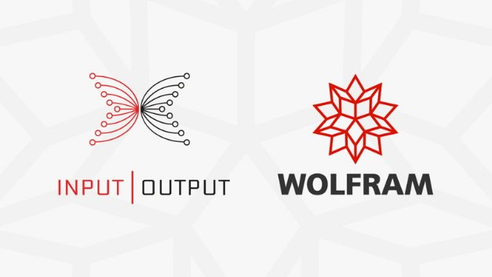

# IOHK partners with Wolfram to power Cardano
### **Cardano joins Bitcoin and Ethereum in integrating into Wolfram’s industry leading technology and knowledge base, Wolfram Alpha. But this is only the beginning of an exciting new partnership.**
 17 December 2020[ Eric Czuleger](tmp//en/blog/authors/eric-czuleger/page-1/) 2 mins read

### [**Eric Czuleger**](tmp//en/blog/authors/eric-czuleger/page-1/)
Senior Content Editor

Marketing & Communications

- 
- 
- 

IOHK is dedicated to making Cardano an industry leading blockchain project. This has led us to collaborating with global leaders in technology, business and finance. Now, we’re pleased to announce a new partnership with Wolfram. As a part of this relationship, Cardano data will be integrated into the Wolfram Alpha computational intelligence engine. This places Cardano alongside Ethereum and the Bitcoin as blockchain data to be included within Wolfram Alpha.

Wolfram and IOHK have historically enjoyed close ties, with Stephen Wolfram presenting at [#Cardano2020](https://www.youtube.com/watch?v=h94VrSuPFJc&t=17s) as well as at the IOHK Miami 2019 summit. The company has consistently proven itself to be a leader in pushing open source intelligence across a variety of fields including computation, mathematics, and now, blockchain technology. The inclusion of Cardano data into Wolfram Alpha is a landmark moment for IOHK, but it is just the beginning of our collaboration.

We are currently defining a scope of work which would leverage Wolfram Alpha to provide Oracle services for Cardano. Oracles are a crucial component of powering smart contracts. They allow data to be transported from a variety of sources into the blockchain. This information can be anything from election results and sports scores to currency exchange rates and statistical data. This greatly expands Cardano’s ability to offer new ways for developers to integrate advanced external information into their smart contacts.

As a part of this ongoing roll out IOHK will also work closely with Wolfram Blockchain Labs. Wolfram Blockchain Labs provides blockchain ecosystems with necessary tools to assist in DLT-based commerce and business innovation. The educational teams at IOHK and Wolfram will collaborate to provide Cardano-specific course material. This will help draw developers and users into the Cardano ecosystem by promoting understanding of the platform. 

Integrating with Wolfram Alpha also boasts industry leading natural language processing capabilities. This makes Cardano’s information available to virtual assistants like Alexa and Siri. Once integrated, users will be able to query the system to find information or solve computational problems as easily as asking their virtual assistant. We anticipate the initial phases of integration with Wolfram will occur Q2/Q3 of next year.

IOHK and Wolfram are currently building out a collaborative framework, so we’ll have lots more to share over the months ahead. Meanwhile, if you would like to hear more about the partnership between Wolfram and Cardano, check out our interview with Wolfram Blockchain Labs’ (WBL) Jon Woodard on December’s monthly [Cardano product update](https://www.youtube.com/watch?v=32A3878DLnk&feature=youtu.be).
