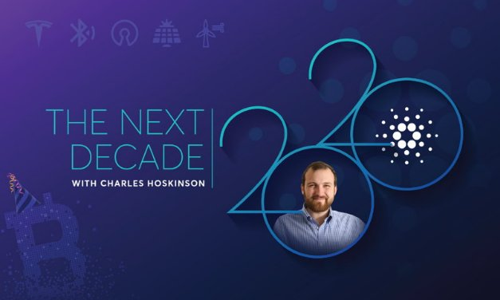

# Reflections on a decade of blockchain, and predictions for the next
### **We've had bitcoin for over a decade. Now, we're heading into the decade of Cardano**
 9 January 2020[ Charles Hoskinson](tmp//en/blog/authors/charles-hoskinson/page-1/) 9 mins read

### [**Charles Hoskinson**](tmp//en/blog/authors/charles-hoskinson/page-1/)
Chief Executive Officer

Founder

- 
- 
- 

It's January 2020 and that means not only a new decade, but the 11th birthday of bitcoin. The world's first virtual asset was made available to the general public on January 3rd of 2009. It's been one hell of a decade since then, and I'm excited about the next 10 years: a decade that will bring a lot of interesting things to the world.
## **The rapid growth of blockchain technology**
Bitcoin will always be very special to me. It was my introduction to all sorts of wonderful problems to think about in the world, like remittances and microfinance. It is incredible to think that the small, ragtag group who brought bitcoin to the public changed not only my life but the lives of individuals around the world, sparking a global movement. Now, millions of people wake up every day thinking about cryptocurrencies and blockchain technology. Hundreds, if not thousands of academic papers have been written on the topic. The influence has been profound and it is only just beginning.

The G20 and the G7 have begun talking about it. We are now seeing global regulations begin to change. Every central bank in the world is aware of virtual assets and some are even taking positions on them. This is astounding because there has never been a time in human history where one piece of technology has attained such enormous global relevance without a centrally coordinated effort through marketing, development, and control. No one controls bitcoin. That was true 11 years ago, it is true now, and the revolution is just getting started.
## **What we can expect over the next decade**
So, happy birthday to bitcoin. And welcome to the new decade. I am looking forward to the next 10 years to see where the technology takes us. 2010 to 2019 was crazy and I believe that 2020 to 2029 will be very interesting. In the next decade, we will see the first brain/computer interfaces for consumer devices to be implanted into people; for example, [neural lace](https://www.techworld.com/data/what-is-neural-lace-3657074/). We will also see the rise of private space travel. Within the next ten years, virtual reality and augmented reality will enter the mainstream rather than just being fun things.

Telecommunications, energy, and transportation will also go through a cycle of major innovation. Cell phone technology will likely go through several more doublings. Given that Tesla has proven its model, we will now see the proliferation of electric vehicles. This means that battery technology will only get better. It's likely that battery density will double or quadruple in the next ten years. This means that we will see cars that can go between 600 and 1,200 miles on a single charge. Meanwhile, the capacity for solar and wind energy will double, if not quadruple.

The study of physics is advancing rapidly and we believe that the next decade will see mainstream quantum computers. I read recently that quantum teleportation happened [between two chips](https://phys.org/news/2019-12-chip-to-chip-quantum-teleportation-harnessing-silicon.html). Meanwhile, 5G will spread around the world, and technologies such as WiFi and Bluetooth can only get better. This will pave the road for self-driving cars and intelligent infrastructure. The consequences of this technology will touch governments, services, and democracy itself.
## **A decade of change – and opportunity**
During this decade, we will probably see another economic collapse similar to 2008 and with it, an opening for cryptocurrencies to take over the global economy. We also anticipate that one or more African nations will achieve the same economic prominence as countries like Brazil and South Korea. It could be Kenya, Ethiopia, or Nigeria. This means that we will likely see innovations in the movement of people and the development of new passport and identity systems. This might be the decade that we see self-sovereign identity gain prominence. We believe that, soon, data will be treated as the commodity that it is. New rules and regulations around the use of data will begin to materialize. It is our hope that this will curtail the data surveillance and capitalism economy that has developed over the last twenty years. This might happen through global regulation. Regardless of what happens between 2020 and 2030, it has been the privilege of a lifetime to be alive right now to see how the world changes. Whether in the biotechnology spectrum, the nanotechnology spectrum, the ICT world, or otherwise, it is a privilege to see these technologies work their way into the mainstream.

In my view, this is the last decade of traditional organized media. In the future, we will see less CNN, Fox News, Bloomberg, and The Wall Street Journal. Instead, we will see more Joe Rogans. This will be especially true as we enter 2025 and beyond. The crypto space, in particular, will fundamentally change the incentives governing journalism. We'll move to a different way of paying for and curating content. The age of popular long-form journalism has begun. It is very exciting to see that occur.

It is also exciting to see the continued adoption of open ideas, open technology, and idea flow. All the world's top companies have a dense portfolio of open source technology. This was not the case in 2000. It was only a little bit more the case in 2010. Now that we are entering 2020 and heading to 2030, it is exciting to see how quickly people are collaborating and how products are being built from common DNA across industries. It's good for you, it's good for the consumer, and it's good for all of us.
## **Cardano's role**
So, where does Cardano fit in all of this? This is hopefully our decade. Bitcoin owned the last one and I hope, by the end of the 2020s, Cardano will be the predominant force in the cryptocurrency space. I believe that it will become a true social operating system. My hope is that we could see thousands of meta tokens living on our platform, from securities to commodities to stablecoins, and all other kinds of representations of value, and that we'll see billions of transactions every single day from over a billion users. It really all comes down to whether or not the technology can properly meet the right incentive set and have the right commercial utilization. These are the things that we have to put together and we are obsessed with getting the technology right. We think we have the right paradigm. The peer-review process has given us unparalleled clarity and understanding of trade-offs, along with where we can go.

It has also allowed us to talk with everyone in the world about what we can do using a common language. We've mastered virtual network infrastructure, consensus protocols, and the underlying cryptographic primitives. We have a very good understanding of what needs to be done in order to build a global skill system. We also know how to do that in a responsible, peer-reviewed, sustainable way. So, from a technological perspective, we feel our approach is right.
## **Marketing and commercialization**
This year, in particular, we're going to start hitting commercialization hard. I've announced to the company that we are on a 'Cardano first' strategy. This means that if we are building a product we will always ask ourselves if we can deploy it on Cardano. So, if someone comes up to us and says, "Hey we'd like you to do some interesting blockchain solution," whether it be supply chain, authentication, credential verification, we will look at Cardano first. That might be in Ethiopia, Georgia, Mongolia, or closer to home like our partnership with New Balance.

I think it's very important to use our own product in order to build these things properly. Hopefully, the Ethiopia project will be able to launch its currency on Cardano. This is the same for the credential verification project for Georgia. Our strategy is to always begin with Cardano first, this year and into the future.

We're also going to get very aggressive about the commercialization of the technology, especially as Shelley and Goguen are deployed. We feel that this platform has a right to exist and brings a lot to the table. It allows people to solve problems in ways they couldn't previously. We believe that this is the platform that will bring future solutions into existence. We will push that mentality to our partners at Emurgo and the Cardano Foundation.

We're excited to explore incentives. At the moment, we're looking at tokenomics, incentive schemes, and governance systems as first-class citizens in the growth of the product. The reason why bitcoin was so successful was the simplicity of its incentive model. Satoshi created the model for people to mine it. Similarly, if we're to be successful, we need incentives that are directly aligned with the growth of the system. So, with the launch of the Incentivized Testnet, we're learning a lot about the business of stake pools and the business of maintaining a stable cryptocurrency.

We already have 500 stake pools registered and we're learning critical information. This includes everything from what saturation metrics should look like to who is a good operator, who is a bad operator, and how the market and user experience look. This is a topic that we are incredibly interested in exploring this quarter. Our partners at Emurgo and the Cardano Foundation are also investing a lot of time to make sure that we fully understand how incentives work in the Cardano ecosystem.

As we exit 2020 and throughout the next decade, incentives will be a source of continuous research. The better we get, the faster the feedback loop becomes, the faster we can grow to achieve a billion users and become a truly global social operating system that is beneficial to everyone. With all that being said, commercialization, technology, and incentives are the three things that will need to be aligned for us to achieve that coveted number one spot.

We are building Cardano for a reason. It is not an academic project: it is a commercial project and we want to see it grow. This is an exciting time but we must remember where we came from. We came from bitcoin and bitcoin will always be around for us. It will always be a valuable project, and will always have a soft spot in my heart.

So, on behalf of the Cardano community, Happy Birthday bitcoin! Thank you so much for all you've done. Thank you also to the bitcoin community. We wish you great success, stability, and innovation.

*This is an edited transcript of [Charles' January 3rd 2019 AMA](https://www.youtube.com/watch?v=CBGYIHb600w).*
