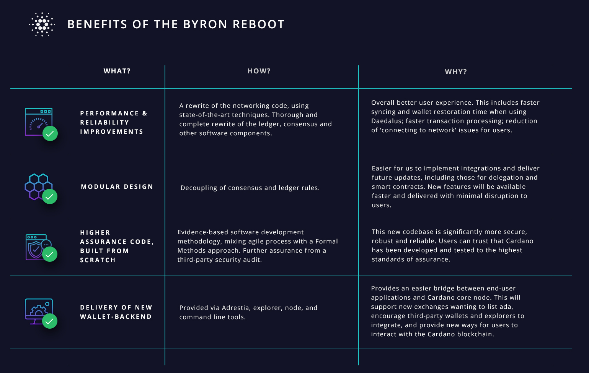

# What the Byron reboot means for Cardano
### **New code delivers big benefits for the network and Daedalus users as we prepare for Shelley**
 30 March 2020[ Tim Harrison](tmp//en/blog/authors/tim-harrison/page-1/) 5 mins read

### [**Tim Harrison**](tmp//en/blog/authors/tim-harrison/page-1/)
VP of Community & Ecosystem

Communications

- 
- 
- 
- 

The Byron reboot is a series of updates to multiple components of the Cardano network. Namely the Cardano node, but also the Cardano explorer, the wallet backend, and the Daedalus wallet itself. The first part of the Byron reboot – a totally new node implementation – has already been deployed to some relay nodes on the network, and the next few weeks will see core network nodes and more relays being incrementally upgraded to the new system. Soon, users will be able to experience the node improvements directly via a new version of the Daedalus wallet.
## **Why do we need a reboot?**
To prepare for the future, and for Shelley. The node that launched at the start of the Byron era was only ever going to take us so far. The new node implementation has been designed from the ground up to support not only imminent Shelley features, such as delegation and decentralization, but anything else that the future has in store. The improved design is modular, separating the ledger, consensus, and network components of the node, allowing any one of them to be changed, tweaked, and upgraded without affecting the others. 

The reboot has also been an opportunity to apply evidence-based formal methods and testing to every single aspect of the node. Rather than try and make these substantial improvements to the existing code, it was more effective to work from scratch. All critical elements of the new node have been formally specified, and the final implementation tested against those specifications. Basic code quality and performance are now significantly higher and more robust across the board, as well as being easier to test and verify going forward.
## **What’s involved?**
Improvements to the Cardano node, of course, but work has also been underway to improve the Cardano explorer, the wallet backend, and Daedalus itself. The new explorer has been redesigned to make it easier to use, as well as having an updated visual design and more information available. The improved wallet backend and associated services, collectively known as Adrestia, will allow exchanges and third-party developers to engage with the Cardano network using a collection of independent, self-contained libraries. The newly extended APIs have been explicitly designed to meet the needs of larger exchanges, enabling ada to be supported on even more platforms. And finally, a new and improved Daedalus release will see Yoroi wallet support, transaction filtering, parallel wallet restoration – not to mention some significant performance improvements.

## **How will it impact the Cardano network?**
At the most fundamental level, the Byron reboot will improve the performance of the entire Cardano network. Transaction throughput capacity will increase, and the network will be able to handle much higher demand and transactions per second. The node improvements also make the node more efficient and reliable in terms of memory usage, increasing the viability of running a Cardano node on a low-spec machine or in poor network conditions, which, in turn, enables more users to participate in the Cardano network across the world. 
## **What does it mean for Daedalus users?**
First, there’ll be a new rolling release of Daedalus that is designed to allow users to test the new node functionality and wallet backend, and to provide us with feedback. We’ll be sharing more about how that will work in our [monthly product update](https://www.crowdcast.io/e/ai0641sn/register) on Tuesday, March 31. Once the wallet has been user tested, feedback will be implemented in a new production version of Daedalus. Many of the issues users have experienced with Daedalus in the past were due to the underlying node, rather than Daedalus itself. The new node will go a long way to improving performance, and users should see Daedalus syncing and restoring wallets at significantly improved speeds.
## **What’s next?**
The reboot commences with the deployment of a CLI and associated APIs to exchanges and wallet partners. The new node update will then be rolled out to more core and relay nodes on the Cardano mainnet within the next few weeks, followed by other reboot and continuing Daedalus improvements in the months ahead. The goal is to gradually and sustainably migrate the entire Cardano blockchain to working on the new node implementation, without any disruption or loss of service. After that comes the Haskell Shelley testnet, which will include onboarding stake pool operators from the Incentivized Testnet to help them set up and prepare for running their pools on the Shelley mainnet.

The Byron reboot is the culmination of over 18 months of work by several IOHK development teams and represents a significant investment in the network-critical infrastructure required to support the Shelley era of Cardano. For more details on the reboot and how it will all roll out, tune in to March’s product update on the [IOHK Crowdcast stream](https://www.crowdcast.io/e/ai0641sn/register) on March 31. Cardano product director Aparna Jue and members of her team will join me to discuss the latest on the reboot and the next steps for the project.
