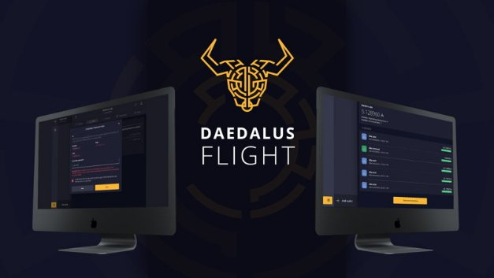

# We need you for a Daedalus testing program!
### **A call for the Cardano community to help shape IOHK’s ada wallet for the Shelley era**
 1 April 2020[ Anthony Quinn](tmp//en/blog/authors/anthony-quinn/page-1/) 7 mins read

### [**Anthony Quinn**](tmp//en/blog/authors/anthony-quinn/page-1/)
Editor

Marketing & Communications

- 
- 
- 
- 

The Daedalus team is opening up IOHK’s wallet testing program to ada owners. The aim is to seek the help of a broad range of people who can test – on a rolling basis – the latest interface features being readied for the next release version of Daedalus. This will be a fully-functioning version of the wallet, called Daedalus Flight, so you will be able to spend and receive ada as usual – and give the team valuable feedback to improve the experience with each release.

We put some questions to Daedalus Product Manager, Darko Mijić, to tease out the details for people who want to take part.

**Darko, can you expand on the thinking behind the program?**

I’ve been working at IOHK for almost four years. It’s been amazing to see the way the Incentivized Testnet has galvanized the Cardano community in the past few months. The community helped us develop the stake pools for Shelley, and, of course, to test and develop a version of the Daedalus wallet for the ITN. So, building on that strategy, we came up with the idea of Daedalus Flight. This is a pre-release version of the Daedalus wallet that users can test with real ada transactions on the mainnet. People can join the program by downloading and using the Flight wallet alongside their usual Daedalus – or Yoroi – wallet to find and report issues so we can fix them before the actual release. We’ve seen that people want to help – and they will gain early access to the new features of the next production Daedalus release for the mainnet.

It’s similar to beta testing, or the ‘canary’ approach Google uses for its Chrome browser. Adding this tactic to our release process creates another valuable source of testing data. We will be able to improve the quality assurance of our new software versions and move more quickly into full production by first trialing these changes in Daedalus Flight with a subset of participating users.

**But is it for everyone?**

This program is especially important because it will give us a bigger sample of users who are using Daedalus in various ways on a wide variety of software and hardware configurations. We want to bring confident ada owners on board to help us develop the wallet by testing features and suggesting their own ideas. People who volunteer for this must already be familiar with using the Daedalus wallet. People need to be skilled in using computers – copying and backing up files, moving things around between folders – and prepared to deal with any issues that arise. We’re not expecting IT experts, but you do need to be confident about computers and making ada transactions.

**How will the process work?**

We complete a Daedalus development sprint every two weeks and quality assurance is a continuous effort during the development of every feature. At the end of each sprint, we will now create a new Daedalus Flight release, and, starting with the first flight candidate, we do our tests internally. But testing in a lab for a mass-market desktop product is not a real test. Under the new flight process, we will release a series of flight candidates and work on testing, finding issues and fixing issues with members of the Cardano community who have joined the program to help us. Flight candidate releases will be delivered through the Daedalus newsfeed, after an initial download from a new Flight option on the [**official Daedalus website](https://daedaluswallet.io/), which is *the only source* of the Flight wallet.

Once we reach our final candidate, and we are confident that the release ‘can fly’, we will be releasing it to production for all Daedalus users.

This process will repeat every two weeks. There will be instances when we don’t release the production version after completing a flight release. This will happen when we are building big, multi-sprint features that cannot be delivered partially.

When you download Daedalus Flight, you can compare balances and transaction histories and see that all your wallet data has moved across. If there’s a problem, you just report it and go back to using your usual wallet while we fix things and release another candidate.

**Why is this on the mainnet? Won’t it put our ada at risk?**

Your ada will not be at risk. The Flight wallet is a real wallet and can do everything your usual wallet can. We’re adding features to make things easier for users. We could have done this on a testnet but the real test is where the real wallets live, on the mainnet. ‘Real’ user testing only happens after a wallet update is released to the mainnet. This flight process is secure because it is a completely separate wallet installation. We import your wallets from your production version of Daedalus. The production version of Daedalus stays untouched and fully functional.

**So, we keep our present wallets?**

Yes, you keep all your present wallets. You can use them alongside each Daedalus Flight candidate.

**How will we give feedback?**

There is an option to open a support request directly from the Daedalus interface. These requests will be handled separately by the support desk, and you can attach a wallet log so we can investigate your problem. If you just want to suggest an idea, you can do that too by clicking ‘Support request’ in the help menu.

**Can you give us a sneak preview of the features?**

Well, first of all, there will be Yoroi support in the new Flight wallet. Yoroi users will be able to use the same wallet both in Flight and Yoroi. Transactions will be in sync. Then, there will be a transaction filtering function in your transaction history so you can filter transactions by type, date, and ada amount. There will also be a warning in the transaction confirmation window making sure users understand that Daedalus Flight transactions are real ada transactions on the mainnet. Other neat touches will include parallel wallet restoration and a resync wallet function. Later on, we will be adding cool features like hardware wallet support.

**How long will the Daedalus Flight program last?**

The program started with the Byron reboot on March 31, with the first flight release and its candidate #1 release. If we discover and fix issues, we will issue a second candidate. When we get to a fully stable candidate, we will release it to all Daedalus users. April 6 is the planned date for the first production-ready Daedalus, but this depends on the results and user data from Daedalus Flight.

The next release and its series of candidates can be expected for April 14, and then every two weeks. Because this is a new product, we will try this process out for a month or two. If successful, we plan to make this permanent practice in the long term. It is important to note that the special Daedalus version for the Incentivized Testnet will still exist – that is a completely separate product.

**Any final message?**

People should be clear that the Daedalus Flight wallet is used with your mainnet ada. It’s a real wallet with all the core functions of Daedalus. It’s just the new features, which are not to do with transactions, that we’re testing. Going back to the Chrome comparison, think of it as buying something from Amazon using a beta test release of a web browser; you are doing real things with test software.

We hope you’ll be as excited as we are by this innovation – and can help our Daedalus development really fly! And remember, for the latest information and news, visit the [official Daedalus website](https://daedaluswallet.io/en/).
