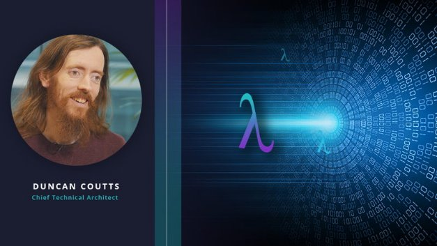

# Architecting Shelley: an interview with Duncan Coutts
### **A fireside chat with Duncan Coutts, Cardano's chief technical architect, about Haskell and delivering Shelley**
 7 April 2020[ Eric Czuleger](tmp//en/blog/authors/eric-czuleger/page-1/) 6 mins read

### [**Eric Czuleger**](tmp//en/blog/authors/eric-czuleger/page-1/)
Senior Content Editor

Marketing & Communications

- 
- 
- 

Duncan Coutts has been an important guide on the road to the Cardano Shelley mainnet. Long time supporters of IOHK are likely familiar with his signature long hair, beard, and penchant for drinking tea while discussing decentralization in front of a [white board](https://www.youtube.com/watch?v=TZGVgNsJSnA&t=572s). He recently sat down for an interview to discuss the upcoming Byron reboot, the Haskell Shelley testnet, and the conclusion of the pre-Shelley development cycle. Coutts, who has been working with IOHK since 2016, brings a wealth of knowledge from working with the Haskell programming language for nearly 20 years and helping found the Well-Typed consultancy.

**What’s your role at IOHK?**

I’m the chief technical architect for the Cardano project and I’m primarily responsible for the design and implementation of the node. This means that I collaborate with the teams that work on consensus, ledger, networking, and other things. Ultimately, I work to bring everyone together around the same design after a discussion with the team leaders. The design of Cardano is the product of joint work by many individuals working together.

**What does the Haskell programming language bring to Cardano?**

Haskell is an enabler. It makes it easier for us to follow the approach that we believe is right, which is driven by computer science. We know how to do things properly; computer science tells us how. We just need to pick the appropriate techniques to do that. Haskell makes that easier.

It’s a good fit for Cardano because it suits the high-assurance, specification-driven software that is vital for a blockchain. Haskell helps us find systematic ways of avoiding mistakes. In essence, it’s a better mousetrap.

**You’ve been working with Haskell for a long time. How have you seen the landscape of functional programming change?**

People take it seriously now. When I started as an undergraduate in 1999, I thought that Haskell was amazing. Other students thought, ‘Wow that’s totally impractical. How will you ever get a job?’

At the time, functional programming was an academic curiosity. There wasn’t any prebuilt code and it wasn’t machine readable, which meant that Haskell wasn’t usable for a wide range of people. There wasn’t the tooling, range of libraries, or experience. That has changed over the years: the tooling got better, the libraries got better. IOHK has helped develop the infrastructure for building and distributing open-source Haskell code and the number of libraries exploded. That, combined with more teaching and a gradual change of attitude in the industry, means that people take it more seriously now. Haskell hasn’t changed as much as the industry around us has.

**What’s the biggest change from an industry point of view?**

There are two things. The first is that attitudes are changing, albeit slowly. People are changing their opinions about what they consider a sensible language choice. Previously, everything had to be in C or Java or maybe Python, but eventually good ideas make progress, even if it takes a long time. You can make a lot of progress by just recognizing that a good idea is a good idea. The mainstream does pick up on important developments, even if it does take 10 or 15 years. The industry has not embraced functional programming wholesale yet, but individual programmers have taken up various ideas. That makes Haskell look less radical.

If you look at a language like Rust, it has some of the clever type systems of Haskell, although it doesn’t have any functional programming ideas. Even Java and C++ have some functional programming ideas in them these days, so Haskell is not quite so far from the mainstream as it used to be.

The second major change has been performance, which is getting much better. We’ve recently become competitive with Java in terms of performance. It makes people say, ‘Wow, Haskell is so fast,’ but that’s because they’re comparing it to Python and PHP rather than C. So that’s another way of saying that Haskell has improved slightly, but the industry environment around it has changed as well.

**You have been heavily involved in the Byron reboot which was kicked off last week. Why was this work important?**

The [Byron reboot](https://iohk.io/en/blog/posts/2020/03/30/what-the-byron-reboot-means-for-cardano/) is the culmination of over 18 months of hard work across multiple IOHK development teams, and constitutes a complete overhaul of the node infrastructure with 100% fresh code. The reboot introduces an extensible, modular design within the node itself, separating out the ledger, consensus, and networking components, as well as improvements and new functionality in the wallet backend and the Cardano explorer.

For Daedalus users, the Byron reboot will see us moving to a regular update cadence [see our recent piece on [Daedalus Flight](https://iohk.io/en/blog/posts/2020/04/01/we-need-you-for-the-daedalus-flight-testing-program/) for more on that], after which they should find that Daedalus is faster, more reliable, and uses less memory. A lot of the issues users have experienced with Daedalus in the past were due to the underlying node, rather than Daedalus itself. The Byron reboot will go a long way to improving things, and users should see Daedalus syncing and restoring wallets within minutes, even when downloading the entire Cardano blockchain.

**As the chief architect, your job is to lay the foundation for Cardano’s future. What have you focused on to achieve this?**

The most important aspect in terms of flexibility for the future is keeping different functions separate. One of the big improvements of the Byron reboot is that the ledger rules will be totally independent of the consensus implementation; this modularity means that the ledger rules are perfectly clean mathematical functions, which is a core aspect of functional programming.

As a result, everything is easier to test, tweak, and change, both now and in the future. The consensus algorithm isn’t entangled with the details of the ledger rules, so we can alter the ledger rules without changing the consensus implementation. This makes integrating Plutus and smart contracts functionality much easier and will also help in the future when we are adding treasury and governance features.

The consensus implementation itself has also been parameterized so that we can transition from the Ouroboros Classic consensus protocol to BFT and then Praos, which also provides flexibility for future versions of the protocol that haven't been developed yet.

**Shelley is a big step towards the future of Cardano, but what is the significance of compiling Haskell into JavaScript and WebAssembly?**

We’re interested in compiling to JavaScript or WebAssembly because of Plutus. We want to have Plutus contracts or Plutus applications that can be distributed to users, which would include custom interfaces and custom logic with the user rather than in a server. Compiling to JavaScript allows us to do that; you can compile the Plutus code once and distribute it to users on different platforms.

-----
Thanks to Duncan Coutts for his time. As chief technical architect, he’s a cornerstone of the Cardano project and has been fundamental to the ongoing success of the platform. For more interviews with the team, stay tuned to our social channels and the IOHK blog.
