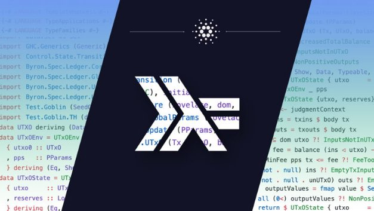

# Merging formal methods and agile development to build Cardano
### **IOHK formal methods director Philipp Kant lays out our methodology for building software with flexibility and precision**
 9 April 2020[ Philipp Kant](tmp//en/blog/authors/philipp-kant/page-1/) 7 mins read

### [**Philipp Kant**](tmp//en/blog/authors/philipp-kant/page-1/)
Formal Methods Director

Engineering

- 
- 
- 

**Form and function**

IOHK is building Cardano into a global financial and social operating system. This enormous task requires both quick iteration and absolute precision. It is why IOHK has chosen to combine the speed of agile development with high assurance code and formal methods. Fusing flexibility and formality led our engineers to pioneer this modern development philosophy.

IOHK believes firmly in research, formal methods, functional programming, and building in a rigorous manner. As a competitor in the blockchain development industry, we also have to consistently demonstrate progress and create value for our global community of stakeholders. This means we can’t compromise on robustness or on development speed and flexibility. In an ever-changing marketplace this is a challenge, so our developers have to strike a balance.

**Agility versus formality**

The start-up standard for developing technology has been to build a minimum viable product quickly and then continually iterate until it is ready for the mass market. This is known as an agile process. It is a great way of showing that a project is advancing while eventually building a fully functional product. However, an agile methodology assumes there will be bugs and weaknesses in each step of development that can be ironed out later. This is fine if there is no value at risk – but, with virtual currencies, there is an enormous amount of money and stakeholder trust on the line. 

Building a digital asset on a blockchain provides several challenges to overcome in terms of organizing a development process. As a proof-of-stake cryptocurrency, Cardano is a distributed system in an adversarial environment where consistent performance is critical. The protocol has to maintain security in the face of malicious actors attempting sabotage. This means that no one can afford to build quickly and deal with problems later. 

Trust is essential for a currency to be accepted and correctness proofs are an important way to increase the veracity of a system. This is why the code should not only be correct, but there should be evidence of its correctness, such as extensive meaningful tests and mathematical proofs. In a young industry like cryptocurrencies, IOHK engineers have to anticipate the addition of new features while maintaining the correctness guarantees established in the initial version. The platform can only scale globally if it is able to grow while maintaining security and utility for everyone. This is why Cardano developers streamlined their methodology, combining a variety of tools ranging from property-based testing all the way to machine verifiable proofs, to create high assurance software even in the presence of changing requirements.

**Research to code**

The methodology begins with scientific research. To date, IOHK has released more than 60 research papers that have contributed to creating the platform. Each paper examines a critical aspect of blockchain technology from first principles. How do we gain consensus in a decentralized way? How is a smart contract designed? What is the right reward structure to incentivize good behavior? IOHK researchers examine these questions, and submit their answers to scientific journals and conferences. These papers contain proofs that must pass rigorous peer review. Then, to ensure that the quality of our software does justice to the science, it is developed using formal methods.

In essence, this means that IOHK engineers specify what the code should do mathematically. That way, they can ensure that when the code is run, it contains the desired properties designed into it. The code is written in Haskell, a high-assurance functional programming language with a strong type system. While Haskell is a great tool for implementing reliable software, it is not foolproof, so the code still needs to be tested. A great way to write tests is using QuickCheck, which allows developers to state properties that should always hold in a program. QuickCheck then generates test cases, and searches for minimal counterexamples that violate those properties.

In code that interacts with the external world, in particular network applications, it can be hard to find minimal counterexamples. This is because the order of execution is not deterministic: it can change every time the software is run. The same code can be run hundreds of times, and only fail once. We can get around this by using simulations with deterministic execution order. Running tests in simulation allows us to reliably find and fix a class of bugs in testing, which would otherwise only occur randomly in production.

**Bridging the gap**

To get a picture of the development methodology employed for Cardano, let’s consider the metaphor of bridge building. When a civil engineer builds a bridge, a large portion of their time is spent behind a desk. The civil engineer plans a design, calculates the statics, and orders geographic surveys. During that time, nothing happens at the building site. An observer would be unable to see any progress being made. For building bridges, this is the correct approach. If the planning is not accurate, it is difficult and expensive to correct problems at a later stage. Ultimately, the result would be a delayed bridge at a higher cost, or one which fails completely. Lack of visible progress is a good price to pay for a functional and safe bridge.

When building software, making changes in later stages is much easier than in construction. That is what enables the common agile development approach. If an agile developer was building a bridge, they would construct a pillar in one rapid sprint and then the next in a second sprint. The gap between the pillars would be spanned in a final sprint and, if things didn’t hold up, the developers would add on one more sprint to fix any issues. While progress would be demonstrable at the building site, the final product would likely have a great deal of problems built into it. This creates clean up work at the end of the project which could have been avoided by better planning at an earlier stage. Furthermore, the minimum viable product would likely be given to a small group of people for a test drive with the expectation that it would fail in order to alert developers of bugs. Needless to say, it is best that bridges aren’t designed in this way.

When hearing the words 'formal methods’, a lot of people in software development think about the civil engineering approach, which is dubbed ‘waterfall’ and generally shunned. This is a common but unfortunate misunderstanding. Indeed, using appropriate formal techniques allows us to have our cake, and eat it too: to have an overall design (a deliberate design, not an accidental one from fitting together pieces developed in sprints), to show progress continuously, and to retain the ability to react to changing requirements.

A key technique employed by IOHK developers is executable specifications. These are high level designs, which abstract over low level details, written in a language that the computer can understand and execute. Executable specifications can be used as prototypes to show progress, get feedback from users, and test assumptions. On top of that, lower level details can be added via successive refinements. Our developers build the bridge to solve the biggest problems first then add pillars to reinforce it at a later time. In a software system, the pillars would be features like saving data to disk, or using performant algorithms, which are needed for a final product, but which are not essential to demonstrate the overall functionality.

Using executable specifications, we get the benefits of proper planning without sacrificing flexibility. IOHK developers can fix what the system should look like on a large scale, and then implement suitable components as needed. Continuous testing guarantees that each component fits the overall design. This helps prevent problems that are common in a late integration approach. With this methodology, we get the best of both worlds: we can use a top-down design (avoiding late integration troubles, having a good handle on the overall design at all times), and have working code early (demonstrating progress, and allowing for tests and feedback through the whole process).

**Future proof**

Ultimately, the method of construction should be determined by what is being built. IOHK is building a global social and financial operating system which requires rigor and speed. Formal versus agile is a false dichotomy. Instead, we’re continuing to develop our methodology which fuses the best of both approaches: formal techniques within an agile delivery framework, with robust, higher assurance code upon which we can build for all our futures.
