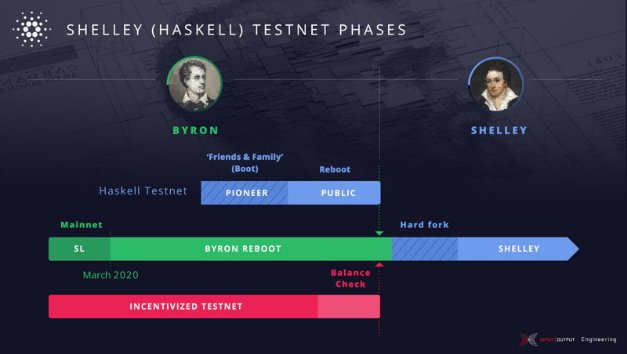

# From Byron to Shelley: Part one, the testnets
### **The evolution to decentralization continues with a series of three Haskell Shelley testnets**
 29 April 2020[ Kevin Hammond](tmp//en/blog/authors/kevin-hammond/page-1/) 7 mins read

### [**Kevin Hammond**](tmp//en/blog/authors/kevin-hammond/page-1/)
Software Engineer

Engineering

- 

Following the successful Byron reboot of Cardano, we are beginning our phased transition to the Shelley mainnet. This means moving from a static, federated system to a dynamic, decentralized Cardano blockchain.

The process begins with a series of Haskell Shelley testnets, culminating in the Shelley upgrade hybrid phase.

The Haskell Shelley testnets will be a different experience from the previous Incentivized Testnet (ITN) for both stake pool operators and general users/ada holders. This is because the ITN and the Haskell testnets have been created with different goals in mind.

The ITN was designed to give stake pool operators experience in building their critical infrastructure, while allowing IOHK’s engineers to test the new incentive mechanisms with real ada, delegated by actual ada holders. The Haskell Shelley testnet is about ensuring that the Shelley mainnet is calibrated to be a best-in-class experience from day one. Unlike the ITN, the Haskell Shelley testnet will not involve ‘regular’ ada holders: the testnet will not be incentivized. Each phase is intended to run for a much shorter period – weeks rather than months. We will, of course, be testing out the operation of the wallet, explorer, and so on, but using a faucet distributing test ada that doesn’t offer rewards. Ada holders will be able to try Daedalus and the explorer on the public testnet and provide feedback, but without using real ada.

The Shelley experience will roll out within clearly defined phases. The first three phases will involve exploring and testing the new Shelley capabilities and moving to a situation where we are ready for full Shelley mainnet deployment.
## **Phase 1: Pioneers and the ‘Friends & Family’ phase**
The rollout will begin with an invitation-only ‘friends and family’ testnet. During this phase, IOHK will first spin up and run a Shelley-only test network internally. We will then invite about 20 trusted stake pool operators – we’re calling them ‘pioneers’ – to join this (initially closed) network. These operators will comprise a small group who have demonstrated a high level of technical skill and community contribution during the ITN.

These pioneers will blaze the trail for others to follow as we head to full Shelley deployment on the Cardano mainnet. In this important first phase, we’ll be asking them to perform specific functionality tests to capture their valuable feedback while exploring the capabilities of the Haskell Shelley platform. We expect to invite more pioneers to join us – a few at a time – as we add features and prove the reliability of the testnet.

In this ‘closed alpha’ testing phase, IOHK will focus on tuning system parameters such as the saturation threshold, network resilience, and decentralization. Furthermore, IOHK’s engineers will see the Ouroboros Praos consensus mechanism working outside of simulation. The pioneer phase will give IOHK’s engineers the opportunity to address any issues in a controlled environment, with feedback and support from stake pool operators, before moving to the next phase. The findings will be communicated to the Cardano community and opportunities will be taken to learn about and improve the Shelley system.

This phase will also be all about producing high-quality technical documentation and support. The pioneers (supported by the community as a whole) will help us produce documentation that will make it easy to set up and run stakepools, and give our technical support team an understanding of the issues that our users will face.
## **Phase 2: Opening up the testnet – the public phase**
The community response to the ITN was incredible, and we are blessed with having a wealth of skilled stake pool operators in the community. We’ll keep everyone informed through every step of the process and – as ever – our repos will be fully open. But for purely practical reasons, we’ll be working 1-2-1 with just a small group of around 20 operators at first. But our goal is to open things up as soon as we can, with full public access in the next phase.

This will allow all the stake pool operators who participated in the ITN to redeploy their previously constructed infrastructure, and to tune their stake pool to the new Haskell settings. This testnet will run as closely as possible to mainnet conditions, including mixing Byron and Shelley era blocks.

During each evolution in the transition to Shelley, IOHK is placing an emphasis on community training and collaboration. Decentralization of knowledge is just as important as decentralization of the platform. Pioneer participants in the alpha testnet will provide crucial support in advising the remaining stake pool operators on configuration and use of the Shelley system. And as operators acclimatize, we’ll also be asking them to support and bring new operators on board.
## **Phase 3: The balance check**
The third and final phase prior to mainnet deployment is the balance check. This will bring together the Byron and ITN transaction histories, and prepare the mainnet for the Shelley era. At this point, the ITN rewards and mainnet balances will be consolidated. After this point, it will no longer be possible to earn rewards on the ITN. However, users will be able to check their rewards and confirm them in mainnet wallets. We’ll share full details of what ada holders need to do to reclaim their ITN rewards a little nearer the time. The balance check phase will last for only a couple of weeks before we start moving towards decentralized stake pools and the Shelley era.
## **How we will select the pioneers**
We are selecting the pioneer group based on a number of criteria, devised in collaboration with the team at the Cardano Foundation. Pool operators must have a deep knowledge of running stake pools on the ITN, as well as competency working with Linux, and come from a range of backgrounds and geographical locations. Some will be working with cloud solutions providers to run their pool, others with their own hardware – we’ll have a mix. By selecting pioneers from different geographical regions, we will be able to ensure a global reach, and test out our new network implementation.

Pioneers will be expected to commit a set number of hours per week to supporting the rollout program, give direct feedback and provide advice to the community and mentor others at subsequent phases. Bringing others on board and supporting them along the way will be a crucial part of the role. To be clear, as ever, all our repos will be open so we encourage everyone to get involved. As always, IOHK’s developers value input from every member of the Cardano community. Anyone who wishes to is encouraged to spin up their own nodes. If they are skilled developers they can also recommend enhancements to the Shelley Haskell code base because all the information will be published through GitHub.

We’ll be looking to expand the network rapidly with more pools as soon as this earliest testing phase delivers the results we want.
## **Ensuring an easier start for everyone**
The Haskell Shelley code base has been developed with formal methods and the high assurance Haskell programming language. So while we anticipate that some minor elements will need addressing, we believe that the initial experience should be free of any major issues. This is the approach that we have used for the Byron reboot, with great success, and we will be building on the code base that we have developed there. The approach will deliver even greater benefits for Shelley and beyond, by allowing us to deploy software much more quickly than in the past, with new features subject to rigorous and careful checks even before coding has been completed.

Our goal is to provide a plug-and-play solution to get stake pool operators up and running. This means they should be able to pick up a pre-prepared docker image or AWS instance, for example, and their stake pool will be launched. We will, of course, also provide standalone binaries and source code for those with more experience, or who have specific configuration requirements.

We’re now in the final stages of preparation and things are heating up (you may have recently seen a tweet that the [new node](https://twitter.com/IOHK_Charles/status/1254642739247022081) has produced its first block). With that successful first step completed, we’ll be sharing dates and more details very soon. We’ll also be publishing further blogs outlining the other key steps and milestones in the process. Keep an eye out for those and meanwhile stay tuned to IOHK’s social channels. We’ll be sure to let you know as we start rolling things out.
