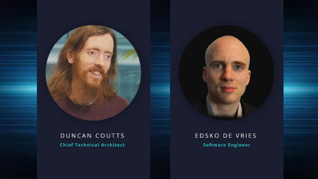
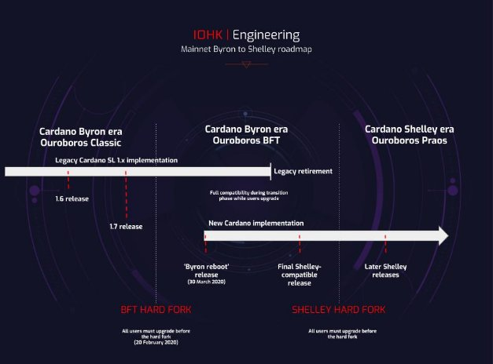

# Combinator makes easy work of Shelley hard fork
### **A behind-the-scenes look with Duncan Coutts and Edsko de Vries** 
 7 May 2020[ Anthony Quinn](tmp//en/blog/authors/anthony-quinn/page-1/) 11 mins read

### [**Anthony Quinn**](tmp//en/blog/authors/anthony-quinn/page-1/)
Editor

Marketing & Communications

- 
- 
- 
- 

Since the launch of the Incentivized Testnet marked the coming of the Shelley era last year, the Cardano platform has entered a fast-moving period of development. The Ouroboros Classic consensus protocol has supported Cardano Byron and the ada cryptocurrency for the past 30 months, and we’ll soon be switching to Ouroboros Praos. This is the version of our [proof-of-stake](https://iohk.io/en/blog/posts/2020/03/23/from-classic-to-hydra-the-implementations-of-ouroboros-explained/) (PoS) protocol that will initially power Shelley as Cardano decentralizes. It builds in the staking process with monetary rewards for ada holders and stake pool owners.

We upgraded Cardano on February 20 with a hard fork that switched the mainnet from the original consensus protocol, Ouroboros Classic, to an updated version, Ouroboros BFT. This BFT hard fork began a transition period under Ouroboros BFT, a slimmed-down version of the protocol designed to help us make the switch to Praos, while still preventing any malicious behaviour. Many probably didn’t even notice. For Daedalus wallet users, it meant a standard software update. Exchanges had to upgrade manually, but they had several weeks to do this and we were on hand to help.

The next event was the ‘[Byron reboot](https://iohk.io/en/blog/posts/2020/03/30/what-the-byron-reboot-means-for-cardano/)’ on March 30. This released totally new code for many of the Cardano components, including a new node to support delegation and decentralization, and future Shelley features. A big advantage of the new code base is that it has been redesigned to be modular, so many components can be changed without affecting the others.

In turn, the BFT will act as the jumping off point for the Shelley hard fork, which will happen once we’re happy with the Haskell testnet. This second hard fork will be a similar process to the February one for exchanges, ada holders and wallet users, and, hopefully, just as much of a non-event.

However, while everything looks smooth on the surface, there is a lot of hidden activity going on. Like a duck serenely swimming across a pond – while its feet are furiously paddling below the calm waters – our blockchain engineers are hard at it.

So, we sat down two of the leading engineers on the Cardano project, Duncan Coutts and Edsko de Vries, to find out how they’ve done it. Duncan has been Cardano’s architectural lead for the past three years, and between them, Duncan and Edsko have spent 35 years using Haskell, the programming language being used to develop Cardano.

**Duncan, how did you do it?**

As described in the Cardano roadmap, IOHK’s blockchain engineers believe in smooth code updates. Instead of trying to do the jump from Ouroboros Classic to Praos in a single update – which would be an incredibly complex task – it’s been a two-stage approach using Ouroboros BFT as an intermediary (Figure 1). The BFT code is compatible with both the Byron-era federated nodes and the Shelley-style nodes released in the Byron reboot. It's like a relay race: one runner (in our case, running one protocol) enters the handover box where the other runner is waiting; they synchronise their speeds (so they're perfectly compatible with each other) and then hand over the baton (operating the mainnet), and then the new runner with the baton continues from the handover box for the next lap.

 

**Figure 1. Mainnet Byron to Shelley roadmap**

The [Daedalus Flight](https://iohk.io/en/blog/posts/2020/04/01/we-need-you-for-the-daedalus-flight-testing-program/) process has helped us quickly develop and test a new wallet and, once everyone is running that on the mainnet, and once we finish swapping over the core nodes, the old code is redundant. We are in that transition phase right now, with a new mainnet Daedalus wallet released on April 24.

Our aim is to have a ‘graceful entry into Shelley’, as IOHK chief Charles Hoskinson describes in his [whiteboard video about the hard fork](https://www.youtube.com/watch?v=g7uySEgt06c). A vital tool in making this move has been creating a hard fork combinator.

**That sounds like farm machinery. What is it?**

A combinator is just a technical term for something that combines other things. For example, addition is a combinator on numbers. A hard fork combinator combines two *protocols* into a single protocol. We call this a sequential combination of the two protocols because it runs the first protocol for a while and at some point it switches over to the second. In our case, this is two versions of Ouroboros as we move from BTF to Praos.

The clever part of all this has been the use of discrete modules that do their job, while knowing as little as possible about each other and the blockchain. Simplicity is the key here and this process of taking out the details we call ‘abstraction’. Most of the consensus modules don’t even have to know that they’re dealing with a cryptocurrency and could be putting pretty much anything on a blockchain. For example, we’ve done seminars using the example of a Pokémon ledger on a Ouroboros blockchain. The only thing that’s different is the ledger rules; the consensus is all the same. You just set it up – ‘instantiate’ it in the programming jargon – with the rules for playing Pokémon rather than for UTXO-style accounting.[For readers with a technical interest, watch out for Edsko delving further into the ‘abstraction’ process and combinators in a future blog post.]

**You make it sound simple**

In fact, it’s tricky because Cardano is running the ada cryptocurrency, and a pile of other things, at the same time. Think of it as changing all the wheels on a car while you’re driving along and towing a caravan. So we have to be sure we can do this in a totally reliable way.

We could have tackled this as a one-off task, but it made sense to do it in a generic way using a protocol combinator. We chose this route because we get a better result and the testing that is vital to ensuring the code works is made far easier. On top of that, there will be more hard forks to come, which made the choice even clearer. For example, as we near the culmination of Cardano’s development and move through the Goguen, Basho, and Voltaire eras, there will be at least one hard fork at each stage.

**So how did you cope with the tricky bits?**

Well, first off, we had to do it without research to turn to. The researchers describe a single protocol as a free-standing, perfect thing. But that’s not where we are. We are trying to run Praos after having started with a chain that was using something else. What Edsko’s working on, going from one protocol to another in a generic way, is just not covered in the research. And it’s hard, it’s complicated. All the details need a lot of thinking, a lot of scratching your head. But switching between Cardano code bases is not the sort of thing the academics can expect to get published. It doesn’t have a novel aspect and is seen as just an implementation issue.

**Edsko, can you give us an example?**

As Duncan says, for the researchers, these implementation issues are trivial but dealing with them is 99% of what we do. Take the problem of time for a blockchain. It’s what I’ve been banging my head against for a couple of weeks. Time is divided into slots where the chain can contain at most one block per slot. We often need to convert between slot numbers and time in the real world, for example when a node needs to know ‘Is it my turn?’ to generate the next block. This is fundamental to Cardano, but the length of a slot changes after the hard fork. For Byron, a slot is 20 seconds; for Shelley, it will be two seconds, or perhaps one. To really complicate things, the exact point of time when the hard fork is made is decided on the chain itself. Yet, I need to know when the changeover point is. It’s a quandary: to do slot conversions I need to know the state of the blockchain, but to know the state I need to know the slot conversions!

This is real chicken-and-egg territory with many complex things to disentangle. We have to be very precise with how we do things. It might be trivial in theory, but it’s very difficult to disentangle things and make sure it’s not a circular problem.

**We can’t afford for it to be wrong, so how do you know you’re right?**

*Duncan*: That’s an excellent question. My reply is that you come to the answer on two levels. The first is intellectual: you analyse the problem, you do the maths, you talk to colleagues and wrestle with it until you can see how it all fits together. Second, we do all our QuickCheck testing to give us the confidence that this does what we think it does. We do extensive testing that really takes us into the unusual cases that you might never think of, including this changeover. We can do 100,000 tests every time we change a line of code. [Lars Brünjes has written about how John Hughes, one of the creators of Haskell, has helped [IOHK develop its testing strategies](https://iohk.io/en/blog/posts/2018/09/26/functional-correctness-with-the-haskell-master/).]

*Edsko*: Yes, I agree with those two points. In terms of the combinator, I resolve these things by thinking about the guarantees that the code I write needs to provide, and which guarantees that it, in turn, needs from the ledger. I sketch a mathematical proof that this ‘if-then’ reasoning is indeed justified, and then turn to the formal method teams. The formal methods team are the people who set up the mathematical rules that describe the blockchain, and they can then tweak the rules in such a way that they provide the required guarantees.

In terms of Duncan’s second point, I know the time issue I mentioned above is correct by thinking hard mathematically, and by testing. Timing decisions are easy when we have the full blockchain, but are hard when we have to make predictions about the future. Fortunately, the way we set things up means I can easily create testing blockchains. So, I can create a full blockchain, then slice this chain in half. I take the first half and consider that to be in the present; and set the other half in the future. Then I can use the ‘present’ (first half) to make predictions about the ‘future’ (the second half) and verify them against the whole thing (on which the calculations are easy). If they match, then I know everything is OK.

**When did you start on this?**

Right after Duncan came up with the genius idea of the OBFT. So I’ve been thinking about the combinator on and off for about 18 months. It was a design goal from the very beginning of our modular rewrite of Ouroboros starting in October 2018, with my first commit to the GitHub repository. We had a prototype demonstration with OBFT and Praos soon after, in December 2018.

**And how many people have been involved?**

*Duncan*: Many people have been working on the consensus code, but whenever we have anything really hard, like this combinator, we give it to Edsko: he’s our software engineer extraordinaire! This is Haskell programming as free climbing, rather than climbing with the ropes of formal methods for support.

**Any final thoughts?**

*Duncan*: The code that was running is right now being phased out and pretty soon the code that was running Cardano a month ago will no longer exist. Once everyone is running the new code on the mainnet and once we finish swapping over the core nodes, the old code is redundant. We are in that transition phase right now and no one is shouting that the sky is falling. No one has noticed it.

*Edsko*: That is quite an achievement in its own right. The idea of OBFT was crucial in making the transition, but it’s not relevant any more once we make that transition to Shelley. This has been a way for us genuinely to ditch legacy code, which is often very difficult to do, as the banks know to their cost.

*Duncan*: And if it all works fine, you won’t notice anything.

**Duncan and Edsko, thank you for your time. I think we’d better let you both get back to it.**
