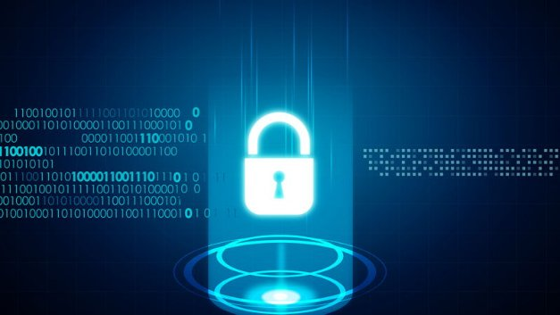

# Building new standards for privacy and scalability
### **IOHK joins the conversation around zero-knowledge proofs at the ZKP Workshop**
 20 May 2020[ Brian McKenna](tmp//en/blog/authors/brian-mckenna/page-1/) 6 mins read

### [**Brian McKenna**](tmp//en/blog/authors/brian-mckenna/page-1/)
Product Manager

Operations

- 
- 
- 

## **Building privacy and agency**
In the age of information capitalism, data is a commodity which needs to be protected on an individual and global level. Every time someone makes a purchase, logs into an account, or accesses a website, metadata is connected to their individual IP address. Mass amounts of information move around the world every second but if it is not secured through encryption it can be exploited. The downstream effects of this can be benign, such as receiving targeted marketing. Or they can be dangerous like spreading political propaganda.

Privacy is central to the ethos of the crypto space. In terms of cryptocurrencies this has historically made many uncomfortable. Much of the early negativity around Bitcoin was linked to the perception that it was an untraceable enabler of the shadow financial system, from money laundering to global terrorism. But growth and greater awareness of data breaches, corporate and governmental overreach and ‘surveillance capitalism’ has shifted mainstream mindsets. Privacy has become a significant and legitimate concern for many, particularly with the arrival and potential fallout from the recent pandemic. Cryptography is recognized as an important tool for keeping institutional and governmental power in check and ensuring that data is kept by the people.

An individual’s personal information and metadata are their property. If they choose to share or sell access to their digital trail then it is their right. However, third parties currently take advantage of their stewardship over user information. This is why at IOHK we see it as our responsibility to investigate all technologies that might be used to enhance privacy, personal agency, and inclusive accountability. 

New cryptographic approaches to address data security concerns have been a growing and significant area for IOHK research. We have produced more than 60 peer-reviewed academic papers, which have become an open-source, patent-free resource for everyone. Five of these papers relate to zero-knowledge proofs and their global application. They cover innovations in zk-SNARKs, privacy-preserving smart contracts and techniques for initializing these systems on blockchains in a more efficient and trustless way. But what are zero-knowledge proofs?
## **ZKProof Workshop**
Zero-knowledge proofs, or ZKPs, are a cryptographic technique that, when applied to blockchains, can make them ultra-private and scalable. ZKPs allow information to be verified without being revealed to anyone but the intended recipient. In essence, zero-knowledge cryptography allows you to prove that you know something without revealing what that is. In the end, ZKPs protect people’s individual sovereignty and self-ownership. This is achieved using encryption to secure information while ensuring certainty and confidentiality when interacting with data sets, finances, and applications.

IOHK believes that these proofs represent an important step forward for universal inclusion, personal data management, and security. That is why we have been both sponsoring and participating in the third annual [ZKProof Workshop](https://zkproof.org/events/workshop3/), which concludes tomorrow.

This online conference brings together leading cryptographers, researchers and companies to advance the conversation around ZKPs. ZKProof’s open-industry academic initiative is focused on broad adoption of ZKP cryptography through the development of standards and frameworks. These international standards create a common language for applications, security, assurance and interoperability.

IOHK believes that the world will one day function through a nexus of interoperating distributed ledgers. This global network will combine legacy financial institutions, current tech companies, and emerging decentralized organizations. A global system like this will have to work equally for everyone. For that to occur, developers and engineers need to build common, trusted specifications and standards around privacy. They also need to ensure that immutable sources of information can be accessed by everyone. The workshop aims to define this framework for ZKPs. Ensuring privacy isn’t enough to build our worldwide system, we also have to make certain that it is accessible to all.
## **Power to the edges**
IOHK has stated that its goal is to push financial and social power to the edges of society rather than siloing it at the center. To that end, we have to ensure that everyone has equal access to the single source of truth that is the blockchain. Things like state-dependent contracts and smart contracts require a large amount of space and computing power to maintain. This is a challenge given the fact that we want our platform to be equally accessible from high-powered desktops in London to cellphones in rural Uganda.

As blockchains grow they must also include multi-asset functionality, identity, and even voting. This is far from simply exchanging money or tokenized assets. All of these interactions involve maintaining and curating large amounts of information. For an individual to verify the source of truth from the node level of the blockchain, it would require petabytes and eventually exabytes of storage space. This is untenable for any user. Fortunately, ZKPs provide a solution to the problem.

Recursive construction of zero-knowledge proofs allows transactions on the distributed ledger to be truncated so that even as the blockchain grows, the necessary capacity to host the full node remains achievable for all participants. ZKPs bring both privacy and scalability together, which makes them a critical stream of research for IOHK engineers. The result of this is increased universal understanding and inclusion.
## **Inclusive accountability**
Zero-knowledge cryptography isn’t just a scientific or academic stream of research. It is directly applicable to a variety of global challenges. ZKPs help create inclusive accountability. Inclusive accountability is the idea that there is universal verification for every actor running an algorithm on their computer or device. While ZKPs can be used to account for private monetary transactions they can also be used for casting votes, transferring records, and securing personal information. In essence, inclusive accountability is built into all of the most important processes that govern the world, laying a foundation of trust for everyone.

The focus of the ZKProof Workshop is to set standards that will pave the path to adoption of zero-knowledge cryptography. IOHK believes that these cryptographic tools are the key to addressing emerging challenges within our future financial and social frameworks. If you'd like to be a part of the conversation surrounding ZKPs you can still [sign up](https://zkproof.org/events/workshop3/) to join the online ZKProof Workshop. 

Check out our recent papers and our open source implementation of the [Sonic protocol](https://github.com/input-output-hk/sonic):

- [Mining for Privacy: How to Bootstrap a Snarky Blockchain](https://eprint.iacr.org/2020/401.pdf)
- [Sonic: Zero-Knowledge SNARKs from Linear-Size Universal and Updatable Structured Reference Strings](https://eprint.iacr.org/2019/099.pdf)
- [Kachina: Foundations of Private Smart Contracts](https://eprint.iacr.org/2020/543.pdf)
- [Ouroboros Crypsinous: Privacy-Preserving Proof-of-Stake](https://eprint.iacr.org/2018/1132.pdf)
