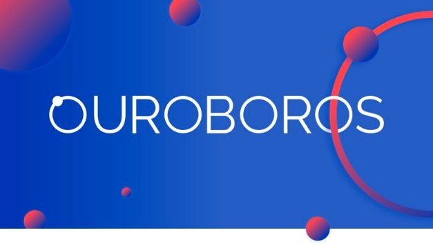

# The Ouroboros path to decentralization
### **The protocol that powers Cardano and its design philosophy**
 23 June 2020[ Prof Aggelos Kiayias](tmp//en/blog/authors/aggelos-kiayias/page-1/) 6 mins read

### [**Prof Aggelos Kiayias**](tmp//en/blog/authors/aggelos-kiayias/page-1/)
Chief Scientist

Academic Research

- 
- 

Designing and deploying a distributed ledger is a technically challenging task. What is expected of a ledger is the promise of a consistent view to all participants as well as a guarantee of responsiveness to the continuous flow of events that result from their actions. These two properties, sometimes referred to as *persistence* and *liveness*, are the hallmark of distributed ledger systems.

Achieving persistence and liveness in a centralized system is a well-studied and fairly straightforward task; unfortunately, the ledger that emerges is precariously brittle because the server that supports the ledger becomes a single point of failure. As a result, hacking the server can lead to the instant violation of both properties. Even if the server is not hacked, the interests of the server’s operators may not align with the continuous assurance of these properties. For this reason, *decentralization* has been advanced as an essential remedy.

Informally, decentralization refers to a system architecture that calls for many entities to act individually in such a way that the ledger’s properties emerge from the convergence of their actions. In exchange for this increase in complexity, a well-designed system can continue to function even if some parties deviate from proper operation. Moreover, in the case of more significant deviations, even if some disruption is unavoidable, the system should still be capable of returning to normal operation and contain the damage.

How does one design a robust decentralized system? The world is a complicated place and decentralization is not a characteristic that can be hard-coded or demonstrated via testing – the potential configurations that might arise are infinite. To counter this, one must develop *models* that systematically encompass all the different threats the system may encounter and demonstrate rigorously that the two basic properties of persistence and liveness are upheld.

The strongest arguments for the reliability of a decentralized system combine formal guarantees against a broad portfolio of different classes of failure and attack models. The first important class is that of powerful Byzantine models. In this setting, it should be guaranteed that even if a subset of participants *arbitrarily* deviate from the rules, the two fundamental properties are retained. The second important class is models of rationality. Here, participants are assumed to be *rational utility maximizers* and the objective is to show that the ledger properties arise from their efforts to pursue their self interest.

Ouroboros is a decentralized ledger protocol that is analyzed in the context of both Byzantine and rational behavior. What makes the protocol unique is the combination of the following design elements.

- It uses **stake** as the fundamental resource to identify the participants’ leverage in the system. No physical resource is wasted in the process of ledger maintenance, which is shown to be robust despite ‘costless simulation’ and ‘nothing at stake’ attacks that were previously thought to be fundamental barriers to stake-based ledgers. This makes Ouroboros distinctly more appealing than proof-of-work protocols, which require prodigious energy expenditure to maintain consensus.
- It is proven to be resilient even if arbitrarily large subsets of participants, in terms of stake, abstain from ledger maintenance. This guarantee of **dynamic availability** ensures liveness even under arbitrary, and unpredictable, levels of engagement. At the same time, of those participants who are active, barely more than half need to follow the protocol – the rest can arbitrarily deviate; in fact, even temporary spikes above the 50% threshold can be tolerated. Thus Ouroboros is distinctly more resilient and adaptable than classical Byzantine fault tolerance protocols (as well as all their modern adaptations), which have to predict with relative certainty the level of expected participation and may stop operating when the prediction is false.
- The process of joining and participating in the protocol execution is **trustless** in the sense that it does not require the availability of any special shared resource such as a recent checkpoint or a common clock. Engaging in the protocol requires merely the public genesis block of the chain, and access to the network. This makes Ouroboros free of the trust assumptions common in other consensus protocols whose security collapses when trusted shared resources are subverted or unavailable.
- Ouroboros incorporates a reward-sharing mechanism to incentivize participants to **organize themselves** in operational nodes, known as stake pools, that can offer a good quality of service independently of how stake is distributed among the user population. In this way, all stakeholders contribute to the system’s operation – ensuring robustness and democratic representation – while the cost of ledger maintenance is efficiently distributed across the user population. At the same time, the mechanism comes with countermeasures that de-incentivize centralization. This makes Ouroboros fundamentally more inclusive and decentralized compared with other protocols that either end up with just a handful of actors responsible for ledger maintenance or provide no incentives to stakeholders to participate and offer a good quality of service.

These design elements of Ouroboros are not supposed to be self-evident appeals to the common sense of the protocol user. Instead, they were delivered with meticulous documentation in papers that have undergone peer review and appeared in top-tier conferences and publications in the area of cybersecurity and cryptography. Indeed, it is fair to say that no other consensus research effort is represented so comprehensively in these circles. Each paper is explicit about the specific type of model that is used to analyze the protocol and the results derived are laid out in concrete terms. The papers are open-access, patent-free, and include all technical details to allow anyone, with the relevant technical expertise, to convince themselves of the veracity of the claims made about performance, security, and functionality.

Building an inclusive, fair and resilient infrastructure for financial and social applications on a global scale is the grand challenge of information technology today. Ouroboros contributes, not just as a protocol with unique characteristics, but also in presenting a design methodology that highlights first principles, careful modeling and rigorous analysis. Its modular and adaptable architecture also lends itself to continuous improvement, adaptation and enrichment with additional elements (such as parallelization to improve scalability or zero-knowledge proofs to improve privacy, to name two examples), which is a befitting characteristic to meet the ever-evolving needs and complexities of the real world.
## **Further reading**
To delve deeper into the Ouroboros protocol, from its inception to recent new features, follow these links:

1. [Ouroboros (Classic)](http://ia.cr/2016/889): the first provably secure proof-of-stake blockchain protocol.
1. [Ouroboros Praos](http://ia.cr/2017/573): removes the need for a rigid round structure and improves resilience against ‘adaptive’ attackers.
1. [Ouroboros Genesis](https://ia.cr/2018/378): how to avoid the need for a recent checkpoint and prove the protocol is secure under dynamic availability for trustless joining and participating.
1. [Ouroboros Chronos](http://ia.cr/2019/838): removes the need for a common clock.
1. [Reward sharing schemes](https://arxiv.org/abs/1807.11218) for stake pools.
1. [Account management](https://ia.cr/2020/525) and maximizing participation in stake pools.
1. [Optimizing transaction throughput](http://ia.cr/2020/037) with proof-of-stake protocols.
1. [Fast settlement](http://ia.cr/2020/675) using ledger combiners.
1. [Ouroboros Crypsinous](http://ia.cr/2018/1132): a privacy-preserving proof-of-stake protocol.
1. [Kachina](http://ia.cr/2020/543): a unified security model for private smart contracts.
1. [Hydra](http://ia.cr/2020/299): an off-chain scalability architecture for high transaction throughput with low latency, and minimal storage per node.
