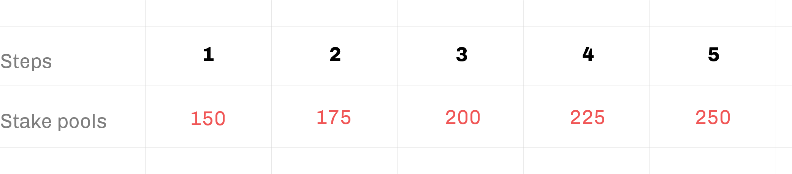
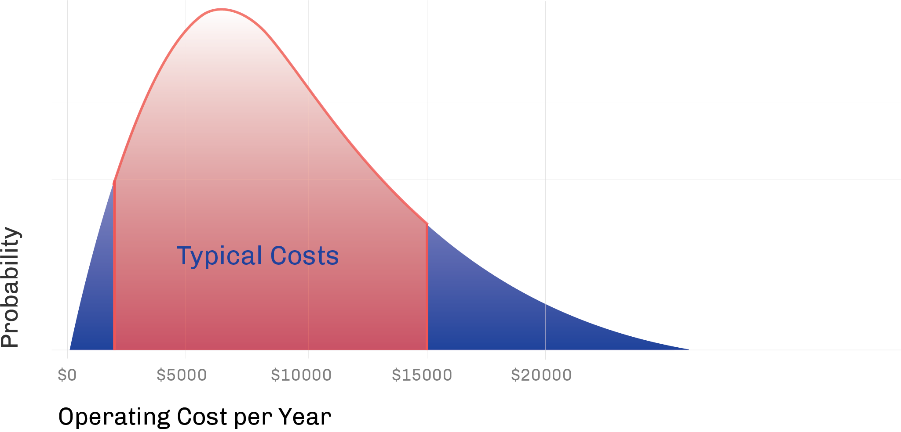
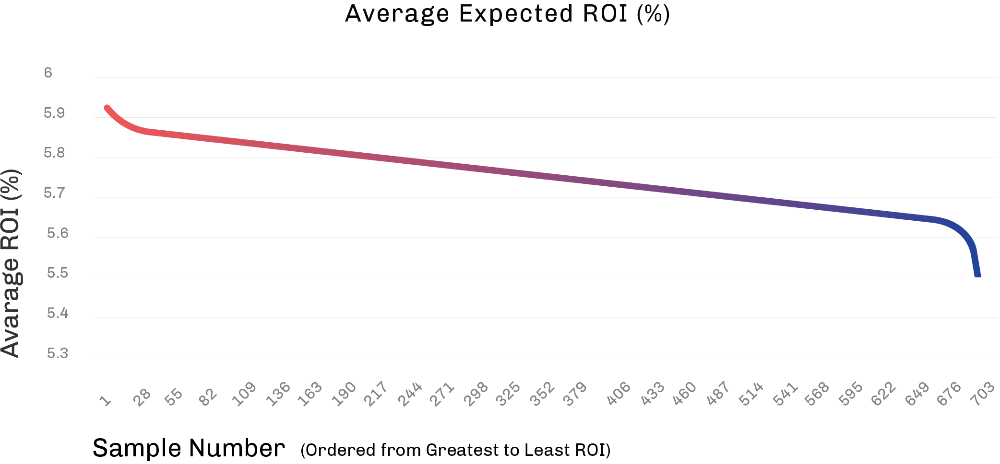

# Iterating for growth with IOHK research
### **Building key values into the Cardano ecosystem**
 25 June 2020[ Lars Brünjes](tmp//en/blog/authors/lars-brunjes/page-1/) 11 mins read

### [**Lars Brünjes**](tmp//en/blog/authors/lars-brunjes/page-1/)
Education Director

Education

- 
- 
- 
- 

Setting solid parameter values – while maintaining flexibility for the future – will be key to the growth and ongoing decentralization of Cardano. After consulting with the community, and working closely with my colleagues Kevin Hammond and Alex Appledoorn, we believe we’ve identified a good place to start.

The behavior of Cardano Shelley is controlled by around 20 parameters, and values have to be set for all of those before we launch the mainnet. Most of these parameters are technical in nature, so while setting them correctly is important to guarantee the safety and optimize performance of the system, their particular values do not have a significant influence on user experience.

Some parameters are different, though. They determine the level of centralization and sustainability of the Cardano ecosystem. They also drive the economics of delegation and of operating a stake pool. Choosing good values for these is exceedingly complicated, because we have to carefully balance a number of important considerations; security, performance, stability, sustainability, decentralization, fairness and economic viability. 

With all parameters on the Cardano blockchain, we have three distinct goals to keep in mind:

- We want to be truly decentralized, so that no one party can threaten the integrity of the chain
- We want the stake pool operators to be incentivized to keep supporting our chain
- We do not want these incentives to significantly change at any singular point in time in a way that might negatively affect the stability of the operators’ income

We want to give equal opportunity to everyone who wants to participate in Cardano and run a stake pool. However, parameter values that might seem fair and reasonable for smaller pools can become challenging for larger pools and vice versa. For example, large pools could find it easy to put down a higher pledge than small pools can afford. Small pools, on the other hand, might be able to operate with far lower costs than larger pools.

We also consider it imprudent to change parameters too frequently, because this might negatively affect the stability and predictability of the operators’ income. Taking all of this under consideration we came up with some recommendations for initial choices of parameter values which we will outline here.

However, we do not want to stop there. With decentralization comes democracy. Our community must have a say in how the chain is governed. For this reason, we will run with these numbers initially and issue a Cardano improvement proposal, where the community can vote on optimal chain parameters. In the end, the governance of Cardano will be in the hands of the Cardano community, who we feel confident are the best people to advise us.
# **Desired number of stake pools**
The desired number of stake pools *k* is an important parameter. Cardano incentives have been designed to encourage an equilibrium with *k* fully saturated pools, which means that rewards will be optimal for everybody when all stake is delegated uniformly to the *k* most attractive pools.

The higher *k* chosen, the more decentralized the system becomes. But a higher *k* also leads to a less efficient system (higher costs, more energy consumption) and lower rewards for both delegators and stake pool owners. Based on what we have learned from both the Incentivized Testnet (ITN) and the Haskell Shelley testnet, we know that our community is highly motivated to set up pools and support the chain with hundreds within a matter of weeks.

This tells us that some measure of decentralization can – and will – happen relatively quickly. But decentralization alone is not enough. Cardano needs a long term commitment from its operators, and conversely, operators need to be sufficiently incentivized to keep supporting the system.

To strike a balance between decentralization and these incentives for stake pool operators, we are proposing an initial *k*=150 and then to gradually increase that value. We believe this will ensure that the system is stable and efficient in the beginning, and can gradually grow over time to become more decentralized (and even more secure) later on:

The number of 150 stake pools of roughly equal size makes Cardano an order of magnitude more decentralized than any other blockchain. And this is only the beginning. There is no reason why there could not be thousands of stake pools in the future.
# **Monetary expansion**
Staking rewards for both delegators and stake pool operators are taken from two sources; transaction fees and monetary expansion. Specifically, every epoch, all the transaction fees from every transaction from all blocks produced during that epoch are put into a virtual 'pot'. Additionally, a fixed percentage, *ρ*, of the remaining ada reserves is added to that pot. Then a certain percentage, *τ*, of the pot is sent to the treasury, the rest is used as epoch rewards.

This mechanism ensures that in the beginning, when the number of transactions is still relatively low, because users are just starting to build their business on Cardano, the portion of rewards taken from the reserves is high. This provides a great incentive for early adopters to move quickly and benefit from the high initial rewards. Over time, as transaction volume increases, the additional fees compensate for dwindling reserves.

This mechanism also ensures that available rewards are predictable and change gradually. There will be no sudden 'jumps' comparable to bitcoin halving events every four years. Instead, the fixed percentage taken from remaining reserves every epoch guarantees a smooth exponential decline.

So what value should *ρ* have? And how much should go to the treasury? This is again a trade off: higher values of *ρ* mean higher rewards for everybody initially and a treasury that fills faster. But higher values of *ρ* also mean faster reserve depletion. It is certainly important, especially in the beginning, to pay high rewards and incentivize early adopters. But it is also important to provide a long term perspective for all stakeholders.

As explained above, Cardano will never run out of reserves; look instead at an exponential decay. To get a feeling for the impact of a specific value of *ρ*, one can calculate the 'reserve half life', the time it takes for half of the reserve to have been used up.

After much deliberation, we arrived at a suggestion of 0.22% for *ρ*. When you crunch the numbers, you get around four to five years as 'reserve half life' for this. In other words, every four to five years, half of the remaining reserve will be used. This is close to the 'bitcoin half life' of circa four years, so Cardano reserves will deplete at about the same rate as bitcoin reserves.

It is worth noting here that it took Bitcoin around eight years to reach its peak of maximum adoption and price. We therefore feel that it makes sense to expect Cardano transaction volume and exchange rate to increase sufficiently over the next eight years to more than make up for the decrease of monetary expansion during that time.
# **From reserves to treasury**
We also propose an initial value of 5% for *τ*, the percentage of rewards automatically going to the treasury every epoch. This means that at least 380,000,000 ada will be sent from the reserves to the treasury over the next 5 years.

However, the real amount going to the treasury will be significantly higher. First of all – again taking learnings from the ITN, but also predicting the use of ada in the future – it’s unreasonable to assume that all ada will be delegated. Some of it will be locked-up in exchanges, be transacted and used in various smart contracts. The ada that is not being delegated will produce unclaimed awards. Those 'unclaimed rewards' also go to the treasury, which will bump the amount to around 1,900,000,000 ada.

Secondly, we do not expect the pledge of most pools to be particularly high, just high enough to make it unattractive to launch a Sybil attack. The difference between potential pool rewards with a very high pledge and pools with the more realistic pledge level we expect goes to the treasury as well and will add an additional 1,000,000,000 ada over the first five years. The sum of all the ada flowing to the treasury means that there will be sufficient funds to pay for new exciting features and extensions for the foreseeable future.
# **Pledge influence factor & minimum operational cost settings**
Ada that is pledged by pool owners provides essential protection against 'Sybil' attacks by ensuring that delegated stake is not excessively attracted to pools whose owners try to attack the system by creating a large number of pools without themselves owning a lot of stake. Myself, Kevin Hammond and Duncan Coutts covered this in some detail recently on the [Cardano Effect](https://www.youtube.com/watch?v=X-ziLksiPOE) show.

The pledge influence factor directly affects the rewards that a pool earns: the higher the influence factor, the more of a difference a higher pledge makes on rewards. A higher influence factor increases the level of Sybil protection and makes the system safer and more secure, but it also gives an advantage to stake pool owners that can afford a higher pledge.

Higher pledge can be used to compensate for higher operational costs, meaning that a pool with relatively high costs can maintain suitable rewards and remain attractive to delegators by increasing its pledge. We have tested a variety of pledge influence factors under various real world conditions (about a million simulations in all). The influence factor can range between 0 and infinity. Our chosen initial setting of 0.3 is designed to balance the level of Sybil protection against the required pledge.

There is no minimal pledge, though. Pool operators can set the pledge as low or as high as they like. Rewards are influenced by their choice, but there is no 'hard' rule forcing them to pledge a specific amount. This means that ultimately, pool pledges will be as high as pool owners are willing to make them, and it will be up to our community to find a sweet spot between protection against attacks, economic considerations and the desire for fairness and equal opportunity.

The minimum operational cost setting ensures that the pledge influence factor is effective, by avoiding a 'race to the bottom' where pool owners claim excessively low operating costs in order to gain a competitive advantage. While this might benefit ada stakeholders in the short term, the long-term effect would be to risk the health of the Cardano network by disincentivizing professional pool operation.

Distribution of Typical Pool Operating Costs per pool per year, obtained from a survey of experienced pool operators in May 2020.

Genuine low cost operators can greatly benefit from the minimum operational cost, because the difference between the minimal cost and their actual cost provides them with additional income on top of their margin and their staking rewards. Our research shows that typical operating costs are expected to be in the $2,000-$15,000 range per pool per year, as shown in the diagram above. We have therefore chosen a setting of $2,000 for the minimum operational cost.

Estimated Range of Average Return on Investment (ROI) for Stake Pools assuming a Monetary Expansion Rate of 0.22% per epoch.

Finally, we calculated the expected returns for stake pools under a range of different real world scenarios (about 150,000 pools in total). We used the settings for the influence factor, monetary expansion and minimum cost that were given above and varied the targeted number of pools between 150 and 500. Our results show that given the distribution of costs that we showed in the diagram above, stake pools will achieve sustainable ROIs of between 6%-6.5% on average, using today’s ada to dollar conversion rate. The ROIs would, of course, be even better if the value of Ada were to appreciate.
# **Conclusion**
Choosing good values for all Cardano Shelley parameters is a hard and complicated endeavor, because a lot of concerns have to be balanced – security, efficiency and stability of the system on the one hand versus economic viability for stake pool operators and delegators and long-term sustainability of the ecosystem on the other hand.

No other blockchain has ever done what we are going to do, we are charting new territory with every step and move at the cutting edge of science and technology, so we can’t rely on existing data and statistics or past experience, but have to use educated guesses and mathematical models, which can never be perfect, more often than not.

We did our best to come up with a reasonable proposal, but we know it will have to be improved upon over time. The values proposed here are just a start, and we will closely work with our Community to refine and adjust them over the coming months and years.
