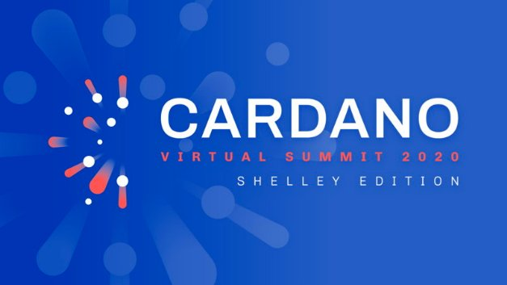

# Bringing the community together for the Cardano Virtual Summit 2020: Shelley Edition
### **Celebrating the journey and making way for the future with IOHK**
 30 June 2020[ Eric Czuleger](tmp//en/blog/authors/eric-czuleger/page-1/) 4 mins read

### [**Eric Czuleger**](tmp//en/blog/authors/eric-czuleger/page-1/)
Senior Content Editor

Marketing & Communications

- 
- 
- 

Shelley has arrived and IOHK is gearing up to celebrate with the [Cardano Virtual Summit 2020: Shelley Edition](https://cardanosummit.iohk.io/) on July 2nd and 3rd. Every presentation, panel and guest speaker at this online event, has been chosen to represent the many faces of Cardano. From world-class foundational research to the latest advances in cryptographic development; from the passion and dedication of the wider community to some of the innovators who have created our world and are lighting the path to the future. The event is meant to honor the hard work and dedication of the Cardano community, developers and contributors, and the wider ecosystem.

The virtual summit, much like IOHK’s 2019 Miami summit will include presentations from IOHK team members, special guest appearances by thought leaders and a keynote speech by IOHK CEO, Charles Hoskinson. We were proud to announce that our guest of honor is internet co-creator and lead internet evangelist for Google, Vint Cerf. As one of the lead architects of the internet Vint is uniquely positioned to give us insight into building world changing technology.

We’ll also be joined by Caitlin Long of the Wyoming Blockchain Select Committee. The Wall Street professional turned crypto pioneer has been blazing the trail for adoption in the state of Wyoming. She will give us a look at the challenges and opportunities she has faced while pushing for wider adoption of decentralization. Our final special guest, Stephen Wolfram is the creator of the computational knowledge platform Wolfram Alpha and the CEO of Wolfram Research. Cardano shares his dedication to advancing technology through open source research and a commitment to academic excellence. Between each of these important discussions our colleagues at IOHK will take center stage.
## **Thought leadership**
IOHK’s chief scientist, Aggelos Kiayias, and director of African operations John O’Connor will talk about research and outreach in the Cardano Blockchain. Our panel entitled ‘Haskell, then, now, and the future’ will examine the impact the functional programming language has had and where it is heading. The virtual summit also serves as the launchpad for new advancements like ‘Prism’ our decentralized identity solution. More guest speakers will be announced over the week ahead and we’ll also have a number of special announcements over the 2-day summit itself; we’re keeping those under our hats until then.

The two day [agenda](https://cardanosummit.iohk.io/images/virtual-summit-agenda.pdf) includes five digital stages with programs dedicated to the ideology of blockchain technology; the science of decentralization, and building distributed ledgers for business and enterprise. We will be discussing next steps for growing the Cardano community alongside oncoming blockchain regulations, governance, and opportunities. In combination, we hope the summit tracks will offer something for anyone interested in the future of Cardano, by the science and ideas that surround it, by the great minds making it all happen and by the incredible community that has brought us here and will take us forward.

Sessions will encompass the philosophical as well as the technical. Brian Behlendorf, the CEO of the Hyperledger Consortium will form part of a panel focused on the importance of open source development. IOHK recently [joined](https://iohk.io/en/blog/posts/2020/06/11/why-we-are-joining-hyperledger/) the Hyperledger Consortium, to better exploit our common vision of a future made better through shared knowledge. Following on the philosophy track, artificial intelligence researcher, Ben Goertzel will speak on the intersection of AI and decentralized technology. We hope to announce more exciting sessions in the days leading up to the event. At the end of the day, building the next generation of technology means bringing the best minds of many fields into the same room, even if it’s a virtual one.
## **Building community**
The Cardano Virtual Summit 2020: Shelley Edition, won’t be all work and no play. The Covid crisis has forced every conference online in past months. While we can’t recreate the full physical conference experience in the virtual space, we’re keen to provide some of the networking and downtime opportunities you might expect. So we’ve added a virtual ‘chill-out’ zone, with guided meditations, a DJ set, and even an online calligraphy lesson/demonstration. Our virtual platform will allow attendees to enjoy the digital expo space through avatars. We’ll even get the conversation flowing with a digital Shelley cocktail ‘happy hour’ between meetings.

Recent events have made it difficult to meet in person but we see The Cardano Virtual Summit as an opportunity to invite everyone from around the world to participate. Attendance for anyone interested in the summit is absolutely free of charge. To join in, simply [reserve](https://www.ubivent.com/register/cardanovirtualsummit) your spot.

Shelley is the culmination of over 5 years of research and development, the creation of a multi-disciplinary team and a remarkable community. The virtual summit is just a single point of time – a time to take stock, reflect and celebrate. But it marks just the start of a groundbreaking new era of decentralization, growth and adoption.
