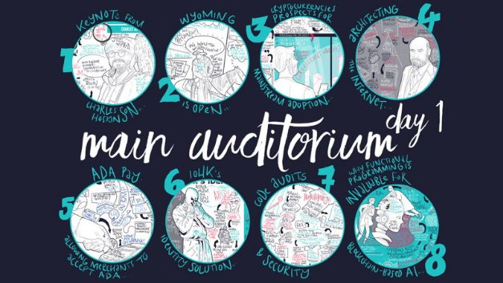

# Cardano Virtual Summit 2020: Shelley Edition
### **Bringing the global community together under one virtual roof.**
 3 July 2020[ Tim Harrison](tmp//en/blog/authors/tim-harrison/page-1/) 5 mins read

### [**Tim Harrison**](tmp//en/blog/authors/tim-harrison/page-1/)
VP of Community & Ecosystem

Communications

- 
- 
- 
- 

Day One of the Cardano Virtual Summit 2020: Shelley Edition started with a splash. IOHK CEO, Charles Hoskinson, took the stage to welcome almost 10k registered attendees from around the world to the digital conference space. Each participant was met with exhibition areas, lots of virtual hangout space, and most importantly, session programming across five digital stages, covering everything from governance and community, to science and enterprise. With so much content to enjoy, we can’t hope to summarize it all here. So take a look for yourself. [Register now](https://cardanosummit.iohk.io/) to enjoy all of today’s sessions either live or on-demand right after the summit closes this evening. 

To bring you up to speed, here are the key take-outs from Thursday.
### **Shelley is here**
The summit comes right after a significant milestone in the Shelley rollout. The pace of delivery has been ramping up considerably over the last couple of months, leading to the June 30th deployment of the first Shelley-complete node. The stage is now set for the continued rollout, with a high degree of confidence in the dates we have laid out, with delegation and staking due on mainnet in August. However, the confirmation of Shelley’s successful deployment was just the first of many announcements at the summit.
### **Goguen and Voltaire are coming**
Within 120 days, we’ll be rolling out the native asset standard for Cardano. Within 150 days, we’ll see the roll-out of Plutus Foundations, the first point of entry for smart contracts on Cardano. Sustaining a decentralized project means more than simply allowing users to run the protocol and build on the platform. They must also decide what the platform does and where it goes. Project Catalyst and Voltaire seek to give that power to the community through decentralized democracy. A pool of funds and a voting protocol will allow the Cardano community to make their voices heard on proposed advancements to the blockchain. Ada holders will also be able to submit improvement proposals to help shape the direction of the ecosystem. Improvement proposals might include software updates, technical development options, funding decisions, and choices about the long-term plans of the ecosystem. Once delivered, the Cardano network will become a self-governed and user-run platform. 
### **Atala PRISM**
Day One continued on a successful note with the announcement of [PRISM](https://atalaprism.io/), a decentralized identity solution that enables people to own their personal data and interact with organizations seamlessly, privately, and securely. It will encourage better practice in consumer data privacy and security by offering users ‘self-sovereign’ digital identities, without Big Tech intermediaries accessing, storing or sharing personal data.

PRISM also promises to open up access to a blockchain marketplace of financial and social services for millions of users who might not previously have had access to banking and financial services. This will enable low-income populations to store and share personal information like credentials, land deeds, and health records. Through PRISM, users can also access financial products like loans and insurance.

Atala PRISM is built for compatibility with other blockchains and legacy systems to make it accessible worldwide. A pilot currently underway in Georgia will give employers the ability to verify graduate qualifications instantly. But PRISM is only one part of a suite of enterprise-grade ‘layer 2’ software solutions designed to bring advanced, highly flexible functionality to blockchains. Other elements of the evolving Atala suite of products include traceability for supply chains and the ability to monitor the movement of goods globally.

In an impressive [demo](https://atalaprism.io/credentials), the team showcased the platform and mobile app with a smart city walkthrough. The app will work with Android and iOS devices, while the platform also supports paper wallets and smart cards.
### **cFund**
Last but not least, we announced a landmark partnership with Wave Financial Group. The $10 million dollars pledged to the development of Cardano’s ecosystem represents the first venture capital to support IOHK. Together, the two companies will generate a $20 million dollar incubator fund to help startups who want to build on the blockchain. This provides several years of financial runway to target seed and early-stage opportunities. Wave Financial is looking to invest in global companies created on Cardano by giving funding of up to $500k. The move aligns both firms’ interests in driving Wave to become the industry’s leading digital asset management group while ensuring IOHK becomes the vanguard technology provider in the space.

We’ll revisit all these stories over the weeks ahead to give you a deeper dive into our plans and what they mean. But, as excited as we are by these opportunities for future adoption and growth, Day One was also a day of reflection.

Because we would not be where we are without the incredible support of the Cardano community, which helped to bring us here and joined from all around the world to celebrate Shelley. Connections were made between companies, platforms... and people. Day One was full of big announcements, and boosted by some fascinating speaker sessions with world-class scientists, technologists, and thought leaders sharing their vision of the future. It was also full of optimism, of ideas, buzzing with community contribution and opportunity. Thanks to everyone who helped make it such a special day. And see you back at the summit later today!
