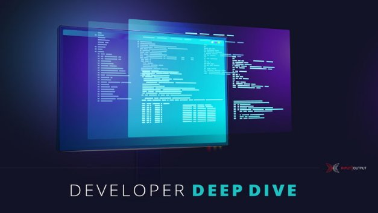

# Cardano’s path to decentralization
### **Three mini-protocols are vital to the network’s operation**
 9 July 2020[ Marcin Szamotulski](tmp//en/blog/authors/marcin-szamotulski/page-1/) 6 mins read

### [**Marcin Szamotulski**](tmp//en/blog/authors/marcin-szamotulski/page-1/)
Software Engineering Lead

Engineering

- 
- 
- 
- 

The next releases of Cardano and the Ouroboros protocol contain changes that guide us towards decentralization and the Shelley era. This Deep Dive post explains how we are approaching this phase. With the release of the Praos algorithm for Shelley, which comes with the staking process, stake pools can be set up so ada owners can delegate their stake. The networking team is focused now on two features that will enable us to run a fully decentralized system. Let me first briefly describe how the networking is designed and engineered and give an overview of where we are at the moment. This post will start at the top of our abstractions and go down the stack. Hopefully, this will be an interesting journey through our design.
## **Typed protocols**
At the very top of the stack is IOHK’s typed-protocols framework, which allows us to design application-level protocols. The top-level goal of protocol design for Ouroboros is to distribute chains of blocks and transactions among participants in the network and that is achieved by three mini-protocols:

- *chain-sync* is used to efficiently sync a chain of headers;
- *block-fetch* allows us to pull blocks;
- *tx-submission* is used to submit transactions.

All three mini-protocols were carefully designed after considering the threats that can arise running a decentralized system. This is very important, because cyber attacks are very common, especially against targets that present strong incentives. There is a range of possible attacks at this level that we need to be able to defend against and one type that we were very careful about is resource-consumption attacks. To defend against such attacks, the protocols allow the consumer side to stay in control of how much data it will receive, and ultimately keep use of its resources (eg, memory, CPU, and open file descriptors) below a certain level.

If you are interested in more details about typed-protocols, we gave talks and ran workshops at Haskell events last year and these were very well received by the engineering community. In particular, see the talk by [Duncan Coutts talk at Haskell eXchange](https://skillsmatter.com/skillscasts/14633-45-minute-talk-by-duncan-coutts) and the workshop I ran at [Monadic Party](https://www.youtube.com/watch?v=j8gza2L61nM).
## **Role of the multiplexer**
TCP/IP protocols form the most ubiquitous protocol suite deployed on the internet. They are also some of the most studied protocols and are available on almost every operating system and computer architecture, so are a good first choice for our purposes. TCP/IP gives us access to a two-way communication channel between servers on the internet. The only high-level requirement of typed-protocols is an ordered delivery of network packets, which is guaranteed by the TCP protocol.

Operating systems limit the number of connections at any one time. For example, Linux, by default, can open 1,024 connections per process, but on macOS the limit is just 256. To avoid excessive use of resources we use a multiplexer. This allows us to combine communication channels into a single one, so we can run all three of our mini-protocols on a single TCP connection. Another way to save resources is to use the bi-directionality of TCP: this means that one can send and receive messages at both ends simultaneously. We haven't used that feature in the Byron Reboot era, but we do want to take advantage of it in the decentralized Shelley era.
## **The peer-to-peer-governor**
We want to use bi-directional connections, running all three mini-protocols in both directions, so we need to have a component that is aware which connections are currently running. When a node connects to a new peer, we can first check if it already has an open connection with that peer, which would be the case if the peer had connected to it already. But this is only one part of connection management that we will need.

Another requirement comes from the peer-to-peer governor. This part of the system is responsible for finding peers, and choosing some of them to connect to. Making a connection takes some time, depending on factors such as the quality of the network connection and the physical distance. Ouroboros is a real-time system, so it is good to [hide some latency](https://link.springer.com/referenceworkentry/10.1007%2F978-0-387-09766-4_415) here. It wouldn't be good if the system was under pressure and yet still needed to connect to new peers; it's much better if the system maintains a handful of spare connections that are ready to take on any new task. A node should be able to make an educated decision about which existing connections to promote to get the best performance. For this reason we decided to have three type of peer:

- *cold peers* know about their existence, but there is no established network connection.
- *warm peers* have a connection, but it is only used for network measurements and none of the node-to-node mini-protocols is used;
- *hot peers* have a connection, which is being used by all three node-to-node mini-protocols.

A node can potentially know about thousands of cold peers, maintain up to hundreds of warm peers, and have tens of hot peers (20 seems a reasonable figure at the moment). There are interesting and challenging questions around the design of policies that will drive decisions for the peer-to-peer governor. Choice of such policies will affect network topology and alter the performance characteristics of the network, including performance under load or malicious action. This will shape the timely distribution of block diffusion (parameterized by block sizes), or transactions. Since running such a system has many unknowns, we'd like to phase it into two parts. For the first phase, which will be released in a few weeks (probably shortly after Praos, also known as the Shelley release), we want to be ready with all the peer-to-peer components but still running in a federated mode. In addition, we will deliver the connection manager together with implementing a server accepting connections, and its integration with the peer-to-peer governor. In this phase, the peer-to-peer governor will be used as a subscription mechanism. Running various private and public testnets, together with our extensive testing should give us enough confidence before releasing this to mainnet. 

In the second phase, we will extend the mini-protocols with a gossip protocol. This will allow exchange of information about peers, finalize network quality measures, and plug them into the block-fetch logic (which decides from whom to download a block) as well as the peer-to-peer governor. At this stage, we would like to design and run some experiments to discover how peer-to-peer policies shape the network, and check how they recover from any topologies that are suboptimal (or adversarial).

I hope this gives you a good sense of where we are with the design and implementation of decentralization for Cardano, and our roadmap towards the Shelley era. You can follow further progress in our [weekly reports](https://roadmap.cardano.org/en/status-updates/).

*This is the third of the Developer Deep Dive technical posts from our software engineering teams.*
