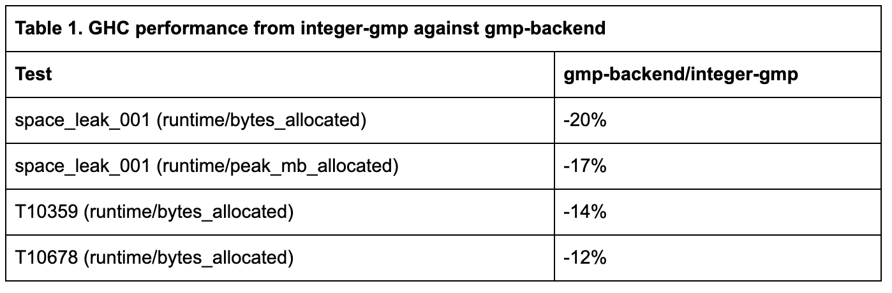
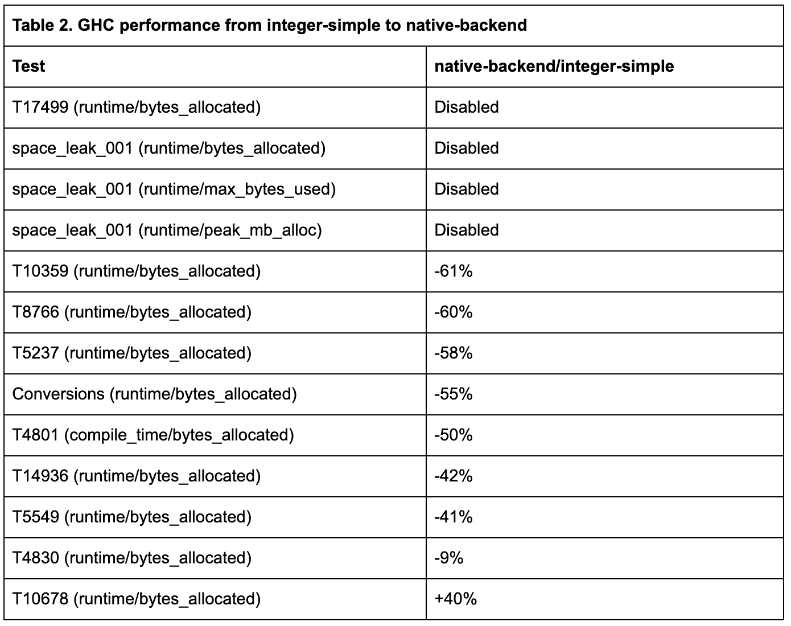
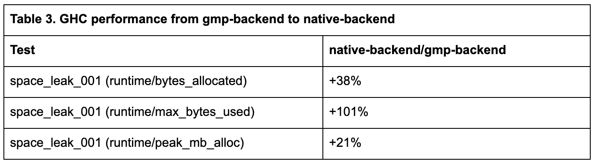

# Improving Haskell’s big numbers support
### **Work by IOHK engineers is part of the latest release of the Glasgow compiler**
 28 July 2020[ Sylvain Henry](tmp//en/blog/authors/sylvain-henry/page-1/) 9 mins read

### [**Sylvain Henry**](tmp//en/blog/authors/sylvain-henry/page-1/)
Software Engineer

Engineering

- 
- 
- 
- 

Haskell is vital to IOHK’s work in ensuring Cardano is a secure blockchain for the future of decentralized finance. As part of this, we use the language to develop the [Plutus smart contract platform](https://prod.playground.plutus.iohkdev.io/tutorial/), and you may have read about the training courses run by our engineers, including a [Haskell course in Mongolia](https://www.montsame.mn/en/read/231778) this month. Smart contract applications are a powerful way for a distributed network to generate value, allowing individuals and businesses to agree to conditions and automatically execute exchanges of information and wealth, without relying on third parties. Plutus contracts contain a substantial amount of code that is run off the chain, on users’ computers. To make it easy to create portable executables for these, we want to compile the off-chain Haskell code into JavaScript or WebAssembly. To reach that goal, we take part in the development of the Glasgow Haskell Compiler ([GHC](https://www.haskell.org/ghc/)), [GHCJS](https://github.com/ghcjs/ghcjs) (Haskell to JavaScript compiler) and [Asterius](https://github.com/tweag/asterius/) (Haskell to WebAssembly compiler).

Recently we have been working on improving GHC’s support for big numbers, ie, numbers larger than 64-bit (both Integer and Natural types in Haskell). We have developed an implementation of big number operations in Haskell that is faster than the previous one (integer-simple). We have also improved the way GHC deals with the different implementations to make it more robust and evolutive. These contributions are part of the [latest GHC release, version 9.0](https://gitlab.haskell.org/ghc/ghc/-/wikis/status/ghc-9.0.1).
## **Background**
Every Haskell compiler has to support arbitrary-precision integers (see [Haskell 98](https://www.haskell.org/onlinereport/basic.html#sect6.4) and [Haskell 2010](https://www.haskell.org/onlinereport/haskell2010/haskellch6.html#x13-1350006.4) reports, section 6.4). GHC is no exception and as such it provides the ubiquitous Integer and Natural types (‘big numbers’ for the rest of this post).

Until now, GHC could use one of two packages for this support:

- integer-gmp: use [GNU MP library (GMP)](https://gmplib.org) (via FFI), LGPL. Good performance.
- integer-simple: Haskell implementation, BSD3. Bad performance.

Choosing one or the other depended on license, performance and cross-compilation considerations. In some cases, GMP’s LGPL license can be problematic, [especially if you use static linking](http://www.gnu.org/licenses/gpl-faq.html#LGPLStaticVsDynamic), which is required on some platforms, including [Windows](https://gitlab.haskell.org/ghc/ghc/wikis/windows-dynamic-linking). When it comes to performance: integer-simple is sometimes several orders of magnitude slower than integer-gmp, as discussed below. And with cross-compilation, some target platforms may not support GMP, such as JavaScript.

The situation was already unfortunate but there were additional issues:

1. Each implementation had its own way of representing big numbers (array of unboxed words or list of boxed words). GHC was aware of the selected implementation and produced different code for each. It could lead to bugs – even ‘[insanity](https://gitlab.haskell.org/ghc/ghc/issues/15262)’! – when big numbers were exchanged between processes compiled with different implementations. Moreover, it made the compiler code more complicated because it had to deal with this discrepancy (eg, when inspecting heap objects at runtime in GHCi).
1. Similarly, because of the different internal representations, there are at least [71 packages on Hackage](https://packdeps.haskellers.com/reverse/integer-gmp) (among them some widely used ones such as bytestring and text) that explicitly depend on integer-gmp package or that provide a flag to depend either on integer-gmp or integer-simple. It is a maintenance burden because each code path could have specific bugs and should be tested on CI.

All this meant that every new big number implementation was a daunting task. First, the interface to implement was very large (Integer and Natural types and all their operations). Then, we needed to ensure that GHC’s rewrite rules (constant folding) still worked for the implementation, the packages mentioned above needed to be fixed, and new Cabal flags added (by the way, Cabal flags are Boolean so they can’t be easily extended to support more than two options). Finally, GHC’s build system needed to be modified. No wonder it never happened.

Fortunately, most of these issues are now fixed in the latest release, GHC 9.0.
## **The ghc-bignum package**
Starting from GHC 9.0, big numbers support is provided by a single package: ghc-bignum. This provides a Haskell implementation of big numbers (native-backend) that is faster than integer-simple’s (performance figures are given below), is also BSD3-licensed, and uses the same representation of big numbers as integer-gmp.

Now the different big numbers implementations are considered as internal backends of ghc-bignum library and there should be no observable difference between backends, except for performance. To enforce this, we even have a meta-backend used during tests that performs every operation with two backends (native-backend and another selected one) and checks that their results are the same.

A pure Haskell implementation can't really expect to beat the performance of heavily optimized libraries such as GMP, hence integer-gmp has been integrated into ghc-bignum as a backend (gmp-backend).

Adding a big numbers backend is now much easier. The interface to implement is minimal and is documented. A new backend doesn’t have to provide the whole implementation up front: operations provided by native-backend can be used to fill the holes while another backend is being developed. The test framework doesn’t have to be rewritten for each backend and results can be checked automatically against native-backend with the meta-backend mentioned above. We hope backends using other libraries, such as [OpenSSL libcrypto integers](https://github.com/ghc-proposals/ghc-proposals/pull/183) or [BSDNT](https://github.com/wbhart/bsdnt), will be developed in the near future.

The ghc-bignum package also has a third ffi-backend that doesn’t provide an implementation per se but performs FFI calls for each operation. So ghc-bignum must be linked with an object providing the implementation or the compiler should replace these calls with platform-specific operations (eg, JavaScript/CLR/JVM big numbers operations) when this backend is selected. It is similar to what the Asterius compiler was doing – replacing GMP FFI calls with JavaScript BigInt calls – but in a cleaner way because GMP isn’t involved any more.

A major advantage of ghc-bignum is that all the backends use the same representation for big numbers: an array of words stored in little-endian order. This representation is also used by most big numbers libraries. Formerly, integer-simple was a notorious exception because it used a Haskell list to store the words, partly explaining its poor performance. Now, any package wanting to access the representation of the big numbers just has to depend on ghc-bignum. Cabal flags and CPP code are no longer required to deal with the different implementations. However, conditional code may be needed during the transition from integer-\* packages to ghc-bignum. 

To make the transition easier, the integer-gmp-1.1 package is still provided but it has been rewritten to depend on ghc-bignum and to provide some backward-compatible functions and pattern synonyms. Note, however, that some functions that were only available in integer-gmp-1.0.\* (eg, prime number test, extended GCD) have been removed in integer-gmp-1.1. We expect these very specific functions to be exported by packages such as [hgmp](https://hackage.haskell.org/package/hgmp) instead. Alternatively, someone could implement Haskell versions of these functions into native-backend.

GHC code has been simplified and made faster. Big numbers types and constructors are now known to the compiler (‘wired-in’), in the same way as other literals, so GHC doesn’t have to read interface files each time it wants to generate code using them. The unified representation avoids any need for two code paths, which makes the code more robust and easier to test. 
## **Performance**
We have compared the performance of native-backend against latest integer-simple and integer-gmp implementations (Figure 1). We measured the time necessary to compute basic operations:

Platform was Linux 5.5.4 on Intel Core i7-9700K CPU running at 3.60GHz. The three GHC bindists have been built with Hadrian using ‘perf’ flavor. integer-gmp and integer-simple bindists are built from commit 84dd96105. native-backend bindist is built from ghc-bignum branch rebased on commit 9d094111.

Computations have been performed with positive integers of the following sizes: small – 1 word (64-bit); medium – 8 words (512-bit); big – 76 words (4,848-bit).

Figure 1. Native-backend and integer-gmp are faster than integer-simple in almost all cases (note the logarithmic scale)

Figure 1 shows that native-backend and integer-gmp are always faster than integer-simple. The only exceptions are when we add or subtract a small number (1 word) from a big one as these operations are particularly well suited for integer-simple’s bignum representation (a list) because the tail of the list remains unchanged and is shared between the big numbers before and after the operation. With the other representation, the tail has to be duplicated in memory.

Division with integer-simple performs so badly that native-backend is 40 times faster in all the tested cases.

Sometimes, native-backend is faster than integer-gmp (eg, addition/subtraction with a small/medium number). GMP library is probably at least as good as native-backend but the latter avoids FFI calls, which may explain the better performance. Otherwise, native-backend is still slower than integer-gmp but these results are expected because it only implements basic algorithms and it doesn’t use vectorised or optimised processor instructions.

When it comes to GHC performance tests, we took our baseline as GHC HEAD compiled with integer-gmp. We compare the results with ghc-bignum's gmp-backend. There are no regressions. Noticeable improvements in memory use are seen in Table 1.

Next, we compared metrics obtained with native-backend to those obtained with GHC HEAD built with integer-simple. The new Haskell implementation results in noticeable changes (Table 2). Note that the first four tests were disabled with integer-simple because they took too long or failed to complete (heap overflow) but they all passed with native-backend. Also, T10678, the final test in the table, performs a lot of additions of a small number to a big number. As we saw above, this is the only case for which integer-simple representation is better: in most iterations only the head of the list is modified without duplicating the tail. It is reflected again in this result.

Finally, we compared native-backend with gmp-backend: it tells us how far our Haskell implementation is from our best backend. Noticeable changes are reported in Table 3.

## **Conclusion**
We are very proud to have made this contribution to GHC. IOHK and the whole community now benefits from the improved performance and robustness of the compiler. Programs that use the new Haskell implementation of big numbers (native-backend) should get a performance boost when they switch from integer-simple.

We are also eager to see what the community will do with this work. In particular, it should now be easier to create backends based on other libraries. There is also a lot of room for optimization in native-backend. We also encourage everyone to test this new implementation and to report any issue on [GHC’s bug tracker.](https://gitlab.haskell.org/ghc/ghc/-/issues)
