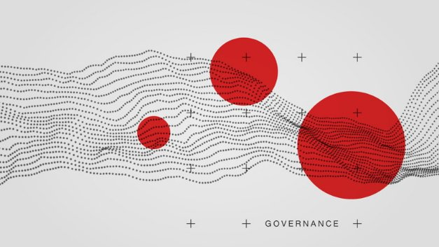

# Blockchain governance - from philosophy and vision to real-world application
### **Robust and effective community governance lies at the very heart of Cardano's decentralized vision, and Project Catalyst will test the theory this summer.**
 5 August 2020[ Olga Hryniuk](tmp//en/blog/authors/olga-hryniuk/page-1/) 8 mins read

### [**Olga Hryniuk**](tmp//en/blog/authors/olga-hryniuk/page-1/)
Technical Writer

Marketing & Communications

- 
- 

Taking a decentralized approach to governance and decision-making is proving to be more efficient in many spheres than the centralized, authority-based model that became the norm in so many areas in the last century. At IOHK, we believe that blockchain technology offers a way to encourage participation in collective action. And we are building just such a system, so Cardano can grow in a fair and decentralized way, with an open governance system that encourages global participation by granting ada holders the power to make decisions.
## **Decentralization is core to global governance**
As we’ve been working on this, the pandemic crisis has exposed weaknesses in our globalized economy and made it clear that everyone needs to reconsider the ways we collaborate in the face of challenging international situations. Over recent decades, the world has become ever more connected through digital infrastructure and social platforms. Therefore, robust tools and new behavior patterns are now necessary to improve the way we collaborate. 

In the past, large collective challenges had to be solved in a centralized manner by high-level actors governing from the ‘top’ down. In that governance model, power, authority, and control were decided and exercised at management level. This could be a chief executive, a president, or even a dictator determining the ‘best’ course of action. In this centralized system, once a decision is made, it becomes the law of the land, and new behaviors are enforced. However, the top-down model is inefficient for solving global-scale challenges. Dr Mihaela Ulieru, an adviser on digital ecosystems organization and transformation, spoke at the recent Cardano Virtual Summit about her vision of ‘bottom-up’ organic governance. There, she pointed out that hierarchical structures are rigid and less productive. Furthermore, they cannot deal efficiently with emerging complexity.

A centralized governance model depends on the limited knowledge, expertise, and understanding of a single individual or a body of actors. Decisions must then proliferate through the system to deal with emerging problems. This generates an inflexible response that lacks on-the-ground information from the people affected by a particular event. Therefore, the more complex and widespread a problem is, the less prepared a top-down organization can deal with it in a way that works for most people. So the question arises, how do we create a system that responds to emerging problems, aids decision-making, and remains all-inclusive?

Dr Ulieru reminds us that the bottom-up approach has been used in peer-to-peer networks to great effect allowing network participants to collaborate in a way that is reflective of the desires and needs of the community. [SoScial.Network](https://soscial.network/), launched by Jon Cole after Hurricane Harvey hit the southern US in 2017, is one example. This network enabled people and communities to gather and offer help to each other by providing aid to disaster victims. Another social network, [ChefsForAmerica](https://wck.org/chefsforamerica), delivers food to hospitals, the disadvantaged, and those in need. [AgeWell](https://www.agewellglobal.com/) created a peer-to-peer care delivery model that improves the well-being and health of elderly people, keeping them in their homes, while reducing their healthcare costs. Such activity, organized by individuals in a decentralized manner, can solve challenges faster and collaboratively.
## **Cardano decentralization**
For effective collaboration on decision-making, Cardano offers a decentralized network built on a blockchain for a higher level of security and transparency. It takes the networking peer-to-peer concept further and builds it into a global infrastructure. For Cardano to establish a solid governance model, it is important to ensure that everyone can participate in a transparent, accountable, and responsive way. As decentralization empowers individuals and communities to take action and collaborate, anyone can suggest a change, or an activity to be initiated, whether this is for social good or for technological progress. 

The question is, how to decide which change is crucial and what exactly will benefit everyone? Crucially, who will pay for its realization? To solve these issues, Cardano is establishing a global voting and treasury systems for funding the blockchain long-term development. Hence, decision-making and funding are two crucial components of governance. At IOHK, we worked to solve these issues and to provide the tools to empower decentralized governance and improve all our systems. 
## **Voltaire and ada holders**
For Cardano, a decentralized governance model should grant all ada holders the ability to decide what changes should be made for the ecosystem to grow and mature. When building an ecosystem for the next century rather than the next decade, the self-sustainability of the network becomes vital. Since individuals in the Cardano ecosystem are most affected by the decisions made about the protocol, it is important for them to understand how those decisions are made and how they are paid for, as well as how to participate in that process.

[Voltaire ](https://roadmap.cardano.org/en/voltaire/)is the era in Cardano development that deals with decentralized governance and decision-making. Voltaire focuses on the Cardano community’s ability to decide on software updates, technical improvements, and project funding. To provide the final components that turn Cardano into a self-sustainable blockchain, we need to introduce:

- A treasury system: a continuous source of funding to develop the Cardano blockchain.
- [Decentralized software updates](https://www.youtube.com/watch?v=eK1fAtubEyA&feature=youtu.be): the process enabling decentralized, open participation for fair voting on decisions about system advancements.

In line with that, IOHK’s engineers are implementing tools and social experiments to enable Cardano’s governance framework. Hence, we are working on:

- Cardano improvement proposals (CIPs): a social communication system for describing formal, technically-oriented standards, codes, and processes that provide guidelines for the Cardano community in a transparent and open-source way.
- Project Catalyst: an experimental treasury system combining proposal and voting procedures.

Project Catalyst focuses on making the treasury system a reality by establishing a democratic culture for the Cardano community. This goal will be achieved by a combination of research, social experiments, and community consent. Catalyst enables the community to make proposals, vote on them, and fund them according to their feasibility, auditability and impact. 

It is important to note that everyone has an equal right to propose changes and system enhancements, and that everyone is encouraged to collaborate on innovative and powerful proposals.

To ensure that everyone gets a say, we are establishing a ballot submission system where people can propose improvements. This may be a proposal to sustain a system, to market it, or perhaps a suggestion to improve an existing protocol. In addition, IOHK wants to enable our community to create products or applications aimed at solving challenges within the market. 

To suggest such contributions, people can submit ballots to the community. After the ballots are submitted, voting will decide which proposals can move forward.

Voting is the exercise of influence to decide which proposals get accepted or rejected. Only by encouraging everyone to participate can we ensure that preferences are determined in a democratic way. The value of Catalyst, though, lies not only in the technology improvement, but also in enabling the community to learn how to collaborate, make good decisions, and essentially, generate great proposals. So, decisions are taken through a robust set of voting protocols that we are developing. These will be evaluated by the community with the help of members who can put themselves forward as ‘experts’ to help explain proposals.

Although any ada holder can submit a proposal, the voting power of an individual is proportional to the amount of ada that is ‘locked’ into the system when people register. By voting, participants will influence decisions on which proposals to fund for network development and maintenance. This could also lead to the creation of educational materials, marketing strategies, technical improvements processes, and many other ideas.

Another feature of Catalyst is privacy. As in any political elections, this is key for preventing voter coercion and helping defend against corruption. So, Cardano is looking to implement a zero-knowledge proof for each vote. This cryptographic technique grants privacy by allowing the vote to be verified without it being publicly revealed. 
## **The treasury funds proposals**
A crucial aspect of a self-sustainable network is understanding who will fund decisions and proposals. To meet these needs, Cardano is introducing a self-sustainable treasury system to fund blockchain enhancements and maintenance. The main sources of capital will be refilled every epoch from a portion of stake pool rewards, and later from minted new coins, the percentage from fees, and additional donations or charity. 

Project Catalyst will maintain this constant source of funding. A steady income stream will support initiatives and improvements proposed by ada holders, while at the same time rewarding and incentivizing people who dedicate their time and effort to making productive decisions. This will enable the establishment of a decentralized system that promotes participation, collaborative decisions, and incentivization. Besides the funding purposes, Catalyst ensures that funds are used well, facilitating the flow of information so the community is able to assess proposals while addressing the most important needs of the ecosystem.

IOHK is building a decentralized financial system that can address the world's needs. Voltaire is the first step in this direction. Using a collection of concepts, tools, and experiments, we are creating a fully decentralized ecosystem that will democratize our blockchain, and open it to the world. 

*Want to help shape the future of Cardano? Project Catalyst is looking for 25 community members to join a focus group on the direction of the program, pitch their ideas, and test the platform and voting. If you have an idea that might be suitable for funding, or would like to join a panel assessing community ideas, [apply today](https://docs.google.com/forms/d/1ooKwWwylKQ0-krsCv4eQAELal1nHpsjUWlgr1cwWqSQ/viewform?edit_requested=true)! Please ensure you have a Telegram and an email account to apply by midnight UTC on Friday, August 7.*
