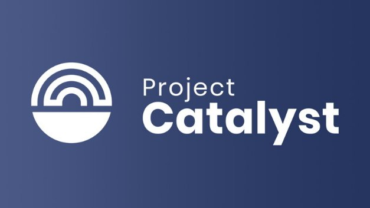

# Project Catalyst; introducing our first public fund for Cardano community innovation
### **An exciting experiment to start building the future of Cardano**
 16 September 2020[ Dor Garbash](tmp//en/blog/authors/dor-garbash/page-1/) 4 mins read

### [**Dor Garbash**](tmp//en/blog/authors/dor-garbash/page-1/)
Head of Product

Commercial

- 
- 
- 

Today, we are announcing the launch of Project Catalyst’s first public fund, an important first step into the world of on-chain governance, treasury, and community innovation for Cardano.

The public fund launch follows five months of intense activity, across two previous trial ‘funds’. ‘Fund 0’ was the very first experiment, using a focus group made up from IOG team members. ‘Fund 1’ was the first time we introduced the idea to the Cardano community, recruiting a group of some 50 volunteers to help us develop the platform and processes. While this voting cycle did not offer ‘real’ funding, it served as a hugely valuable way to give our team and the Cardano community members a chance to test drive and refine the emerging process.

We still have a way to go. But with the community's support, we want to maintain the pace of progress we have already set. If Fund 0 was the technical runthrough, Fund 1 was the dress rehearsal. Announced today, Fund 2 is the opening night where the star acts of the community get the chance to compete for the funding to bring their project center stage.
## **Funding the future**
We have learned a lot since we kicked off the private phase of the program in August. Support from our pioneer group of 50 community participants helped us to identify areas for improvement so we could develop and refine the process before opening things up more widely. We learned that providing clear documentation and guidelines helps the community engage more deeply and focus on the ideas. We also learned we can provide alternative avenues for the community to discuss “meta” proposals. This enhances the Catalyst and Voltaire processes while focusing attention on writing impactful proposals. Furthermore, we realized that it was important for IOHK to support individuals writing proposals to ensure their ideas were fairly represented.

Cardano will thrive by unlocking the creative potential of our global community. Our voting protocol will only be as good as the ideas which feed into it. To that end, we are developing a guide to help anyone develop the best possible proposal for Fund 2 and beyond.

The first public fund we’re announcing today contains up to $250k-worth of ada, which the community can access. Anyone can bring their idea and create a proposal. Through a public vote, ‘winning’ proposals will begin a development process.

Initially, we’re keeping the focus tight, asking the community to address a challenge statement: “How can we encourage developers and entrepreneurs to build Dapps and businesses on top of Cardano in the next 6 months?” Funding proposals (or ‘FPs’) can address this with a wide variety of ideas – from marketing initiatives and infrastructure development, to business planning and content creation.

The first stage will be to ‘explore the challenge’, asking members of the community to provide their perspectives. Next, we’ll encourage everyone to put their best ideas forward on the [innovation platform](https://cardano.ideascale.com/a/index) to collaborate and discuss via a dedicated [Telegram chat](https://t.me/cardanocatalyst) channel.
## **A public vote**
After the initial ideation, collaboration and proposal stages, we’ll be putting things to a vote. Proposals can be reviewed either on the innovation platform or on the new mobile voting application, currently in development. When it comes time to vote, all participants will need to register to vote through the voting app. The ‘right’ to vote will be linked to each participant’s ada holdings and will earn them additional rewards for voting. Participating in this first funding round will not prevent ada holders from delegating their ada and earning rewards as normal. Voting effectively functions like a ‘transaction’, allowing all participants to cast their vote to indicate ‘yes,’ or ‘no.’ We’ll share further information on the app and the voting process in a future blog post.
## **Collaboration and innovation**
Voltaire will be a crucial building block in the Cardano ecosystem, because it allows every ada holder to be involved in making decisions on the future development of the platform and contribute to the growth of the ecosystem. Project Catalyst is the important first component in delivering that capability. The early stages of this experiment have already demonstrated the passion and commitment of the Cardano community to develop this further. With the introduction of an on-chain voting and treasury system, network participants will be able to use their stake and voting rights to steer Cardano towards tackling shared goals, in a democratic and self-sustaining way.

To find out more, you can watch our [announcement Crowdcast](https://www.crowdcast.io/e/fofg4hrz) with Charles Hoskinson and Project Catalyst’s product manager, Dor Garbash.
