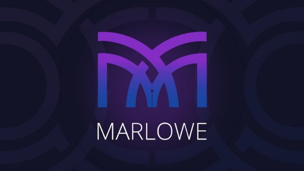

# Marlowe: industry-scale financial smart contracts for the blockchain
### **Move over Solidity – this specialized language will bring decentralized finance to Cardano**
 6 October 2020[ Prof Simon Thompson](tmp//en/blog/authors/simon-thompson/page-1/) 5 mins read

### [**Prof Simon Thompson**](tmp//en/blog/authors/simon-thompson/page-1/)
Technical Project Director

Research

- 
- 

In this post, we introduce Marlowe, a new language for financial contracts, and describe the benefits of it being a domain-specific language (DSL). As a DSL it describes only *financial* contracts, rather than smart contracts in general. Because of this, it differs from general-purpose blockchain languages like Solidity and Bitcoin Script.

Marlowe is industry-scale. We have built Marlowe contracts based on examples from one of the leading projects for financial smart contracts, the Algorithmic Contract Types Unified Standards ([Actus](https://www.actusfrf.org/)) system. Currently, these and other examples can be seen in the [Marlowe Playground](https://alpha.marlowe.iohkdev.io), a browser-based environment in which users can create, edit, simulate, and analyse Marlowe contracts, without having to install or pay for anything.

Who can use Marlowe? Marlowe is a platform for decentralized finance (DeFi) that supports direct, peer-to-peer lending, contracts for difference (CFD), and other similar instruments. Financial institutions can use it to develop and deploy custom instruments for their customers and clients, for example.

As a part of the Goguen rollout, we will be completing the implementation of Marlowe on Cardano, giving users and organisations the opportunity to execute DeFi contracts they have written themselves or downloaded from a contract repository, transferring cryptoassets according to the contract terms. Marlowe will run first of all on the Cardano blockchain, but it is not tied to Cardano, and could run on other blockchains in the future.

Smart contracts running on Cardano will be able to access external data values, such as the exchange rate between ada and bitcoin, through *oracles*. In some ways, an oracle is just like a participant that makes a choice, and we plan to support oracle values as part of the implementation, allowing contracts to access values directly from a stock market ‘ticker’ or a popular data feed such as Coinbase.

Marlowe contracts can be used in many ways: for instance, a Marlowe program can automate the operation of a financial contract that transacts cryptocurrencies on a blockchain. Alternatively, for audit purposes, it could be used to record compliance of users’ actions to a contract being executed in the real world.

Marlowe is just one example of a DSL running on a blockchain, but it is also an exemplar of how other DSLs might be created to cover supply-chain management, insurance, accounting, and so on, leveraging the experience of designing and building Marlowe on the Cardano platform.

We have stressed that Marlowe is a special-purpose financial DSL, but what if you want to write other kinds of contract? To write those, Cardano has [Plutus, *a general purpose language*](https://www.youtube.com/watch?v=usMPt8KpBeI&vl=en) running on the blockchain. Plutus contracts can handle all kinds of cryptoassets, and don’t have the constraints of Marlowe contracts: for example, they are unconstrained in how long they will remain active, and in how many participants they can involve. Indeed, every Marlowe contract is run by a single Plutus program, the Marlowe interpreter.
## **Marlowe as a domain-specific language for DeFi**
Being domain-specific, rather than general purpose, has a number of advantages.

Contracts are written in the language of finance, rather than the language of the blockchain. This means that some sorts of errors are impossible to write: so certain kinds of incorrect contracts are ruled out completely. For example, every Marlowe contract will have a finite lifetime after which it will perform no further actions, and at that point any funds tied up in the contract will be returned to the participants, meaning that funds in a contract can never be locked up indefinitely.

It is possible to analyse, completely automatically, how a contract will behave in all circumstances, without having to run it. For example, it is possible to determine whether a particular contract can fail to make a payment in some cases, or whether it is guaranteed to make full payments in every eventuality.

Contract behaviour can be simulated in a browser, so that users can try out the different ways that a contract might behave, before committing funds and running it for real.

Users can create their DeFi contracts in different ways: they can write them as text, but also use visual programming to create smart contracts by fitting together blocks that represent the different components. Users can also choose from a range of templates and customise them as needed.
## **Next steps – and some prize challenges**
Currently, Marlowe contracts can be written in Haskell or JavaScript or directly in Marlowe, and visually, using the Marlowe Playground, where it is also possible to simulate and analyse those contracts. Over the next few months we will continue revising and improving the user experience provided by the Playground, and continue implementing examples from the Actus project. At the same time, we will finalise the implementation of Marlowe on Cardano, so that Marlowe contracts will run on the blockchain itself. We look forward to sharing that work with you as soon as it is ready. 

In the meantime, take a look at [Marlowe Playground](https://alpha.marlowe.iohkdev.io) or join in one of the two Marlowe-based challenges running this month – there’s a $10,000 cryptocurrency fund to [tackle the United Nations’ global development goals](https://iohk.io/en/blog/posts/2020/10/06/united-nations-and-iohk-join-forces-to-use-blockchain-for-development-goals/), and a [$5,000-prize Actus](https://wyohackathon.io/wyohackathon.html) event at the Wyoming Hackathon.
