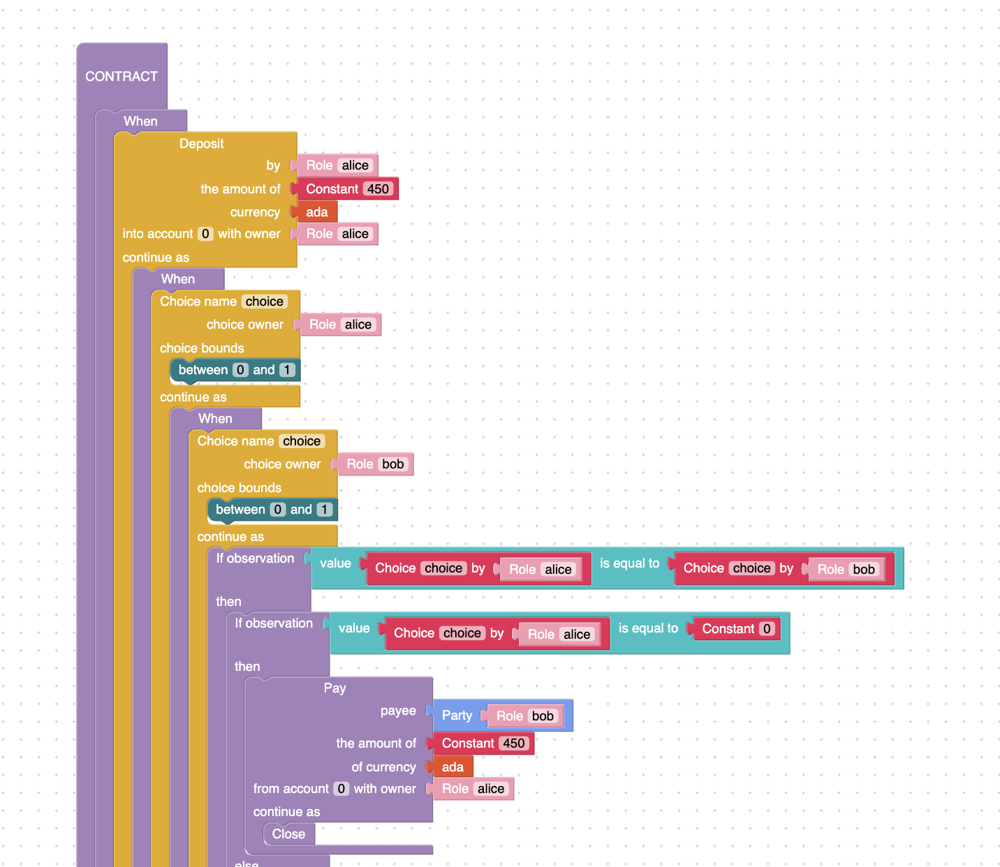

# Actus smart contracts in Marlowe
### **Writing in the language of finance, rather than the language of blockchain**
 13 October 2020[ Prof Simon Thompson](tmp//en/blog/authors/simon-thompson/page-1/) 12 mins read

### [**Prof Simon Thompson**](tmp//en/blog/authors/simon-thompson/page-1/)
Technical Project Director

Research

- 
- 

*In our Developer Deep Dive series of occasional technical blogs, we invite IOHK’s researchers and engineers to discuss their latest work and insights.*

Marlowe is a domain-specific language for secure financial smart contracts that is being developed by IOHK for the Goguen capabilities of the Cardano blockchain. Following my [introductory post on Marlowe](https://iohk.io/en/blog/posts/2020/10/06/marlowe-industry-scale-finance-contracts-for-cardano/), in this Deep Dive post, we'll look at the details of the language, and the various ways of writing Marlowe smart contracts as we move into the era of decentralized finance (DeFi). After explaining our approach to oracles, which import ‘real world’ information into a running contract, we look at the Algorithmic Contract Types Unified Standard ([Actus](https://www.actusfrf.org/)) for financial contracts, and explain how we have implemented this innovation in Marlowe.
## **Marlowe in a nutshell**
Marlowe is a small language, with a handful of constructs that, for each contract, describe behavior involving a fixed, finite set of *roles*.

- A running contract can make a *payment* to a role or to a public key.
- In a complementary way, a contract can *wait* for an *action* by one of the roles, such as a *deposit* of currency, or a *choice* from a set of options. Crucially, a contract cannot wait indefinitely: if no action has been initiated by a given time (the *timeout*), then the contract will continue with another behavior, such as refunding any funds in the contract.
- Depending on the current state of a contract, it may *make a choice* between two future courses of action, which are themselves contracts.
- When no more actions are required, the contract will close, and any remaining currency in the contract will be refunded.

When a contract is run, the *roles* it involves are fulfilled by *participants*, which are identities on the blockchain. This model allows a role to be transferred during contract execution, so that roles in a running contract can be *traded*. Each role is represented by a *token* on the chain, and transferring this transfers the ability to perform the role’s actions. Taking this further, we can represent a single role with *multiple* tokens, thus allowing the role to be shared: this could be termed being ‘securitized’.
## **The Marlowe system**
We deliberately chose to make the language as simple as we can, so that it is straightforward to implement on Cardano and in the [Marlowe Playground](https://alpha.marlowe.iohkdev.io/#/simulation). Marlowe describes the flow of cryptocurrencies between participants, and for this to be implemented in practice on the Cardano blockchain, code has to be executed both on-chain and off-chain: remember, though, that just one Marlowe contract describes both parts. The on-chain part accepts and validates transactions that conform to the requirements of the smart contract: this part is implemented as a single Plutus script for all Marlowe contracts, with the particular Marlowe contract comprising a datum passed through the transactions. Off-chain, the Marlowe contract will be presented via the user interface and wallet, offering or, indeed, automating deposits and choices and receiving cryptocurrency payments.

Figure 1. Marlowe Playground simulates the ways that contracts behave

In the Playground we’re able to *simulate* contract behavior, so that potential users can walk through different ways that contracts will evolve, according to different actions taken by the participants. In the main simulation, Figure 1, users have an *omniscient point of view* and are able to perform actions by any participant, with the option at each point to undo the actions taken, and then to take a different path. The *wallet* simulation allows users to see behavior from one particular participant’s perspective, thus simulating how that user will interact with the running contract once it is deployed on the blockchain.

This simplicity also makes it possible for us to model Marlowe contracts in an [SMT solver](https://en.wikipedia.org/wiki/Satisfiability_modulo_theories), a logic system for automatically checking the properties of systems. Using this model, which we call *static analysis*, for each contract we are able to check whether or not it might fail to fulfil a payment, and if the contract can fail we get *evidence* of how it fails, helping the author to rewrite the contract if they wish.

We can build a formal model of our implementation in a *proof assistant*, in which we are able to produce machine-checked proofs of how the language behaves. While the SMT solver works for individual contracts, the proof assistant can prove properties of contract templates, as well as the system itself: for instance, we can show that in any running contract, the accounts it references can never be in debit. Simulation, static analysis, and proof provide complementary levels of *assurance* for a contract to which users will be committing assets to ensure that the contract behaves as it should.
## **Writing Marlowe contracts**
We have seen how Marlowe contracts can be analysed in various ways, but how do authors actually write smart contracts in Marlowe? The Playground provides several ways of producing Marlowe contracts. Users can write Marlowe directly, but beginners often choose to build contracts visually, using an interactive Blockly editor. Figure 2 shows a section of an escrow contract.

Figure 2. An escrow contract in Playground’s interactive Blockly editor

Working in this visual editor has the advantage of showing all the options as you select how to fill in a part of the contract that is being developed. Alternatively, you can develop contracts in Haskell, because the Marlowe DSL is in fact *embedded* in Haskell. Figure 3 shows the same contract in Haskell: the blue and purple parts are Marlowe, and the black components are defined in Haskell, as abbreviations that make the overall contract more readable. This approach allows users to build up a smart contract step by step from components. In the code shown in Figure 3, the roles, Alice and Bob, are each asked to make a choice: if their choices match, they agree, and the contract proceeds one way; if not, then a third participant, Carol, is asked to arbitrate between them. The contracts *agreement* and *arbitrate* are defined later in the Haskell file.

Figure 3. The escrow contract in Haskell

Users will also be able to write their financial smart contracts using JavaScript, while still enjoying all the advantages of analysis, simulation, and proof, as provided by the Marlowe implementation.
## **Oracles**
One of the first questions we get asked when we describe Marlowe is about financial oracles, or how we can get a contract to take account of external data values, such as the exchange rate between ada and bitcoin. Abstractly, an oracle is just like a participant that makes a choice, and so the semantics of Marlowe can already deal with external values. However, we plan to support oracle values as part of the implementation, allowing contracts to access values directly from a stock market ticker or a data feed such as Coinbase. At the same time, the Plutus team is researching the best way to deal with oracles in general, and we can expect support for that in due course, though maybe not in the first full release of Marlowe and the Plutus Application Framework.
## **Actus for financial contracts**
Marlowe has the potential to give people the chance to make financial commitments and trades without a third party facilitating it: the blockchain ensures that the contract is followed.

We are building a Marlowe implementation of disintermediated contracts to offer to end users who want to make peer-to-peer financial deals directly without the intervention of any third parties.

The Actus Financial Research Foundation categorizes financial contracts by means of a [taxonomy](https://www.actusfrf.org/taxonomy) that is described in a detailed [technical specification](https://www.actusfrf.org/techspecs).

Actus builds on the understanding that financial contracts are legal agreements between two (or more) counterparties on the exchange of future cash flows. Historically, such legal agreements are described in natural language, leading to ambiguity and artificial diversity. As a response, Actus defines contracts by means of a set of contractual terms and deterministic functions mapping these terms to future payment obligations. Thereby, it is possible to describe most financial instruments through 31 contract types or modular templates.

Next, we look at a simple example, and then we explain our full approach to implementing Actus, with complementary approaches providing different pros and cons.
## **A first Actus example**
A zero-coupon bond is a debt security that does not pay interest (a coupon) but is issued at a discount, rendering profit at maturity when the bond is redeemed for its full face value.

For example, Figure 4 describes a contract whereby an investor can buy a bond that costs 1,000 lovelaces with 15% discount. She pays 850 lovelaces to the bond issuer before the start time, here slot 10.

Later, after maturity date, slot 20 here, the investor can exchange the bond for its full notional value, ie, 1,000 lovelaces.

Figure 4. Contract for a zero-coupon bond with a 15% discount

This contract has a significant drawback. Once the investor has deposited the 850 lovelaces, it will be immediately paid to the issuer; if the investor does not invest quickly enough, ie before the timeout, the contract ends. After that, two outcomes are possible:

- the issuer deposits 1,000 lovelaces in the investor's account, and that sum is immediately paid to the investor in full;
- if the investor doesn’t make the deposit, then the contract is closed and all the money in the contract is refunded, but there is no money in the contract at this point, so the investor loses her money.

How can we avoid this problem of the bond issuer defaulting? There are at least two ways to solve this: we could ask the issuer to deposit the full amount before the contract begins, but that would defeat the object of issuing the bond in the first place. More realistically, we could ask a third party to be a guarantor of the deal, as expressed here.

Figure 5. Improved contract with a guarantor
## **Actus in Marlowe**
Products in the Actus taxonomy, such as the principal at maturity contract, can be presented in different ways in Marlowe, according to the degree to which they can accept changes to their terms during the contract lifetime (Figure 6).

Figure 6. Actus taxonomy and Marlowe

In the simplest case, all cash flows are set, or *frozen*, at contract initiation, so that it is entirely predictable how the contract will operate, assuming that all participants continue to engage with the contract during its lifetime. Contracts of this kind we call Actus-F (for fixed or frozen).

Dynamism – that is change during contract evolution – can happen in two ways. Participants can make *unscheduled payments* that require re-calculation of the remaining cash flows, and also the cash flows can be modified by taking into account *external risk factors*. The full generality of contracts that do both are modelled in Actus-M (for Marlowe).

There are intermediate levels too: Actus-FS models fixed schedules: allowing risk factors to be taken into account, but with no unexpected payments; conversely, Actus-FR contracts allow payments to be made at unexpected points, but do not take into account any risk factors.

Finally, moving outside Marlowe, Actus-H (H for Haskell) models the contracts directly as programs in Plutus or Haskell, using Marlowe for validation of each transaction in the contract lifetime by generating Plutus code from the Marlowe description of the contract logic.

Why do we offer these different models of Actus contracts? The reason is that there is a *trade-off* between the dynamic nature of contracts and the *assurance* we can give to users about how the contracts will perform in advance of contract execution.

- Actus-F contracts present an entirely fixed schedule of payments, which can be scrutinized directly by the participants so that it is straightforward to see, for example, that all payments from such a contract will succeed.
- Actus-FS and -FR contracts present more dynamism, but the contracts are readable and easy to scrutinize. Moreover, they are subject to (slower) static analysis to establish, for example, that all payments will succeed.
- Actus-M contracts are expressed in Marlowe, and so can be analysed. Analysis is, however, substantially slower because of the unpredictability of the actions that the contract will undergo at any particular point in time. Note that assurance can be offered for scaled-down versions of contracts, which have the same computational content, but which evolve over a shorter time, thus involving fewer interactions.
- Actus-H contracts are written in a combination of Plutus and Marlowe, and so are not amenable to static checking in the same way as the others. However, this platform offers corporate clients full extensibility and tailoring of the implementation of the Actus standard.

In our implementation of Actus, available as a pre-release version in the [Labs tab of the Playground](https://alpha.marlowe.iohkdev.io/#/actus), users are able to *generate* Actus-F and -FS contracts from the terms of the contract, using a visual presentation of the data required.

Figure 7. The three items with asterisks are required for a principal at maturity contract

For a principal at maturity contract, three items are required: the start and end date, and the notional amount of the contract (hence the items being starred in the template). Such a contract will comprise a simple load, in which the notional amount is transferred from the counterparty to the party at the start of the contract, and in the reverse direction at the maturity date.

Adding additional items will change the generated contract accordingly. In Figure 7, the party will have to transfer the notional plus the premium to the counterparty at maturity date, hence giving the counterparty an incentive to make the loan in the first place.
## **Moving into a DeFi world with smart contracts**
As we have seen, finance professionals and developers now have a way to start creating financial smart contracts directly in Haskell or pure Marlowe, or visually, using the [Marlowe Playground](https://alpha.marlowe.iohkdev.io/#/simulation), depending on their programming expertise. In the Playground, you can simulate and analyse the contracts you create to test that they work properly and are ready to be issued into the world of decentralized finance when the Goguen stage of Cardano is implemented. IOHK’s Marlowe team will continue implementing examples from the Actus standard, as we prepare to finalize the implementation of Marlowe on Cardano, and bring financial smart contracts to the blockchain itself.
