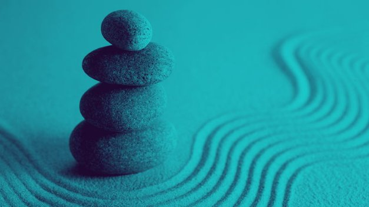

# Five lessons in blockchain governance
### **Project Catalyst is bringing collective innovation to Cardano.**
 15 October 2020[ Dor Garbash](tmp//en/blog/authors/dor-garbash/page-1/) 6 mins read

### [**Dor Garbash**](tmp//en/blog/authors/dor-garbash/page-1/)
Head of Product

Commercial

- 
- 
- 

Project Catalyst is, at its heart, a series of experiments in innovation and governance. Once it was decided to set up a funded system to encourage innovation for Cardano, the IOHK team decided to collaborate with our global community from the start. So, that’s what we did. Now, with two funds already incubating hundreds of proposals and fostering thousands of conversations, we wanted to share some of the things that we’ve learned.

1. **Our diversity is our strength**

We knew that the Cardano community was crucial to realizing the full potential of Project Catalyst. But we did not fully realize the depth of the expertise available, nor its truly global reach. When we called for ideas for the project, people responded. To date, Project Catalyst has drawn 3000 registered users, 500 perspectives, 126 proposals and +5,000 comments from 70 countries around the globe. Building courses in Haskell engineering, boosting decentralized technology in West Africa, podcasts and blockchain applications in many fields are among the ideas pitched on our Ideascale innovation platform. Furthermore, each one of these has been refined by the Project Catalyst community. 

With such a worldwide community of entrepreneurs, experts, and specialists, we are able to tap into a previously unknown well of ingenuity. Furthermore, the community itself is responsible for ensuring that the brightest ideas rise to the top. 

2. **Community interest is self-interest**

Proposals in Fund2 are vying for a share of an ada fund worth $250,000. This is an enormous incentive for individuals to make their pitch as strong as possible. However, we are working hard to ensure that there is an equal incentive for people to help develop the ideas of others, instead of focusing on just their own proposal. When a strong idea comes to fruition, it will inevitably benefit Cardano, and therefore every ada holder. Ultimately, we have learned that we need to provide a variety of motivations and experiences for the community to foster the most productive dialogue.

Currently, Project Catalyst participants can give a limited number of ‘kudos’ or positive affirmations to people providing value to the Fund through their comments and proposals. This is meant to build communal support. We are also establishing a cohort of community advisers. These are registered participants who have no active proposals but want to provide thoughtful and fair advice to voters. The first of these community advisers are now joining up and we are looking forward to seeing how they will benefit the project. 

3. **Innovation requires a positive mindset**

Despite its many benefits, the digital world can be a toxic place. From YouTube scams and keyboard warriors, to Twitter trolls and spam emails, there sometimes seems no end to the pitfalls in online engagement. Project Catalyst is learning to minimize this activity if not eliminate it entirely. One way that we are working on this is by leveraging the experience of our Fund1 participants. These early pioneers are helping encourage mutual respect and collaboration, which we hope will proliferate through the entire system. However, we understand that is a tough goal for any global platform.

That being said, we have an automated reminder to encourage people to keep their thoughts focused on how feasible an idea is, how its effect can be measured and audited, and its potential impact on Cardano. We want to attract the most talented entrepreneurs, and so the more constructive the feedback, the nearer we come to fulfilling our strategic objective. Furthermore, the Catalyst team has published a guide for community behavior and feedback. If and when we detect abusive activity, we reserve the right to warn or ban the miscreants. Toxicity can damage the project and even Cardano as a whole, so our interventions will develop as the community grows. We remain focused on creating a forum for passionate discussions without constraining creativity.

4. **Break down barriers to creativity**

Thus far, we have been pleased with the progress Project Catalyst has made on the Ideascale innovation platform. It provides an easy-to-use interface for developing complex ideas. But no system is perfect. Some community members have found the interface overwhelming. For us to find and develop groundbreaking ideas, our working methods must always work to enhance creativity.

Currently, we are listening to community feedback through the Catalyst problem sensing challenge and feedback forms. This helps us hear what works and what needs iterating and improving. Ultimately, the proposals chosen and funded by Project Catalyst are only as good as their ability to be embraced and championed by the community. And great collaboration tools are vital for this.

5. **Focus on the returns**

Every challenge within the program represents an intention to generate outcomes from the fund. We are now working on ways to measure the effect of these intentions and how they contribute to a challenge being met. These measures include measuring how many developers, entrepreneurs, businesses, and Dapps were developed as an outcome of every proposal. Ultimately, that which is measured can be managed.

For example, the current Fund2 challenge is:

“*How can we encourage developers and entrepreneurs to build DApps and businesses on top of Cardano in the next 6 months?*”

This challenge is fairly open-ended, and deliberately so. These wide-ranging challenges are designed to encourage a broad spectrum of ideas. But not too broad, so we can still measure and track them effectively.
### **Applying the lessons**
We’re building a system which will eventually be run, developed, and funded entirely by the community itself. In time, IOHK will only be involved with the daily operations of Cardano at the request of the community itself. However, until we are able to hand over total control to ada holders, we must maintain constant communication.

Throughout the Project Catalyst program, we have worked to ensure that communication is a two-way street. We are redoubling these efforts by ensuring that we seek out feedback at every stage. We also ensure that community assessments will be performed at the conclusion of each fund. These interventions allow us to prioritize solving issues that are important to the community.

Project Catalyst has been an incredible journey. These are only five of the takeaways from our current process. As the experiment continues grows, we are looking forward to learning more, attracting more participants, and building a best-in-class governance system. This is only the beginning. 

*Get involved with Project Catalyst by logging on at Ideascale or joining our next [Crowdcast town hall](https://www.crowdcast.io/e/project-catalyst-weekly-3) on October 21.*
