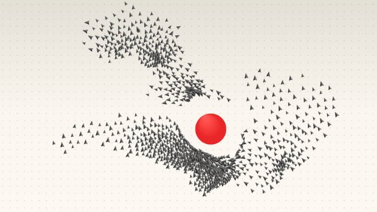

# Bringing new value and utility to the Cardano blockchain
### **Adding metadata to transactions prepares Cardano to become part of the DeFi revolution**
 29 October 2020[ Alan McSherry](tmp//en/blog/authors/alan-mcsherry/page-1/) 5 mins read

### [**Alan McSherry**](tmp//en/blog/authors/alan-mcsherry/page-1/)
Solutions Architect

Engineering

- 
- 

With the rollout of Goguen, Cardano is becoming a smart contract platform. Adding metadata – information about the data being processed – to transactions is key to this, and last month this capability was added to the blockchain. From a focus on transactions, Cardano is now becoming a utility platform open for partnerships, enterprises, and commercial applications that can be used for the complex operations that will define the era of decentralized finance (DeFi).

With an increasing volume of financial cryptocurrency operations, the ability to access immutable data that cannot be altered is crucial, especially when it comes to applications such as wealth management. The Cardano blockchain maintains permanent records of processed transactions, ensuring that the history of financial activity is transparent and auditable. However, to grant more accountability and visibility to financial processes, context has to be added to these transactions. Additional information can include facts such as sender and receiver details, conditions, and time of processing. This is done by adding transaction metadata.
## **What is metadata?**
Metadata refers to ‘data about data’. In other words, it describes the context, content, and structure of records. As blockchain technology provides a transparent ledger for storing records immutably and securely, metadata generates trust with permanent data attestation.

All transactions happen for specific purposes, whether this is a payment for product or service, or a funds transfer to a family member. When a purchase is made online, for example, there is so much information that can follow along with the transaction. Metadata can tell the story of the product purchase reflecting its buyer and seller, the time of deal, product manufacturer, or the supply conditions. All of these records are important to maintain along with the transaction of wealth. 

With the emergence of Bitcoin, developers started leveraging blockchain technology to put such little bits of additional data on the chain, knowing that the information would be available forever. Over time, adding metadata to the chain became commonplace.

Cardano is a third-generation distributed ledger. In terms of metadata, this means that Cardano is far more efficient in adding transactional information than earlier blockchains. While earlier blockchains supported 40-80 bytes of metadata, Cardano’s transaction size is currently around 16KB. Subtracting the size of the rest of the transaction (UTxOs, inputs, and outputs) still leaves the majority of 16KB for metadata.
## **Why transaction metadata matters**
Metadata is a handy way of certification and validation. It allows cryptocurrency assets to hold historical ownership, transfer or value details. This is highly beneficial when working with non-fungible – unique – assets representing value such as property or intellectual rights, for example. Additionally, a range of documents can be signed and certified using a public key that proves the document’s legitimacy. 

One of the most prominent uses for metadata is in a supply chain. Supply chain involves parties such as factories, customers, suppliers, and delivery services. To enable efficient data tracking, participants must provide confirmation of services that are interlinked, and these must be accessible by everyone for verification. In this case, metadata can provide a complete picture of supply chain processes with fixed recorded data on the blockchain ledger. This grants transparency, immutability, and trust for all stakeholders. 

**The Atala products**

The deployment of metadata on Cardano will see early commercialization through the Atala product suite, which includes Atala Prism, Atala Trace, and Atala Scan solutions. To enhance the overall product functionality in terms of data feasibility, accountability, and traceability, the IOHK team is implementing metadata support while integrating with the Cardano ledger. 

[Atala Prism](https://www.atalaprism.io/) is a decentralized identity system that enables people to own their personal data and interact with organizations seamlessly, privately, and securely. The Atala Prism team is integrating metadata to certify and store DIDs and DID documents on Cardano. Also, it will be possible not only to create but also to revoke credentials such as university certificates. 

Atala Trace and Atala Scan are being developed to enable brand owners to improve the visibility over supply chain processes and establish product provenance and auditability. In these cases, metadata integration will be used to record tamper-proof supply-chain records. 
## **Working with metadata**
There are different ways of working with metadata both for enterprises and the developer community. One such way is using the metadata service developed by IOHK’s Professional Services Group. We have been working with a number of partners on integrations and have many more in the pipeline. So if you’re running a business and also wish to ensure trust for your customers and partners while managing your transaction metadata securely, please contact us via **enterprise.solutions@iohk.io** to find out how to incorporate metadata services in your processes. 

*Transaction metadata is an important early feature of Goguen utility and smart contract functionality, which will be enhanced and developed by many other capabilities over the months ahead. Stay tuned to this blog for all the updates on native assets, ERC20 convertor, Marlowe, Plutus and other smart contract languages as we roll these out.*
