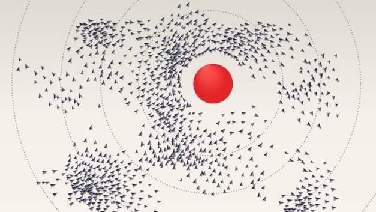

# Getting to grips with metadata on Cardano
### **Adding information about transactions is a powerful tool for companies and developers**
 3 November 2020[ Alan McSherry](tmp//en/blog/authors/alan-mcsherry/page-1/) 5 mins read

### [**Alan McSherry**](tmp//en/blog/authors/alan-mcsherry/page-1/)
Solutions Architect

Engineering

- 
- 

In a previous post, [Bringing new value and utility to the Cardano blockchain](https://iohk.io/en/blog/posts/2020/10/29/bringing-new-value-and-utility-to-the-cardano-blockchain/), I discussed the notion of transaction metadata. I also explained why this is crucial to Cardano’s Goguen evolution as a utility platform for decentralized finance (DeFi) operations.

There are many potential uses for metadata. With that in mind, IOHK has been working to ensure that both developers and enterprise-focused clients can easily build metadata into their applications. Furthermore, we want to make certain that ada users have a convenient way to see information about their transactions.
## **How does metadata work on Cardano?**
Metadata tells the story of a transaction and there are many ways to interact with this story. Developers can take advantage of metadata by embedding details directly into a transaction, and ada users can search for specific information in the Cardano Explorer. The data can be added directly, or, for larger amounts, it is possible to create a Merkle tree of the data and put the root hash of the Merkle tree on the blockchain. Once this is done, it can be proved that the data existed at a specific point of time and that it remains permanently on the chain for future reference. 

It is also important to note that transaction metadata is stored on the blockchain and is carried along with each transaction. The fact that it is stored on-chain, rather than being recorded in the ledger state, is beneficial because it does not influence transaction validation or compromise ledger performance.

**Metadata service from IOHK**

IOHK’s Professional Services Group (PSG) provides business consulting and technological services. In particular, our PSG is developing services to help companies build and implement blockchain solutions by integrating their systems in a seamless and convenient way with distributed ledger technology.

The metadata service has been developed with a variety of applications in mind, but for commercial applications in particular.

This interface handles the wallet interaction, provides users with low balance alarms, and rolls it all up into a Docker container. This eliminates the complexity associated with submitting metadata directly in the wallet’s backend API. Thus, the metadata service only requires the specified metadata and the number of blocks under which the transaction should be stored before it is considered as final. 

In the metadata request, one can include: 

- **The actual metadata**: sender and receiver identities, comments, tags.
- **The depth**: the number of blocks under which the transaction containing the metadata should be stored before it is considered as final.
- **The client identity**: indicates the wallet to be used.
- **Transaction identity**: this feature is useful in case of failures and restarts. It allows clients to re-examine previously submitted metadata.

After including all the details, the metadata service records a transaction on the blockchain, which then allows transaction information to be retrieved using the Cardano Explorer. For this, one would just have to indicate a transaction identity. 

Another feature is that PSG metadata service can be specified using language-neutral protocol buffers. This expands the number of potential uses because client generators support many programming languages, including Python, Java, and Scala. Such extended opportunities make the process of integration with the Cardano blockchain more straightforward.

**Accessibility is key**

We have also developed a Scala and Java client for the Cardano wallet API, which bundles together calls to the API and makes them easily accessible to more developers. As well as a Java and Scala API, we can provide an executable jar file to give rudimentary access from the command line. You can find details of the [PSG Cardano wallet API on GitHub](https://github.com/input-output-hk/psg-cardano-wallet-api) and see how it allows clients to perform tasks such as submitting and listing a transaction, wallet maintenance, and node monitoring.

**Working with wallets and Cardano-CLI**

Another way of working with metadata is by submitting it directly from a wallet or the Cardano command-line interface (CLI). 

These processes require basic coding experience and familiarity with running the Cardano node and CLI. Direct interaction with metadata opens powerful capabilities for building decentralized applications on Cardano because developers can authenticate valuable data in their preferred way. 

In the Cardano wallet and the CLI, the structure of the metadata is defined by a mapping from keys to values (key-value pairs) that combine details for multiple purposes into the same transaction.

- *Metadata keys* act as a schema identifier showing the metadata value. Keys are unsigned integers limited in size up to 64 bits. 
- *Metadata values* are simple terms, consisting of integers, text strings, byte strings, lists, and maps. Values have to be structured, which makes it easier for them to be inspected and managed, particularly by scripts.

The only extra cost involved is that the metadata adds to the size, in bytes, of the transaction and the processing fee is based on transaction size.

Metadata can be constructed using the Concise Binary Object Representation ([CBOR](https://tools.ietf.org/html/rfc7049)) and Concise Data Definition Language ([CDDL](https://tools.ietf.org/html/rfc8610)) notations. For more detailed information, please refer to [transaction metadata in the Cardano wallet](https://github.com/input-output-hk/cardano-wallet/wiki/TxMetadata) and see how to use [transaction metadata schemes in Cardano CLI](https://github.com/input-output-hk/cardano-node/blob/master/doc/reference/tx-metadata.md).

*Transaction metadata is an integral step for Cardano’s evolution into a multi-functional smart contract platform. Further Goguen enhancements will add metadata to specify transaction conditions for smart contracts, opening more opportunities for commercial use and deal settlement. If you want to integrate metadata into your business processes, contact **enterprise.solutions@iohk.io** with any questions or support requests. And keep following this blog for updates as we continue to build out Goguen functionality.*
