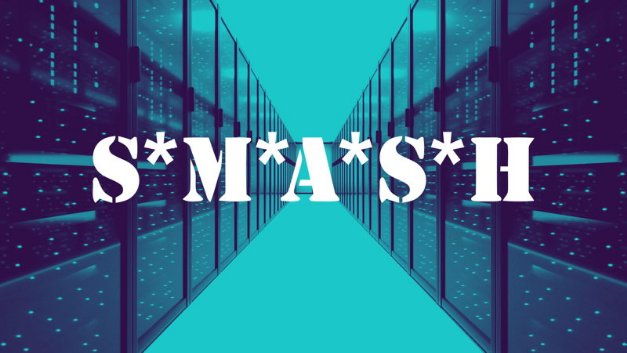

# Smash: introducing a new way of managing stake pool metadata
### **Our metadata framework supports delegators and the community by bringing verified information to the Cardano network**
 17 November 2020[ Olga Hryniuk](tmp//en/blog/authors/olga-hryniuk/page-1/) 5 mins read

### [**Olga Hryniuk**](tmp//en/blog/authors/olga-hryniuk/page-1/)
Technical Writer

Marketing & Communications

- 
- 

Stake pool operations lie at the heart of Cardano decentralization, enabling servers to reach a consensus agreement across the network. Our groundbreaking Ouroboros proof-of-stake consensus protocol allows pool operators to reach agreement on the validity of transactions and sign a block, which is then immutably recorded on the Cardano blockchain.

On the Shelley path to decentralization, as more stake pools are created, the more the Cardano network grows. Operators form their pools, attract delegation, stake ada, earn rewards and take a small cut to cover their running costs before distributing the rest between the pool participants. 

Node decentralization is a key element. However, to keep track of stake pool information and simplify the choice of a pool for delegators, it is crucial to ensure that information about each stake pool is relevant and valid. And, as far as is possible, that the influence of bad actors, such as potential attackers, spoof pools, and trolls, on the system is minimized. 
## **Welcome to Smash**
To address these needs, we have developed Smash – the server that supports operators and ada owners by validating information about stake pools and storing it as metadata. 

Each stake pool is registered on the blockchain along with the information required to calculate rewards. However, stake pools also include metadata that helps ada owners to make a rational choice when delegating their stake. This metadata includes owner details, pool name, pool ticker, homepage, and a short description, which are not stored on the blockchain, and thus it is important to provide visibility and access to this information. 

As well as ensuring that registered stake pools are valid, Smash metadata server helps to avoid duplicated ticker names or trademarks, and ensure that they do not feature content that Cardano users are likely to find offensive. Given that scams, trolls, and abusive behavior are an unfortunate part of life online, we had to find a way of filtering potentially problematic actors out of the playing field.
## **What is Smash?**
Smash is a stake pool metadata aggregation server that was conceived to improve Cardano users’ access to verified stake pool information and make it easier to use the system. A Smash server can aggregate stake pool metadata, fetch it, and store it. 

The first generation of Smash has been deployed by IOHK and provides information about delegation in the Daedalus wallet. Previously, this off-chain data was fetched by Daedalus from each stake pool separately, which required a lot of network connections and affected performance. All of this data can now be served from one server, hosted and fetched, initially by our team. 

Although the Smash server is currently run by IOHK, it is important to note that the server code is open source and can be deployed by anyone. So we hope that in the future, the Smash approach will be adopted by the community for decentralized metadata. Daedalus will allow users to configure any server of their choice and browse custom stake pool lists – for example, charity pools, bare metal pools, or pools from a certain region for ada holders who would prefer to support stake pool businesses with a particular focus.
## **How does it work?**
Smash is an evolving system. Currently, as its operator, we are responsible for the maintenance and metadata curation on the IOHK Smash server. Badly behaved stake pools can be delisted from display in Daedalus. Factors taken into account for such decisions include illegal or malicious metadata content, impersonation, the use of ticker names that were previously registered on the Incentivized Testnet (when this is not the same stake pool/operator), intellectual property rights violations, or stake pools that are no longer active. 

While its most immediate impact can be seen in Daedalus, Smash is a resource to support the community. So if you identify a stake pool ticker that you feel might be causing harm and transgresses the guidelines, we encourage you to review the guidelines we have recently published outlining the [reasons for a stake pool delisting and a step-by-step explanation of the delisting process](https://docs.cardano.org/en/latest/getting-started/stake-pool-operators/SMASH-metadata-management.html). Get in touch if you believe there is a case to be made for removal.

It is important to ensure that there is a reason for a stake pool to be delisted and that if possible, there is a reasonable level of community consent. Thus, any request should include the rationale and any proof of violations. All requests are reviewed by the Smash operator. It usually takes seven days for a request to be inspected and processed, and we always respond by clarifying the motivation for any decision. Cardano is a decentralized ecosystem and aims not to limit any stake pool operation activity unduly or unfairly. We reserve the right to make the final decision regarding the Smash server we manage, however we aim to provide the community with as much visibility and trust as possible. For more details, please email ***smash@iohk.io*** or contact directly ***@benohanlon*** in Telegram.
