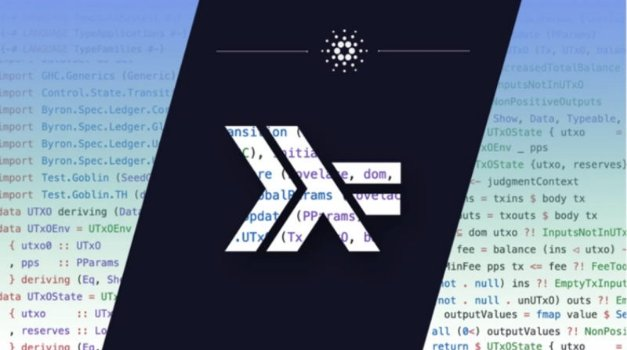

# Online learning with Haskell: the Mongolia Class of 2020
### **Reminiscing on the delivery of the first Haskell massive online course (MOOC)**
 21 December 2020[ Alejandro Garcia](tmp//en/blog/authors/alejandro-garcia/page-1/) 7 mins read

### [**Alejandro Garcia**](tmp//en/blog/authors/alejandro-garcia/page-1/)
Project Manager

Project Management

- 
- 
- 
- 

*Here we share feedback on this year's Haskell course which we delivered online for the first time.*

Saying that the Covid-19 pandemic changed the world's plans is a cliché at this point, and the same thing happened to us here at IOG’s Education department. However, what we did not expect were the new opportunities that the global lockdown opened up for us which enabled us to deliver a fantastic online Haskell bootcamp in 2020.

If you are familiar with IOG, you probably know that the Haskell programming language and its functional approach to software development are integral to the company. It is right there in the name “Input Output”. So, it is no surprise that we have invested heavily in improving the Haskell ecosystem, from contributing to open-source projects, sponsoring developers, and much more. One of our big efforts is that every year we run a Haskell bootcamp, which involves three months of intensive in-person training with Lars Brünjes, director of education, and guest lectures by some of the best developers and computer scientists in the world. So far, there have been four iterations of this class: Ethiopia 2019, Barbados 2018, Athens 2017, and one was planned for Mongolia in 2020.

The actual class takes 10 weeks of Haskell, cryptocurrency, and smart contract training that opens up new opportunities for young students that take the challenge of the course. It is not easy, the topics are hard, the homework is even harder, and the hours are grueling. Calling this a full-time commitment is an understatement, most students in the previous editions have called it the “most difficult class of their lives”.

Despite all these factors, on completion of the 10 weeks, the students come away with experience in the most state-of-the-art topics in software development: strongly typed functional programming, embedded DSL design, property-based testing, smart contract development (with Plutus and Marlowe), as well as a strong sense of pride in having achieved something truly challenging that will influence their professional lives for decades to come.

At the beginning of 2020, the Mongolia Haskell bootcamp was well on its way to taking place in March, and then, as we all know, the planet stopped. In January, the nature of Coronavirus was relatively unknown, but by March its mortality rate and its main mediums of transmission were front-page news, flights were being canceled, and later shut down completely. This made it impossible to deliver the class in person as planned. Thanks to the tenacity, or may I say stubbornness, of Dugerdorj Davaadorj and Lars, that class was going to happen no matter what. So, we had to adapt the class to the new realities imposed by the pandemic. We expected these changes to be difficult, and as any teacher will tell you, it is easier to provide feedback when you can see the students’ reactions, and it is also easier to provide an interactive education when the students can see each other, program in pairs, or even practice “swarm” development. 

What we didn’t expect is that the MOOC approach would turn out to be *even better* in some ways than an in-person training course. For example, in the recent edition, the class was co-taught by Lars and Andres Löh from our friends at Well-typed. Andres is a highly regarded teacher in the Haskell community and has been involved with the language for over 20 years. Basically, if you find an interesting open-source project in Haskell, Andres has probably been involved in it in some way. Then we also had guest lectures by Rob Cohen (Program Manage IOG), Joshua Miller (Project Manager IOG), and Phillip Wadler (one of the original creators of Haskell, with too many achievements to mention; his Wikipedia page is a good starting point to find out more). 

Our Haskell training course started in August and as usual, there were some hiccups getting all the students settled with a proper development environment, language barriers, and some cultural differences. Basically, professors were encouraging students to ask more questions, however, in Mongolian culture students tend to work quietly only asking questions or collaborating with each other. Therefore, it was good that all the students were working together in the University lab on-site and we were very glad to have access to that facility. It was great to see that universities were open in Mongolia!

Remember, this was August 2020 with most schools closed in Europe and America, so how come the Mongolian universities were open? It turns out that Mongolia, up to that point, had recorded zero deaths from Covid-19! Let me say that again — ZERO deaths from Covid-19. We couldn’t even believe it in the beginning, but as the weeks progressed and we were able to get to know the students, we understood why. The discipline and disposition for work that our students were showing in class was the same attitude that allowed Mongolian citizens to isolate from the pandemic on January 27th. The Mongolian government took decisive actions right from the beginning, which the citizens followed precisely. We could see that while working, as everyone wore masks and kept their distance. Although the learning process was hard, students worked on many difficult exercises, consulted each other, and collaborated in spontaneous teams to encourage everyone that was participating.

The homework assignments were deployed on the GitHub Classroom platform, which allowed students to collaborate in team projects the way that professional software developers would do: committing and resolving issues in various branches in a common code repository. 

As an additional benefit of the online learning environment, we were able to accept a couple of students from Mexico. This was also challenging for them as the classes were held from 11 pm until 5 am in the morning, which required a complete 10-week schedule switch for the students, as well as myself, as a reviewer.

In the end, their determination allowed them to finish the course having acquired really valuable skills and a sense of pride in the achievement itself. We want to thank the Mongolia ministry of Education and Economics for making this possible.

The feedback we received from the students was very positive, here are some comments we received from the participants:

*“The course was my very first experience of functional programming. It felt like a whole new world to me and truly broadened my horizons and the way of thinking. I’m so glad that my first steps were guided by professionals. I will never be the same as before I took the class. I am very grateful; I grew both professionally and personally. I recommend it to anyone who wants to level up their programming skills*.”

Tuvshintsenguun

*“After attending the Mongolia Haskell Class, I reaffirmed the beauty of functional programming. The beauty of the code makes it look so simple. I want to thank Lars and Andres for allowing me to attend your class. I admire your utmost professionalism and excitement to share your knowledge. You are an inspiration to all of us who want to become better engineers*.” 

K. Chaires

*“This course exceeded all my expectations. I learned so much with Lars and Andres. They are expert programmers and even better teachers. They effortlessly explained complex concepts. Now I want to develop every project in Haskell*.”

A. Ibarra

As for ourselves, we are very happy with how this experiment of running a small class in a remote setting turned out, making it our first MOOC delivery. It also opens up exciting new collaborative opportunities for the education team in the future. Of course, we cannot wait to get back on the road, and get to meet these students and prospective students in real life once more, once it is safe to travel again. Hence, in 2021 we plan to run one more iteration of the class in person and one online course that is open to the world, as we continue on our journey to train 10,000 smart contract developers on Cardano. Wishing you all a happy new year as we look forward to 2021!
