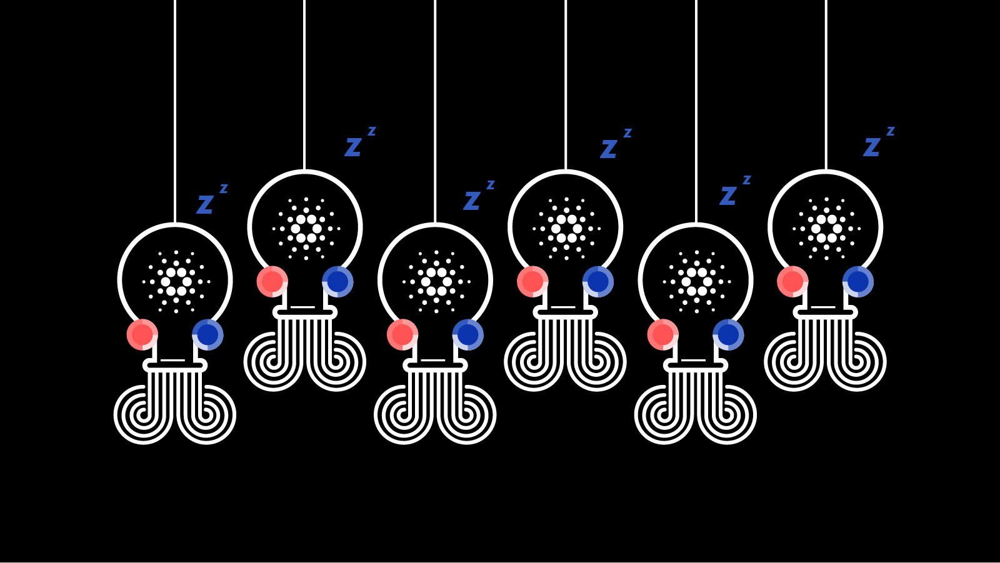

# Three more thoughts for the 12 days
### **The past, present, and future of Cardano in the spirit of an olde English counting song**
 29 December 2020[ Anthony Quinn](tmp//en/blog/authors/anthony-quinn/page-1/) 4 mins read

### [**Anthony Quinn**](tmp//en/blog/authors/anthony-quinn/page-1/)
Editor

Marketing & Communications

- 
- 
- 
- 

We're putting out some thoughts about the past, present and future in the spirit of an olde English counting song. There's one for each of [The Twelve Days of Christmas](https://www.classicfm.com/discover-music/occasions/christmas/twelve-12-days-of-christmas-lyrics-meaning/), from December 25 to January 5. [The first four](https://iohk.io/en/blog/posts/2020/12/24/some-thoughts-for-the-next-12-days/) went out together and here are three for the next few days. 
## **Day 5. Romain Pellerin, technology chief**
It’s been a really satisfying year after delivering so much. There was the Byron reboot, then Shelley, and we have just released [Allegra for token locking](https://iohk.io/en/blog/posts/2020/12/02/goguen-brings-token-locking-to-cardano/) and are preparing [Mary for native tokens](https://iohk.io/en/blog/posts/2020/12/09/native-tokens-on-cardano-core-principles-and-points-of-difference/). We have been digesting years of research and science with strong engineering – and creating a community with the stake pool operators for example. It’s been a very intense year. I am extremely proud of the team and the way they were able to digest all this. Delivering such complexity, steadily and on schedule all along this year was definitely a big achievement. 

Now, we’re absorbing what we’ve learned and we continue to improve the company in terms of structure, organization, and processes. IO definitely grew up!

In 2021, we will deliver [Goguen](https://iohk.io/en/blog/posts/2020/10/29/bringing-new-value-and-utility-to-the-cardano-blockchain/) and [Voltaire](https://iohk.io/en/blog/posts/2020/09/10/project-catalyst-voltaire-bring-power-to-the-people/) – smart contracts and decentralized governance – alongside growing our communities of developers and operators. This will empower users to participate in the governance of the system itself. It is definitely a time that will be interesting to go through, so keep your heads high because 2021 will be amazing!

## **Day 6. Junko Oda, translator**
Japan is an important part of the Cardano community and my job is to translate many of the blog posts into Japanese as quickly as possible. I was particularly pleased with how this post about the [hard fork combinator](https://iohk.io/en/blog/posts/2020/05/07/combinator-makes-easy-work-of-shelley-hard-fork/) read [once translated](https://forum.cardano.org/t/iohk-shelley/32915). I am not a technical person at all, but that is a virtue in my job because we want these posts to be understood by as many people as possible. I’m often the one asking the really basic questions! To translate such articles is tough, but it is also fascinating to learn about such cutting-edge technologies – and to be part of the company making them happen.

Right now, I’m about to click on the purchase button of an e-book website. When I’m off work, I prefer reading Japanese books. I’m also fond of Japanese poetry and my husband publishes [*The Haibun Journal*](https://thehaibunjournal.blog). What I am buying is a novel by Takahiro Ueda called [*Nimrod*](https://bookclub.kodansha.co.jp/product?item=0000319220), which won the 2019 [Acutagawa award](https://www.japantimes.co.jp/news/2012/02/14/reference/literary-awards-run-spectrum/) sponsored by the Society for the Promotion of Japanese Literature. The [Acutagawa prize](https://www.bunshun.co.jp/shinkoukai/award/akutagawa/list.html) started in 1935 and is given twice a year. According to the blurb for *Nimrod*, the story relates somehow to cryptocurrency. A novel using cryptocurrency as a motif won such a prestigious award! Wow!

After Christmas, I’m looking forward to some quiet time reading *Nimrod* before the year starts to get going. The Basho development phase of Cardano is coming near. It is named after Matsuo Basho, the 17th century Japanese poet who specialized in the *haiku* and *haibun* forms, renowned for their intellectual and artistic discipline. If 2021 is anything like the past year for work, it’s going to be a busy one. I hope you will enjoy reading our blog posts – in English or Japanese – while I am enjoying my book! In the meantime, here’s a Basho poem I particularly like:

summer grasses –
all that remains,
of warriors’ dreams

*(trans. Sean O’Connor)*

## **Day 7. Darko Mijić, product manager**
We had 40 releases for the Daedalus wallet this year – more than in all the previous years combined! Among the many new features and improvements that I’m most proud of are the Byron reboot, which meant a big reduction in connection issues and faster blockchain synchronization. Then, Shelley was a big-bang release with a Daedelus update bringing enhanced cryptography, as well as stake pool delegation and rewards.

Right now, we’re analysing the responses to our recent survey – 5,000 from Daedalus users, and more than 100 from stake pool operators. These will help us put the community at the heart of our development plans.

Going into 2021, we are keen for the technically-minded members of the Cardano community to continue with the [Daedalus Flight testing program](https://iohk.io/en/blog/posts/2020/04/01/we-need-you-for-the-daedalus-flight-testing-program/). Wallet improvements will include [decentralized identity using Atala Prism](https://iohk.io/en/blog/posts/2020/10/29/bringing-new-value-and-utility-to-the-cardano-blockchain/) – something that will unlock Western-style financial services for developing countries – and native tokens for use in Goguen smart contracts. Furthermore, paper wallets will combine PGP encryption with the convenience of QR codes.

*The next batch of 12 Days thoughts will be published on December 31*
