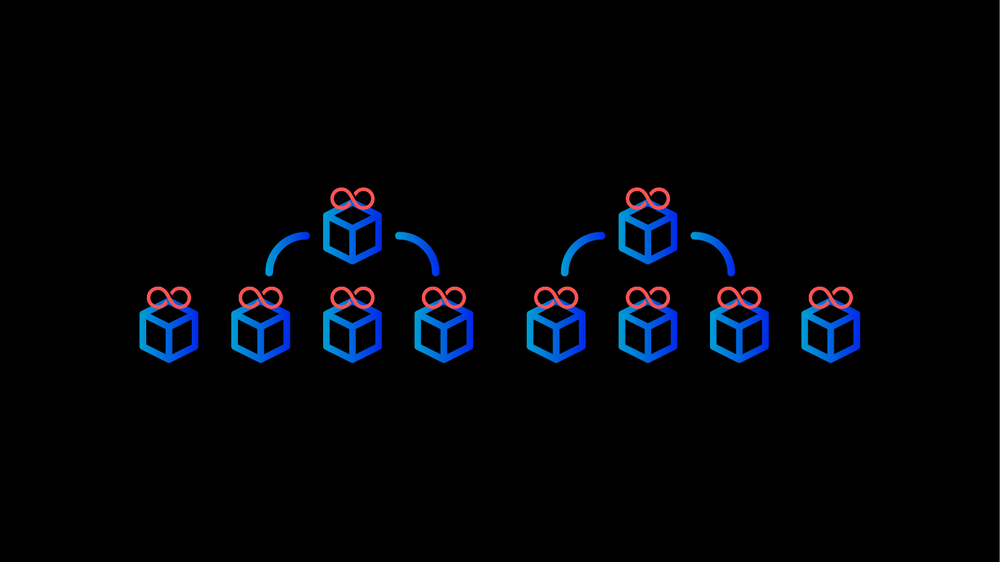

# Three more thoughts for the day
### **The past, present, and future of Cardano in the spirit of an olde English counting song**
 31 December 2020[ Anthony Quinn](tmp//en/blog/authors/anthony-quinn/page-1/) 5 mins read

### [**Anthony Quinn**](tmp//en/blog/authors/anthony-quinn/page-1/)
Editor

Marketing & Communications

- 
- 
- 
- 

We're putting out some thoughts about the past, present and future in the spirit of an olde English counting song. There's one for each of [The Twelve Days of Christmas](https://www.classicfm.com/discover-music/occasions/christmas/twelve-12-days-of-christmas-lyrics-meaning/), from December 25 to January 5, and they are being published in batches. Here are three for the next few days.
## **Day 8. Gerard Moroney, operations director**
In the past year, we’ve changed the way we write software for Cardano. Our development philosophy has gone from trying to plan very accurately huge releases to a much more [agile process where we release small increments](https://iohk.io/en/blog/posts/2020/04/09/merging-formal-methods-and-agile-to-build-cardano/) often. We’ve taken a very incremental, step-by-step approach and that has helped build up confidence in our people, in our company, and in the community at large. I think that has been evidenced in the fact that the hard fork release was within two weeks of when we predicted it would happen. We’re all very pleased with that.

As one year ends, I’m busy planning for that next. Now, though, we are pragmatic about the fact that we can predict well things in the short term, but things that are further away and are not so easy to predict. So we’ve been setting expectations with all of our stakeholders about what we can do and when.

I’m looking forward to these changes really bedding in and leading to more benefits for the team. I think we have a happier team right now, managers can trust the figures we’re giving them, and our community knows what to expect and when. On a personal note, I live in Cork near the superb [Ballymaloe House](https://www.ballymaloe.ie/), and it will be great to be able to celebrate a big event there once again.

## **Day 9. Eric Czuleger, senior content editor**
After working with IOHK for a year and a half now, the most exciting thing that I witness daily is theory becoming reality. I remember hearing about the challenges of building on-chain governance in the office of our chief science officer Aggelos Kiayias. Attempting to understand the complexity of decision-making on a distributed network was enough to keep me awake at night. I comforted myself with the knowledge that I was content editor and not a researcher. Yet, low and behold, months later [Project Catalyst](https://iohk.io/en/blog/posts/2020/10/15/five-lessons-in-blockchain-governance/) is making governance a reality. 

At the moment, I’m looking forward to seeing what happens as Cardano evolves around the world. I’m from the US but I’ve spent a good portion of my time living and working in developing countries, such as Iraq, Lebanon, Albania, and Somalia. Most of these places have been done no favors by the global economic system. I can’t wait to see the results of our first forays into [Ethiopia](https://iohk.io/en/blog/posts/2019/04/08/in-at-the-deep-end-in-addis/), the [Republic of Georgia](https://iohk.io/en/blog/posts/2019/06/18/iohk-announces-partnership-with-georgian-government-and-universities/), and [Mongolia](https://iohk.io/en/blog/posts/2020/12/21/online-learning-with-haskell-the-mongolia-class-of-2020/). Working with legacy financial institutions seems to be the highest priority for some blockchain projects. I’m glad that giving Ethiopian farmers a leg-up is our measure of success.

I’m about to head out on a trek up [Mount Kilimanjaro in Tanzania](https://www.nationalgeographic.org/encyclopedia/kilimanjaro/). In fact, this is the last blog I will have to write for a couple of weeks. Climbing to Uhuru Peak in December might be ill-advised, but I am looking forward to being unreachable by phone or email for nine days. 

## **Day 10. Polina Vinogradova, software engineer**
I haven’t had any chance this year to see how ‘UTXO𝗆𝖺: UTXO with multi-asset support’ goes down at dinner parties, but I did get the exciting chance to present the paper I helped to write at a [formal methods conference](http://www.cs.um.edu.mt/gordon.pace/Workshops/RSC2020/) in October. There’s an [online ‘pre-print’ of the full paper](https://iohk.io/en/research/library/papers/utxoma-utxo-with-multi-asset-support/) available, and the [ISoLA 2021 proceedings](https://www.springerprofessional.de/en/utxo-utxo-with-multi-asset-support/18522640) – most of the conference was postponed by a year – are published by Springer. The research described how a UTXO ledger model like Cardano could be adapted to support several native assets. Not only did I get to present the paper, but it was nice to see the research transformed into a formal specification – and then an [implementation in the Cardano system](https://iohk.io/en/blog/posts/2020/12/08/native-tokens-on-cardano/) over the past few months.

Right now, I am looking forward to finding out how the native tokens testnet goes, and getting feedback, especially about the ledger design. This design, implemented in Haskell via a formal specification, is based on the paper I presented. It’s going to be very satisfying to see it in action!

After all that, the excitement continues as I return to my work on implementing full Plutus smart contract integration into the ledger for the next hard fork. While most of the ledger team has been focused on Shelley, I’ve been working on the formal specification for Plutus integration. Developers can [see on GitHub the open-source code](https://github.com/input-output-hk/plutus) IOHK’s engineers have been producing. Now, I can’t wait until we put all the pieces in place and watch the ledger really interface with the Plutus script interpreter.

*The final pair of posts in this Twelve Days of Christmas will be published on January 4.*
