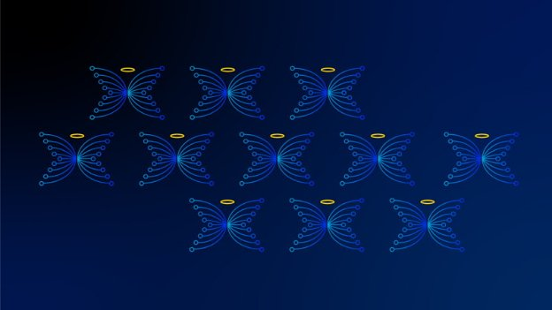

# The final days of Christmas
### **The past, present, and future of Cardano in the spirit of an olde English counting song**
 4 January 2021[ Anthony Quinn](tmp//en/blog/authors/anthony-quinn/page-1/) 3 mins read

### [**Anthony Quinn**](tmp//en/blog/authors/anthony-quinn/page-1/)
Editor

Marketing & Communications

- 
- 
- 
- 

These are our final two thoughts about the past, present and future of Cardano in the spirit of an olde English counting song. There's one for each of [The Twelve Days of Christmas](https://www.classicfm.com/discover-music/occasions/christmas/twelve-12-days-of-christmas-lyrics-meaning/), from December 25 to January 5, published in four batches. You can look back to the [first batch](https://iohk.io/en/blog/posts/2020/12/24/some-thoughts-for-the-next-12-days/), which went out on Christmas Eve.
## **Day 11. Charles Morgan, head of cybersecurity**
My brief takes in a wide range of activities, from the obvious aspects of securing our websites, to advising staff on their physical safety on their travels (such as putting a wedge under a hotel bedroom door!), and enforcing two-factor authentication for almost 250 people around the world ([Yubikeys](https://www.yubico.com/) are brilliant for this). And we’re having to deal with an awful lot more than Santa coming down the chimney, as you can see from these [security statistics over the past year](https://www.websitehostingrating.com/cybersecurity-statistics-facts/). Can you believe that one in five of the billions of files online are completely open for global access? Scary stuff if that’s your health records or financial information.

I have three interesting items I am working on the moment. The first is theft detection, tracing and anti-money-laundering strategies for Cardano using machine cognition. Then, there’s the automation of security audits and anomaly detection. And, on a more personal level, I’m working towards my [Ethical Hacker v11](https://www.eccouncil.org/wp-content/uploads/2020/09/CEHv11-Brochure.pdf) certification.

As for 2021, I am looking forward to having more team members in cybersecurity. This is going to allow us to be far more proactive in our security posture, in running dynamic and static audits of our products, and it will allow us to pursue [ISO/IEC 27001](https://www.iso.org/isoiec-27001-information-security.html) certification and compliance. This work is critical to Input Output becoming recognised globally as a technologically-stable company, which, thereby, will bolster confidence in Cardano and our products based on the blockchain platform.

## **Day 12. Rob Moore, digital deliveries manager**
The Shelley launch and the start of decentralization for Cardano was a monumental event for the project. The whole of the web team was on call in case anything unforeseen happened, but, of course, all we ended up doing was watching the transition take place. However, even playing that bit part in helping to make Shelley happen is something I won't forget in a hurry. 

Setting ourselves up to deliver quality creative work has been absorbing much of my time recently. December’s [Mantis launch](https://iohk.io/en/blog/posts/2020/12/09/the-new-mantis-bringing-security-and-stability-to-the-ethereum-classic-ecosystem-1/) of a new client for [developers working with Ethereum Classic](https://mantisclient.io/) is a taste of things to come.

Live music, seeing friends and family, having plans, meeting work colleagues in real life, going abroad. All the things we used to take for granted. These are the things I’ve been missing and hope to get back to in 2021.

*That completes our Twelve Days of Christmas. We hope some of them – whether on Daedalus, Japanese poetry, decentralized identity or the thoughts of a dreaming octopus – have struck a chord with you.* *The rendition of [The Twelve Days of Christmas](https://www.classicfm.com/discover-music/occasions/christmas/twelve-12-days-of-christmas-lyrics-meaning/) by the choir of Clare College Cambridge has certainly raised plenty of laughs. Here's to an exciting 2021!*
