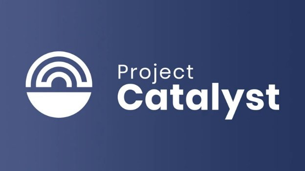

# Project Catalyst blasts off into 2021
### **New fund will commit $500k in ada to find groundbreaking ideas which accelerate Cardano development**
 6 January 2021[ Eric Czuleger](tmp//en/blog/authors/eric-czuleger/page-1/) 5 mins read

### [**Eric Czuleger**](tmp//en/blog/authors/eric-czuleger/page-1/)
Senior Content Editor

Marketing & Communications

- 
- 
- 

Project Catalyst is the first stage in our Voltaire roadmap, created to bring best-in-class governance to Cardano. Effective governance is vital to Cardano because it gives the power to shape the blockchain to its users. Anyone who signs up to Catalyst will be able to propose ideas, and then registered ada holders will vote on funding proposals focused on the continued evolution of Cardano as a platform and a community. This will not only accelerate development but also sustain the Cardano ecosystem in the long term. 

This journey began with two test funds, and then Catalyst swung into action for real with [Fund2 in September](https://iohk.io/en/blog/posts/2020/09/16/project-catalyst-introducing-our-first-public-fund-for-cardano-community-innovation/). With it we saw a very early – and remarkable – example of decentralized collaboration. Thousands of people came together – proposing teams, community advisers and ada-holding voters – to generate, refine and prioritize funding for proposals to drive Cardano forward.

Voting on Fund2 has just concluded and tallying of the votes is under way. Soon, the winning teams will receive funding to help make their proposals a reality. [Join our dedicated Telegram channel for Catalyst](https://t.me/cardanocatalyst) and stay tuned to our social channels for updates on this.

**Challenge accepted**

Meanwhile, with barely a beat, we’re moving forward with even greater purpose by harnessing the community momentum integral to Catalyst. Fund3 launches today and we want to expand the Catalyst community with every fund, encouraging ever more people to get involved.

If you’re not familiar with Project Catalyst, this is how it works. Every funding round begins with a defined set of challenges. Each challenge represents an ‘intention’ by the Cardano community, a collective goal we’d like to achieve – we like to talk of return on intention as the way of measuring progress for the project! Each challenge is designed to be broad enough to inspire both technical and general ideas, while being specific enough to provide focus. As long as an idea addresses a challenge and makes a strong case for meeting the intended outcome, it will be considered. So we welcome all proposals, from marketing initiatives and infrastructure development, to content production and product enhancement. 

Project Catalyst relies on the ingenuity of a global network of participants so all ideas are encouraged and can always be ‘re-entered’ for future funds if they do not meet the challenge criteria at hand.

Fund2 contained a pool of ada worth $250,000 and Fund3 doubles that, distributing $500,000 in ada between proposers, voters, and community advisers. Fund3 has three challenges:

1. **Developer ecosystem challenge:** How can we encourage developers to build on Cardano in the next six months?
1. **DApp creation challenge:** What decentralized applications (DApps) should be funded to drive user adoption in the next six months?
1. **‘Community choice’ challenge:** This new category is where we ask the community itself to set one or more challenges, which will have their own funding round in Fund5. An additional $500,000 pool will be available to cover any goal the community wishes to set, whether it’s about executing the community roadmap, funding content or podcasts, encouraging non-profit work or whatever else is determined to be a priority.

So how do you participate in Project Catalyst?

**From sharing insights to submitting ideas** 

First of all, anyone wishing to get involved with the project, whether as a proposer, adviser or simply a voter, should sign up to our [collaboration platform](https://cardano.ideascale.com/a/index). You do not have to be an ada holder to propose an idea or take part in the discussion phase. 

Fund3 begins with an insight-sharing phase in which people can give their perspectives on the challenge before proposals are launched. Think of this phase as a community brainstorming forum to inspire proposers.

After the discussion of the challenge, participants with proposals will publicly submit an initial draft.

**Refining ideas, finalizing proposals and review**

Community members will be invited to provide constructive criticism, offer suggestions, give positive affirmations in the form of ‘kudos’, and even offer to form partnerships and collaborations with proposing teams. The goal is to pool community knowledge and expertise – and Catalyst members are a diverse crew with valuable life and professional experience to offer. The following graph shows the makeup of people who signed up for Fund2:

After community feedback is given, proposers are afforded the opportunity to revise and finalize their plans.

Once proposals are ready, a group of expert reviewers, recruited as community advisers, will give a rating for how well each one addresses the challenge. After this, ada holders can register and then cast their vote. The votes, which are weighted according to the size of each voter’s holding, are then counted and requested funds distributed to the winning proposals.

**Looking forward**

Fund2 generated incredible creativity and strong proposals, some of which will soon be funded into reality. We expect even greater things from Fund3 as we start building a thriving DApp ecosystem on Cardano. We call Project Catalyst an ‘experiment’ – and we intend to encourage this spirit for some time to come. But our intent is very real and very determined. Every week that goes by presents opportunities to improve and refine this groundbreaking program for, and with, the Cardano community.

*Join us in developing Cardano’s on-chain governance by signing up to our [IdeaScale](https://cardano.ideascale.com/) collaboration platform and our dedicated Catalyst [Telegram](https://t.me/cardanocatalyst) channel.*
