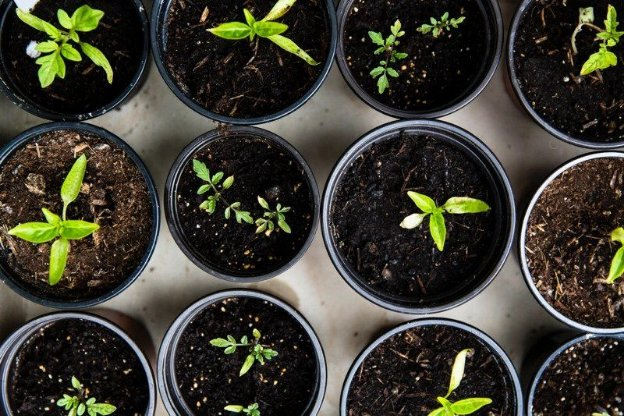

# Project Catalyst – the first winning proposals
### **The community has spoken and 11 projects will receive funding to advance the Cardano ecosystem**
 12 January 2021[ Dor Garbash](tmp//en/blog/authors/dor-garbash/page-1/) 4 mins read

### [**Dor Garbash**](tmp//en/blog/authors/dor-garbash/page-1/)
Head of Product

Commercial

- 
- 
- 

Project Catalyst is an ongoing experiment in exploring decentralized innovation and collaboration at its highest level. As the first stage in the Voltaire roadmap, it challenges participants to pool their ingenuity, creativity and passion to identify ground-breaking projects that support Cardano’s growth. 

Fund2 was the first time that Project Catalyst participants pitched, debated, refined, and voted on proposals using real ada. This was aimed at enhancing and bringing new value to Cardano. We challenged Fund2 participants to come up with ways to encourage Cardano ecosystem development in the next six months. With an available initial ada fund worth $250,000, we are able to fund 11 proposals.

Today, we are thrilled to announce the funded proposals in Fund2.

**PoolTool platform upgrade:** Opening avenues to build businesses and applications on Cardano that differentiate between stake pool operators by offering additional products. This upgrade is aimed at increasing infrastructure diversity across Cardano.

**Ouroboros over RINA:** Deploying a proof of concept stake pool and relay solution of Ouroboros over RINA using Ethernet/WDM at two sites in Tokyo, Japan. 

**Haskell/Plutus/Marlowe education:** Creating educational content that conveys complex information in a structured way, supplemented with examples that inspire ideas. This proposal makes it easier for new developers and entrepreneurs.

**Create a message-signing standard:** Generating a message-signing standard to prove reserves, identity, and stake pool delegation. 

**Liqwid: Cardano lending markets for decentralized finance:** Creating an open-source, non-custodial liquidity protocol to earn interest on deposits and borrow assets on Cardano.

**Cardano for mobile DApp developers:** Turning mobile platforms into the first-class citizens of the DApp world with mobile SDKs, mobile-first DApp experience and app store compatibility. 

**GimbaLabs – starter kits and tools:** GimbaLabs is a startup platform providing free and open source APIs, lessons, and project-based learning resources to help people bring their ideas to life on Cardano and so drive adoption of the blockchain.

**Lovelace Academy for Marlowe and Plutus:** Establishing an online academy to attract, inspire and educate individuals and companies to create applications on Cardano's smart contract and native assets platform. 

**Sign Tx Arduino:** Starting a library for code written in the C programming language that is compatible with the Arduino development environment.  Sign local Cardano transactions in advance of smart contracts being available to  enable applications for the internet of things (IoT). 

**Pet Registry DApp with ₳Pay:** Helping developers accept ada payments on websites. The Pet Registry DApp, built on ₳Pay, will service a global audience in a cheaper, better way. Devs are inspired by successful apps and the tools needed to build them, By creating both, we can inspire and accelerate devs and their solutions.

**Japan Cardano Governance Association: Meetings & Communities & Podcasts:** supporting online/offline meetups, governance podcasts etc. for our Japanese community.

On behalf of the Project Catalyst team, we want to congratulate [all of these exciting projects](https://static.iohk.io/docs/catalyst/catalyst-voting-results-fund2.pdf). Each funded team will receive their ada by the end of January so they can begin bringing their ideas to life. We are looking forward to seeing the impact of these projects on the Cardano ecosystem. 

We also want to extend our congratulations and gratitude to everyone else who participated in Fund2. Our proposers, community advisers, collaborators and voters all had a hand in making Fund2 a success. Project Catalyst is all about putting the community in command of Cardano and you have demonstrated that the future of our ecosystem is in very good hands. 

Although 11 ideas have been funded this time, a number of strong contenders met the community voting threshold but missed out on funding this time. In the linked PDF, those projects highlighted in green have secured community funding. Those in yellow were approved for funding by the community, but the treasury did not have enough funding to support their proposals. We’ll be encouraging these proposers to resubmit their ideas for the just-launched Fund3 where relevant (with its focus on the DApp ecosystem) and we hope to see the best of these funded by the community next time.

We have [bold and ambitious plans](https://youtu.be/GjPhxXDFv58?t=128) for Project Catalyst in 2021, with ada worth millions of dollars being made available to fund innovation on Cardano. Submission for proposals for Fund3 will open tomorrow, don’t miss out on the opportunity to make your voice heard.

*If you’d like to join the Project Catalyst community as a proposer, community adviser, implementer or voter, please join us on [Ideascale](https://cardano.ideascale.com/a/index) and start innovating alongside our global network of participants. Sign up to the [Telegram](https://t.me/cardanocatalyst) announcement channel for the latest news.* 
