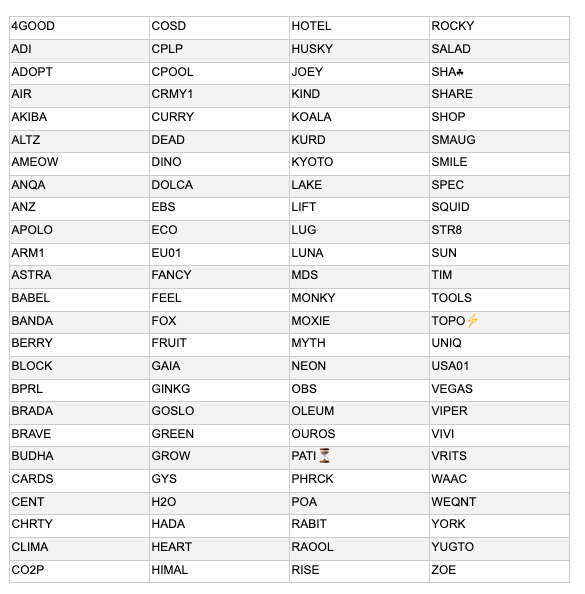

# Our new delegation strategy – announcing the pools we’re supporting
### **We are committed to a vibrant pool ecosystem and we’re supporting that by delegating to 100 community pools**
 22 January 2021[ Tim Harrison](tmp//en/blog/authors/tim-harrison/page-1/) 7 mins read

### [**Tim Harrison**](tmp//en/blog/authors/tim-harrison/page-1/)
VP of Community & Ecosystem

Communications

- 
- 
- 
- 

The Cardano stake pool community powers the Cardano network; the health and vitality of this critical operator ecosystem is essential to the effective running of the protocol. And as we continue to evolve Cardano’s utility through Goguen, this will become ever more important. Staking with quality pools is the very best way to give back to the Cardano community. 

Like any ecosystem, success comes from the balancing of interests, dissemination of power, and the variety and diversity of actors. And like an economy, a balance of commercial influence; bigger players, smaller players offering greater diversity and a healthy core in between. 

As much as ‘code is law’ (and features the judiciary?) we can all recognize the inputs, outputs, human behaviours and social dynamics that shape the community which surrounds and supports any blockchain protocol.

So as part of our continuing commitment to healthy ecosystem growth, we recently outlined [our new strategy](https://iohk.io/en/blog/posts/2020/11/24/delegating-with-fresh-purpose/) for delegating IOG’s ada funds. We instigated this delegation strategy to support our long-term vision for Cardano’s growth and evolution and reaffirm the values we espouse. All in line with following a fiscally sound path which can maintain the commercial viability of our organization. 
### **A positive response**
We put out the call for delegation in December. Our community responded very positively, and by the time we closed for entries just before the Christmas break, we had received just under 300 (299 in fact) applications for delegation. We have since retired all but one of our public pools – their creation was always an entirely tactical activity – and we’re now shifting toward our longer term strategic intent.
### **The process**
Over the past two weeks, we have reviewed all entries from our call for delegation. The process has been relatively complex. We have tried to identify a cross section of pools based on a number of factors, all important on their own merit. Viewed holistically, these factors provide an invaluable map of the SPO environment. Among the key factors (and within them, variables) that we took into account were:

**Purpose** – is this a purely commercial venture, or is it doing something to give back or pay forward to the community or the wider world (content, education, support for the disadvantaged, sustainable practice, donations to charity, etc. )

**Geography** – are they an active and committed player in an under-represented region? 

**Technical contribution** – is the SPO running a best-in-class technical operation or building (tools, applications etc.) on Cardano? Have they been a contributor since the ITN – or longer?

**Stake and pledge ratio** – what is the ratio here? Is the amount of pledge ‘reasonable’ given their stake, or does this SPOs ‘commitment to the network’ –through pledge – suggest they ‘deserve’ a higher level of delegation from the community?

**Community engagement** – are they an active member of the SPO community? Are they adding value through positive role-modelling on social, or supporting other community members via contributing to guilds/alliances etc. Are they helping drive visibility and adoption in an ethical, sustainable way?

The selection process has been challenging, iterative, illuminating and inspiring. 

*Challenging* because we have not been able to delegate to every pool we might have liked to – our SPO community is hugely talented and not everyone got a delegation in this first cohort. While we applied some basic filters to narrow down the field from 299, we still had a long list of probably 75% of that number. So we had to look at factors more holistically; this was not a yes/no choice. Kudos, by the way, to [pooltool.io](https://pooltool.io/) and [adapools](https://adapools.org/) for providing additional data sources during the process.

As our first-ever program, we had always regarded this as a ‘pilot’ we would evolve iteratively. Initially, we planned to classify pools separately. Pools centered on purpose or mission-driven objectives vs. those focused on more technocratic factors. For a start, we were surprised at the number of mission driven pools within the ecosystem. Given our broader mission as a community, perhaps this shouldn't have been a surprise. However, once we dug into the data, it became clear that many pools were hard to classify, adding value in a number of ways; purpose, technical contribution, geographic spread, community contribution. The very best pools here set the standard for all.
### **Choosing pools**
The selection process was illuminating due to the richness of the data set, which reflected the diversity and breadth of our community. We gained some powerful insights. So much so, in fact, that we plan to anonymize the data set and share a subset with the community a little further down the line, both to identify elements we need to iterate, and to provide a snapshot of community growth and evolution over time. Think of it as a quarterly ‘census’ of the SPO community. 

That same richness has been truly inspiring – SPOs in dozens of countries, across every continent (except Antarctica… hmm… now there’s a challenge for someone to take up!). Tangible evidence of a young, but fast-maturing community committed to excellence, collaboration, and making a positive difference in the world. All through Cardano.

So let’s meet the pools we have selected: 

Congratulations to our very first 100-strong pool cohort. We’ll start delegating to our selected pools from the end of January/early February (based on operational considerations), staking IOG funds of 3.2M ada per pool to support block production. Each quarter through 2021, we shall recruit a fresh cohort and update this list accordingly.

We want to make our approach as visible as possible. We have created a dedicated Twitter list, so you can follow our first cohort. And while we have no formal guidelines, we see these delegations as bootstrapping; pools should continue doing what they do within the community and look to organically grow their delegate base, while we delegate to them.

To check out some of these pools, visit [pooltool.io](https://pooltool.io/) or [adapools](https://adapools.org/delegations/input-output?test) and search on each ticker. You will also shortly be able to filter by dedicated lists. Additionally, we’ll also be introducing some of them here on the blog and to our monthly show over the weeks and months ahead.
### **Looking ahead**
If you were not selected this time, take heart. We had many more pools than we could delegate to this time. We encourage all pools that missed out to apply again for the fresh cohort in Q2; we’ll make a new call for applications at the end of March and rotate delegations at the end of April. 

*Every* pool will need to reapply. However, we shall simplify the process for pools that missed out this time. It is also important to note that as the ecosystem grows, we are seeing some strong community contributors emerge who did ***not*** apply for delegation. We also welcome community feedback on how we can continue to grow and evolve the process.

Please check out the program and if you want some support bootstrapping your pool operation (or providing ‘block security’ while you grow your organic delegate base) don't miss out next time. 

We are delighted to see many pools grow from strength to strength. Equally, when a smaller pool calls out that they are stalling, we must listen. Alongside this program, your choice as a delegator is key to supporting a pool ecosystem of abundance and generosity. Because there lies growth and the community we all desire. This is what we do. As the leading crypto community, it is something we should all be very proud of. 

IOG is committed to seeing the Cardano ecosystem grow and flourish. We will continue to play our part. And remember, as a community, we all have our parts to play.
