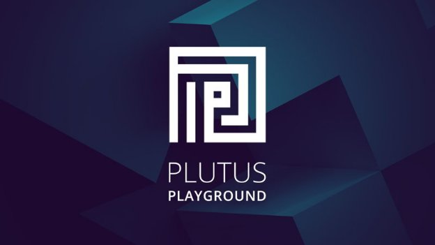

# Introducing the new Plutus Playground
### **Developers are invited to test out our improved smart contract tools before full release**
 25 January 2021[ Olga Hryniuk](tmp//en/blog/authors/olga-hryniuk/page-1/) 4 mins read

### [**Olga Hryniuk**](tmp//en/blog/authors/olga-hryniuk/page-1/)
Technical Writer

Marketing & Communications

- 
- 

Goguen is Cardano’s development theme that focuses on utility, smart contract support, and native token issuance. While delivering it as a system of interactive components, we are gradually adding all the building blocks to add smart contracts to the Cardano platform.

Goguen brings native token support along with Plutus and Marlowe to help develop the smart contracts that are essential to establishing a global, decentralized financial system. To lay the groundwork, we have introduced [transaction metadata](https://iohk.io/en/blog/posts/2020/11/03/getting-to-grips-with-metadata-on-cardano/), upgraded the ledger to support [token locking](https://iohk.io/en/blog/posts/2020/12/02/goguen-brings-token-locking-to-cardano/) (which is essential for complex smart contracts), and will soon deploy [native token](https://developers.cardano.org/en/development-environments/native-tokens/native-tokens/) support for multi-assets. We are also building devnets to bring in [other developer communities](https://developers.cardano.org/).

Now, we have refreshed and upgraded the Plutus Playground and we are encouraging developers to contribute to its growth by testing the pre-release version.
## **What is the Plutus Playground?**
*Plutus Playground* provides an environment for writing and testing smart contracts before they are released on the Cardano blockchain. *Plutus Core*, which is the smart-contract language embedded into the ledger, is based on Haskell formal programming principles and allows developers to write high-assurance applications that interact with Cardano. Haskell was chosen as the basis for the Plutus Platform because it stands out from other programming languages for offering the ability to write more secure code. Using Haskell for smart contract deployment ensures that contracts are programmed to do exactly what they are expected to and can be tested for accuracy before implementation. 

As well as providing a web-based simulator for writing and executing smart contracts, the new Plutus Playground also allows users to access popular smart contracts that have already been written. An early version was previewed at PlutusFest in December 2018. Since then, the project has expanded considerably and this new release of Plutus Playground reflects that. 
## **Who is it for?**
Plutus Playground is for people creating decentralized applications (DApps), and smart contract programmers who wish to work with Cardano. Plutus will become a platform for building DApps for supply chains, track and trace, medical records, identity voting, property registration, P2P payments, and financial systems. Thus, it will serve the needs of audiences such as:

- companies, large and small
- governments
- the Cardano community and ada holders
- entrepreneurs.
## **Plutus Playground features and improvements**
So, now is the time for developers to start building Plutus contracts and testing them prior to the deployment of Plutus on the Cardano mainnet later this year. Plutus Playground works through your web browser and there is no need to install software. There are tutorials on compiling and simulating smart contracts written by the Plutus team.

Improvements have been made to the backend software, reported issues have been addressed, and the interface is even better.

Figure 1. The old Plutus Playground editor (left) compared with the new interface, which is now available

As with the existing Plutus Playground, the interface is split into three sections:

- editor
- simulation
- transactions.

The simulator shows how a contract will behave on the Cardano blockchain. An important aspect of this is that it can act as a training tool for people who do not have advanced developer skills because it demonstrates the working principles. Users can define and modify the wallets that interact with a contract, as well as the actions that affect the outcome. The results can then be evaluated to see what happens on the blockchain and how transactions occur.

The Plutus Playground offers a choice of keyboard setups. Developers can choose between Vim and Emacs options or stick with the default keyboard. 

We have also refreshed the look and feel with UX improvements. Finally, the simulator is more realistic in the way it runs Plutus applications, and as previously, it can be linked with GitHub accounts to save contracts and any work in progress. You can find a [full technical walkthrough here](https://youtu.be/DhRS-JvoCw8).
## **How to get involved**
We are now encouraging experienced developers (and less experienced ones too!) to test Plutus Playground before the final offering. If you are interested in smart contracts and wish to get involved, we are eager to hear your feedback.

The Playground refresh goes live today at <https://playground.plutus.iohkdev.io/>. You can join Plutus discussions at the [Cardano Forum](https://forum.cardano.org/c/developers/cardano-plutus/148) and visit the [Plutus GitHub repository](https://github.com/input-output-hk/plutus). For access to additional support and resources, register your interest by filling out [this Typeform](https://input-output.typeform.com/to/gQ0t9ep5) for us to add you to our Slack community.
