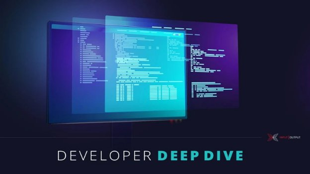

# Plutus Tx: compiling Haskell into Plutus Core
### **Get to the heart of writing smart contract applications on Cardano**
 2 February 2021[ Michael Peyton Jones](tmp//en/blog/authors/michael-peyton-jones/page-1/) 9 mins read

[](tmp//en/blog/authors/michael-peyton-jones/page-1/)
### [**Michael Peyton Jones**](tmp//en/blog/authors/michael-peyton-jones/page-1/)
Software Engineering Lead

Engineering

- [](mailto:michael.peyton-jones@iohk.io "Email")
- [](https://www.linkedin.com/in/michael-pj/ "LinkedIn")
- [](https://twitter.com/mpeytonjones "Twitter")
- [](https://github.com/michaelpj "GitHub")



Last week saw the release of the refreshed version of the [Plutus Playground](https://iohk.io/en/blog/posts/2021/01/25/introducing-the-new-plutus-playground/). This is our showcase for the [Plutus Platform](https://www.youtube.com/watch?v=usMPt8KpBeI), at the heart of which is the ability to write smart contract applications in a single, high-level language: Haskell.  

Our toolchain allows a single Haskell program to produce not only an executable file that users can run on their own computers, but also the code that runs on the Cardano blockchain. This gives users a battle-tested, high-quality programming language, and makes use of standard tooling and library support. Nobody wants to learn a proprietary programming language and half-baked tools if they don't have to!

The technology that powers this is called Plutus Tx, and is, in essence, a compiler from Haskell to Plutus Core  “ the language that runs on the chain  “ provided as a GHC plug-in. In this post we'll dive into how this works, and some of the technical challenges.
## **Boiling down Haskell**
Isn't Haskell an old, complicated language? Notoriously, it has dozens of sophisticated extensions that change the language in far-reaching ways. How are we possibly going to support all this?

Fortunately, the design of GHC, the primary Haskell compiler, makes this possible. GHC has a very simple representation of Haskell programs called [GHC Core](https://www.youtube.com/watch?v=uR_VzYxvbxg). After the initial typechecking phase, all of the complex surface language is desugared away into GHC Core, and the rest of the pipeline doesn't need to know about it. This works for us too: we can operate on GHC Core, and get support for the much larger Haskell surface language for free.

The other complexity of Haskell is its type system. This is much harder to avoid. However, we have the luxury of choosing what type system we want to use for our target language, and so we use a system that is a subset of Haskell's  “ fortunately Haskell's type system is pretty good!

In the end, it turns out that we don't want to support *all* of Haskell. Some features are niche, inapplicable (nobody needs a C FFI on the blockchain), or, honestly, just a real pain to implement. So for now the Plutus Tx compiler will give you a helpful error if you use a feature it doesn't support. Most  simple' Haskell is supported (although there are a few things that look simple, but are annoyingly complicated in practice).
## **Down the tube**
What do we compile Haskell into? At the end of the day we have to produce Plutus Core, but it is ancient compiler wisdom to break down big compilation pipelines like this by introducing  intermediate languages', or an intermediate representation (IR). This ensures that no one step is too large, and that the steps can be tested independently.

Our compilation pipeline looks like this:

1. GHC: Haskell -> GHC Core
1. Plutus Tx compiler: GHC Core -> Plutus IR
1. Plutus IR compiler: Plutus IR -> Typed Plutus Core
1. Type eraser: Typed Plutus Core -> Untyped Plutus Core

As you can see, there are quite a few stages after GHC Core, but I just want to highlight Plutus IR. This is an extension of Plutus Core designed to be close to GHC Core. So, strictly speaking, the Plutus Tx compiler doesn't target Plutus Core: it targets Plutus IR, and then we invoke the rest of the pipeline to get the rest of the way.

This reduces the amount of logic that has to live in the plug-in itself. It can focus on dealing with the idiosyncrasies of GHC, and leave well-defined (but [difficult](https://hydra.iohk.io/job/Cardano/plutus/linux.papers.unraveling-recursion/latest/download-by-type/doc-pdf/unraveling-recursion)) problems such as handling data types and recursion to the Plutus IR compiler, where they can be tested without having to run a GHC plug-in!

Having Plutus IR in the pipeline gives us other advantages too. We don't have total control over how GHC generates GHC Core, but we *do* control how Plutus IR gets turned into Plutus Core. So if users want to ensure total reproducibility of their on-chain code, they can save the Plutus IR and get a (comparatively) readable dump that they can reload later.
## **Sneaking into GHC**
How do we actually get the GHC Core in the first place? GHC Core is part of *GHC*'s compilation pipeline. We'd have to somehow insert ourselves into the middle of GHC's compilation process, intercept the part of the program that we want to compile to Plutus Core (remember: we only compile *some* of the program to on-chain code), compile it, and then do something useful with the result.

Fortunately, GHC provides the tools for this in the form of GHC plug-ins. A GHC plug-in gets to run during the GHC compilation process, and is able to modify the program that GHC is compiling however it likes. This is exactly what we want!

Because we are able to modify the program GHC is compiling, we have an obvious place to put the output of the Plutus Tx compiler  “ back into the main Haskell program! That's the right place for it, because the rest of the Haskell program is responsible for submitting transactions containing Plutus Core scripts. But from the point of view of the rest of the program, Plutus Core is opaque, so we can get away with just providing it as a blob of bytes ready to go into a transaction.

This suggests that we want to implement a function like this:
```
compile :: forall a . a -> CompiledCode a
```
From the user's perspective, this takes *any* Haskell expression and replaces it with an opaque value representing that expression, but compiled into a Plutus Core program (or rather a bytestring containing a serialized representation of that program). The real version is a little more complicated, but, conceptually, it's the same.

However, we don't want to try and implement this as a normal Haskell function. A normal Haskell function with the signature of compile would take a *value* of type a, and turn it into a Plutus Core program at *run* time. We want to take the *syntax tree for the expression* of type a and turn it into a Plutus Core program at *compile* time.
## **The switcheroo**
Here's the trick: we don't actually implement compile as a function; instead, our plug-in trawls through the program to find applications of compile to an argument, and then replaces the whole application with the compiled code.

So, for example, we turn
```
compile 1
```
into
```
<bytestring containing the serialized Plutus Core program ‘(con integer 1)’>
```
This means that the program continues to be type-correct throughout. Before the plug-in runs, the expression compile 1 has type CompiledCode, and the same is true afterwards  “ but now we have an actual program!
## **Finding the source**
Compilers work with the source of programs, and the Plutus Tx compiler is no different. We process the GHC Core syntax tree for programs. But what happens when a program calls a function from another module? Haskell is separately compiled: typically modules only see the types of functions in other modules, and the object code is linked together later. So we don't have the source!

This is, in fact, extremely annoying, and in the long run we plan to implement support in GHC for reliably storing the GHC Core for modules inside the interface files that it generates. This would enable us to do something more like  separate compilation' for Plutus Tx. Until then, however, we have a workaround using  *unfoldings*.

Unfoldings are the copies of functions that GHC uses to enable cross-module inlining. We piggyback on these as a way of getting the source of functions. Consequently, functions that are used transitively by Plutus Tx code must be marked as INLINABLE, which ensures that unfoldings are present.
## **Run time matters too**
This all sounds fine, until you realise that you usually want to create different versions of a Plutus Core program based on decisions at run time. If I'm writing a contract that implements an atomic trade, I don't want to have to *recompile my program* to change the participants or the amount!

But as we said before, it's tricky to write a function of type a -> CompiledCode a that actually works at run time. Rather than looking at the GHC Core syntax tree representing the expression in the Haskell program, we instead need to deal with values that the program computes.

We can do this in typical Haskell fashion by defining a pair of typeclasses:

1. Typeable: which tells us how to turn a Haskell type into a Plutus Core type
1. Lift, which tells us how to turn a Haskell value into a Plutus Core value

For those familiar with Haskell, these deliberately parallel the Typeable and Lift classes that GHC provides for turning Haskell types and values into representations useful for more typical Haskell metaprogramming.

We can't write instances of these type classes for all types. For example, when we're looking at the GHC Core we can inspect the GHC Core for \x -> 1 and see that it is a lambda, and what the body is. But when the code is run, a function can be a compiled blob of native code, and we can't do this any more. So, unfortunately, we can't lift functions at run time.

Ultimately, this means you can typically lift *data* at run time, like an integer, or a complicated data type representing a fee schedule. You can then pass the lifted data to a function that you compiled at compile time with a little helper: 
```
applyCode :: CompiledCode (a -> b) -> CompiledCode a -> CompiledCode b.  
```
This is a nice instance of a functional architecture paying off for us: we can handle these tricky dependencies between compile time and run time with simple functions and arguments!
## **Getting out of the way**
The goal of Plutus Tx is to allow you to freely write Haskell and seamlessly use it in both on-chain and off-chain code. We've made a lot of progress towards that goal, and we look forward to polishing off the remaining warts as we go.
## **Postscript: show me the money!**
How can you actually use Plutus Tx? The compiler will be released with [Plutus Foundation](https://www.youtube.com/watch?v=NjFUYD5FOkE) in one of the updates of Cardano to support Goguen's capabilities. This will include support for Plutus Core on the Cardano chain. At that point we'll release the libraries into the wild. Until then, you can cheer us along [on Github](https://github.com/input-output-hk/plutus) , and let us know how you get on with the new [Plutus Playground](https://playground.plutus.iohkdev.io/) .
