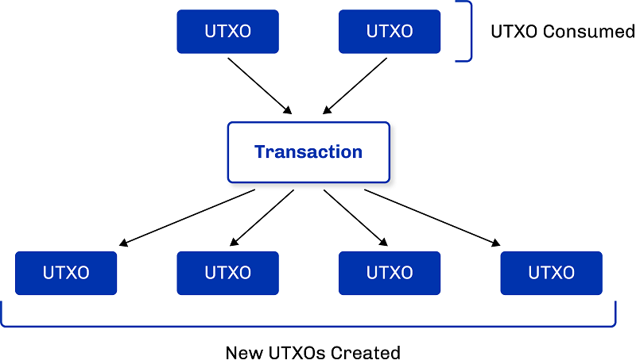

# Cardano’s Extended UTXO accounting model – built to support multi-assets and smart contracts (part 2)
### **In the second part of our blog on Cardano’s EUTXO accounting model, we take a more technical look at transaction components, the UTXO set, and delve deeper into the rationale for Cardano’s EUTXO model**
 12 March 2021[ Fernando Sanchez](tmp//en/blog/authors/fernando-sanchez/page-1/) 5 mins read

### [**Fernando Sanchez**](tmp//en/blog/authors/fernando-sanchez/page-1/)
Technical Writer

Marketing and Communications

- 
- 

Yesterday we offered an [overview](https://iohk.io/en/blog/posts/2021/03/11/cardanos-extended-utxo-accounting-model/) of the Extended UTXO model employed by Cardano, explaining how it differs from the approaches taken by Bitcoin and Ethereum. Now let’s dive a little deeper into inputs and outputs, the component parts of a transaction. 
### **We need to talk about transactions: Outputs and Inputs**
The term *transaction* usually evokes financial echoes. While such meaning would apply to Bitcoin (since the Bitcoin blockchain is used to move funds between peers), many other blockchains (including Cardano) are far more versatile. In these cases, the term ‘transaction’ is much more nuanced. One can think of transactions as transfers of value.

In a blockchain environment, each transaction can have one or multiple inputs, and one or multiple outputs. The concepts of **Inputs** and **Outputs** must be understood, if one wants to understand how a transaction works, and how it relates to UTXO. In abstract terms, think of a transaction as *the action that unlocks previous outputs, and creates new ones*.

**Transaction output**

A transaction output includes an address (that you can think of as a lock) and a value. In keeping with this analogy, the signature that belongs to the address is the key to unlock the output. Once unlocked, an output can be used as input. New transactions spend outputs of previous transactions, and produce new outputs that can be consumed by future transactions. Each UTXO can only be consumed once, and as a whole. Each output can be spent by exactly one input, *and one input only.*

**Transaction input**

A transaction input is the output of a previous transaction. Transaction inputs include a pointer and a cryptographic signature that acts as the unlocking key. The pointer points back to a previous transaction output, and the key unlocks this output. When an output is unlocked by an input, the blockchain marks the unlocked output as “spent”. New outputs created by a given transaction can then be pointed to by new inputs, and so the chain continues. These new outputs (which have not yet been unlocked, i.e., spent) are the UTXOs. **Unspent outputs are simply that, outputs that have not yet been spent**.
### **How UTXO works, in a nutshell**
In a UTXO accounting model, transactions consume unspent outputs from previous transactions, and produce new outputs that can be used as inputs for future transactions.

The users' wallets manage these UTXOs and initiate transactions involving the UTXOs owned by the user. Every blockchain node maintains a record of the subset of all UTXOs at all times. This is called the *UTXO set*. In technical terms, this is the *chainstate*, which is stored in the data directory of every node. When a new block is added to the chain, the chainstate is updated accordingly. This new block contains the list of latest transactions (including of course a record of spent UTXOs, and new ones created since the chainstate was last updated). Every node maintains an exact copy of the chainstate. 
### **EUTXO: The rationale behind Cardano's choice**
Bitcoin’s ‘vanilla’ UTXO accounting model would not suit Cardano, as Cardano is designed to do more than handle payments. Particularly, the need for more programming expressiveness for the upcoming smart contracts functionality in the Alonzo era required a novel (‘Extended’) solution.

The 'basic' UTXO model has a limited expressiveness of programmability. Ethereum's Account/Balance accounting model addressed this specific problem with the development of an account-based ledger and associated contract accounts. But by doing so, the semantics of the contract code became far more complex, which had the unwanted effect of forcing contract authors to fully grasp the nuances of the semantics to avoid the introduction of potentially very costly vulnerabilities in the code.

An ‘extended’ UTXO solution would require two pieces of additional functionality that the existing UTXO model could not provide: 

1 - To be able to maintain the contract state

2 - To be able to enforce that the same contract code is used along the entire sequence of transactions. We call this continuity.

A powerful feature of the EUTXO model is that the fees required for a valid transaction can be predicted precisely prior to posting it. This is a unique feature not found in account-based models.
### **How does the EUTXO model extend UTXO?**
By adding custom data to outputs (in addition to value), and by allowing for more "locks" and "keys" deciding under which condition an output can be unlocked for consumption by a transaction. In other words, instead of just having public keys (hashes) for locks and corresponding signatures serving as "keys", EUTXO enables arbitrary logic in the form of scripts. This arbitrary logic inspects the transaction and the data to decide whether the transaction is allowed to use an input or not.
### **Conclusion: What makes the EUTXO model innovative and relevant**
Cardano's ledger model extends the UTXO model to support multi-assets and smart contracts without compromising the core advantages of a UTXO model. Our innovative research enables functionality beyond what is supported in any other UTXO ledger, making Cardano a unique competitor in the next-generation blockchain space.
