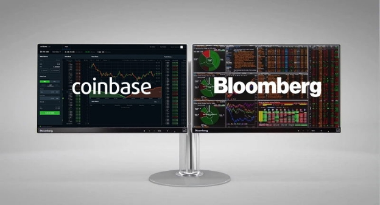

# Momentum continues as Coinbase lists ADA and Bloomberg adds Cardano
### **Cardano reaches another important milestone as financial data powerhouse Bloomberg adds Cardano to its ‘Terminal’ real-time market information platform and leading exchange Coinbase lists ADA**
 17 March 2021[ Tim Harrison](tmp//en/blog/authors/tim-harrison/page-1/) 4 mins read

### [**Tim Harrison**](tmp//en/blog/authors/tim-harrison/page-1/)
VP of Community & Ecosystem

Communications

- 
- 
- 
- 

While their impact on Roman emperor Julius Caesar was less than favorable, the [Ides of March](https://en.wikipedia.org/wiki/Ides_of_March) have proved propitious for Cardano, as ada has this week been [listed on Coinbase Pro](https://blog.coinbase.com/cardano-ada-is-launching-on-coinbase-pro-694b1cb8c778) and also [added to the prestigious Bloomberg Terminal](https://decrypt.co/61413/cardano-added-to-bloomberg-terminal). These are both major developments, reinforcing Cardano's position in the cryptocurrency landscape. One brings ada to an entirely new customer base, while the other offers a whole new level of visibility for Cardano to the global finance industry. 
## **Coinbase – coming of age?**
The Coinbase listing marks something of a coming of age for Cardano, with the potential to bring millions of new ada holders to the ecosystem at an exciting time. [Coinbase Pro](https://pro.coinbase.com/) is designed for individual traders, providing direct access to Coinbase Markets, the company’s ‘single source of liquidity’, as an upgrade path for consumer Coinbase customers.

From the early success of the incentivized testnet in 2019, to the introduction of staking last summer, the momentum has been steadily building for Cardano. Now, as we continue our Goguen rollout, decentralization continues apace, with full responsibility for block production being assigned to stake pools at the end of this month, on [D=0 day](https://iohk.io/en/blog/posts/2021/03/04/not-long-till-d-0-day/). Arguably 100x times more decentralized than the Bitcoin blockchain and, with 2,000+ registered stake pools, we can lay claim to being the most successful, most distributed Proof of Stake network in the world.

The timing is good. After years of research and development effort, the wider industry is now starting to properly recognize the potential that the incredible Cardano community has long believed in. Our network of stake pool operators has helped us create a blockchain that is provably secure, environmentally sustainable and scalable to the needs of a new generation of services.

The Goguen rollout is bringing a new level of utility to the platform – from metadata and native tokens, NFTs, DeFi and smart contracts. Our open innovation funding platform for development on Cardano, Project Catalyst, has already funded a number of proposals to enrich the Cardano ecosystem. Millions more dollars of funding will be made available for community innovation this year, drawn from a total Cardano treasury worth $400M+ today.
## **A technical achievement**
As well as an important driver of future growth, the listing on Coinbase has been an important technical collaboration, carried out using the open-source [Rosetta standard,](https://github.com/coinbase/rosetta-specifications) which we are championing together with Coinbase. Rosetta is now an integral part of our integration armory, for future interoperability projects. Rosetta has the ability to seamlessly interlink numerous blockchains, allowing institutions to manage multiple assets, without spending months researching the various technical implementations.
## **Bloomberg goes live**
Also, this week we received the news that financial data powerhouse Bloomberg has added Cardano to its informational roster. Since it was launched in 1982, Bloomberg Terminal has established a reputation among the finance industry as an essential source of real-time information for markets. As the company states, it helps “the world’s business and financial decision-makers surface relevant information in an ever-expanding ocean of data – and quickly act on it.”
## **So, what does this mean for Cardano & crypto**
Bitcoin was [added to the Bloomberg terminal](https://www.bloomberg.com/company/press/bitcoin-now-bloomberg/) back in 2014 and Cardano now joins a number of coins added to the roster since. More recently, cryptocurrencies, and digital assets in general, have seen a resurgence in interest from Bloomberg’s customers. Bitcoin recently hit an all-time high of $60,000. Meanwhile, non-fungible tokens (NFTs) have entered the mainstream, following the recent sale of artist Beeple’s entirely digital work, [Everydays: the first 5000 days](https://www.smithsonianmag.com/smart-news/entirely-digital-artwork-just-sold-major-auction-first-time-180977039/) for $69m, just as Cardano has launched native tokens on the network.

The addition of ada to Bloomberg Terminal is the latest chapter in a year of continuing momentum and growing credibility in the eyes of the financial industry. It is important to place this news in perspective. Cardano’s mission remains clear and focused on bringing real utility and value to billions of people around the world – in particular, those currently without access to financial services and infrastructure. Our focus continues to be on delivering the enabling technology to achieve this while empowering the community which will ultimately deliver the platform’s growth. Nonetheless, it remains a validation of the work the whole community has done to get here and a powerful marker of our continuing momentum.
