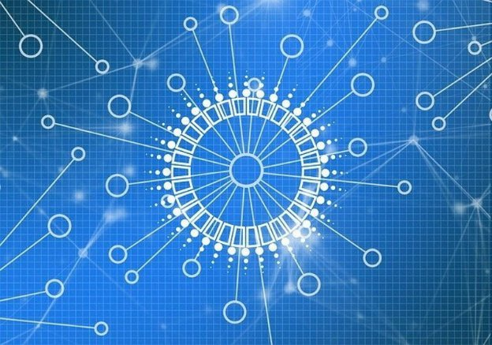

# Decentralization: to D=0 Day and beyond
### **Stake pool operators today take over block production and their role is set only to grow**
 31 March 2021[ Tim Harrison](tmp//en/blog/authors/tim-harrison/page-1/) 7 mins read

### [**Tim Harrison**](tmp//en/blog/authors/tim-harrison/page-1/)
VP of Community & Ecosystem

Communications

- 
- 
- 
- 

Today at 21:44:51 GMT, block production on Cardano will be fully decentralized. That is a watershed. From a federated network of seven core nodes run by IOHK, Emurgo, and the Cardano Foundation, we’ll emerge into a decentralized landscape where the stake pool operator (SPOs) community will produce 100% of blocks. 

Cardano is a proof-of-stake blockchain platform, founded on peer-reviewed research and delivered through evidence-based software development processes, by a team of world-leading researchers and engineers. From this technocratic core, Cardano exists to steadily redistribute power to the edges – to a community of individuals. And to empower them as an enabling force for change and progress. 

Our SPO community has been instrumental in bringing Cardano to this point. When *d*, the decentralization parameter, [reaches zero](https://iohk.io/en/blog/posts/2021/03/04/not-long-till-d-0-day/), SPOs will become responsible for creating all blocks on Cardano.
### **Why decentralization?**
In everyday terms, decentralization is the delegation of power from a central authority to a wider group of bodies. But that definition only scrapes the surface in the context of cryptocurrencies and blockchain. 

Cardano's technical journey to full decentralization continues through phased developments that include degrees of block-production from SPOs, peer-to-peer (P2P) network discovery, and ‘gossip’ with peers exchanging information among themselves. It involves the deployment of advanced community-led governance and decision-making frameworks, culminating in fully decentralized software and protocol updates. Ultimately, it will result in the creation of a platform wholly and democratically operated and controlled through a global community of SPOs, developers and ada holders.

Decentralization is a core value and driver for Cardano, and we are far from alone in this. The mainstream financial world has recognised that blockchain and the decentralized finance (DeFi) technology it enables has the potential to spawn a new financial system as revolutionary as the internet itself. And that is just part of a trend towards decentralization. Open protocols between renters and providers of data storage that anyone can use have the potential to disrupt the dominant centralized cloud server providers such as Amazon and Microsoft, and there are similar trends affecting video and communication networks and gaming. Cryptocurrencies first brought people into the blockchain world and now the buzz around [non-fungible tokens (NFTs)](https://iohk.io/en/blog/posts/2021/02/18/building-native-tokens-on-cardano-for-pleasure-and-profit/) is encouraging them to interact with blockchain in a new, fun way. These trends are introducing blockchain to the mass market.
### **Power to the edges**
Centralization has shifted the balance of power, from the people to corporations such as Facebook and Google, creating a virtual information monopoly. Because of their unchallenged market positions, centralized authorities enjoy data hegemony over their consumers. 

Decentralization is the antidote to this concentration of power and the risks that it brings. Decentralization empowers the individual to make choices and decisions, it returns ownership of personal information to where it belongs, it pushes power to the edges and enables every participant in the network (or ada holder) to have a stake.

There are three pillars to Cardano's decentralization: block production, networking, and governance. These are intrinsically linked to one another, and work synergistically to create a unified outcome: full decentralization, which lies at their confluence.
### **Pillar one: block production**
Every blockchain relies on the addition of new blocks to grow and thrive. With the Byron era deployment, core nodes – managed by IOHK, Emurgo, and the Cardano Foundation – were wholly responsible for creating blocks and maintaining the network. The [advent of Shelley](https://iohk.io/en/blog/posts/2020/04/29/from-byron-to-shelley-part-one-the-testnets/) and the Incentivized Testnet in 2019 served as testing ground for decentralized block production. The results demonstrated the viability of such an initiative. In other words, the [Incentivized Testnet experiment proved](https://iohk.io/en/blog/posts/2020/02/07/shelley-incentivized-testnet-story-in-numbers/) that Cardano could be reliably sustained by a network of community-run stake pools. As of epoch 170 on June 3, 2020, there were 1,299 registered stake pools, 413 of which were creating blocks. 

Today, we now have about 2,300 pools, with a healthy proportion creating blocks and rewarding delegates. Some are controlled by exchanges, others by single-pool community operators. All bring value to the network. The former through their ability to bring new ada holders into the ecosystem, the latter through their contribution to continuing decentralization and encouraging grassroots engagement. We are committed to encouraging decentralization, and adjustments this year to parameters such as [k (maximum pool size) and pledge](https://iohk.io/en/blog/posts/2021/03/04/not-long-till-d-0-day/) along with our community delegation strategy – and more on that later this week – will continue to propel this agenda forward.
### **Pillar two: networking**
The second pillar of Cardano's decentralization is the implementation of peer-to-peer (P2P) networking, which has also been tested with Shelley. The aim here is to link together geographically distributed pools to provide a secure and robust blockchain platform.

On mainnet, this feature will use a [set of mini-protocols](https://iohk.io/en/blog/posts/2020/07/09/cardanos-path-to-decentralization-by-marcin-szamotulski/) and a classification of cold, warm, and hot peers so a given node can make the best decision when selecting connections. From a networking perspective, we are in a hybrid phase where manual processes are required from SPOs to maintain network connections. When *d*=0, all the core nodes will be retired as SPOs take over block production. IOHK will continue to maintain relays but, increasingly, the SPO network will also take on this role. To dig deeper into this, check out this segment of [March’s Cardano360 show](https://youtu.be/mXYIQDUitYI), where Cardano chief architect Duncan Coutts laid out the P2P roadmap.
### **Pillar three: governance**
The Goguen roll-out has already introduced transaction metadata *and* [native tokens](https://iohk.io/en/blog/posts/2021/02/04/native-tokens-to-bring-new-utility-to-life-on-cardano/) to Cardano. Arguably, this has been the most apparent manifestation of growth and progress for Cardano since the Shelley launch. 

Yet, at the same time, we have also seen the rise of something even more powerful: an engaged community of builders, creators, and entrepreneurs within Project Catalyst. At the time of writing, the Catalyst community includes 17,000+ worldwide members. This pool of decentralized talent includes entrepreneurs, experts, and specialists across many areas, and provides a vast reservoir of ingenuity to ensure the best and brightest ideas get the funding they deserve. 

A layer of solid governance supports the very core of what Cardano is trying to ultimately achieve: a blockchain where a community of stakeholders makes practical decisions about the chain’s protocol and evolution. Catalyst is the precursor to [Voltaire](https://iohk.io/blog/posts/2020/09/10/project-catalyst-voltaire-bring-power-to-the-people/), the development theme that will introduce the third and final level of decentralization through the integration of governance and on-chain decision-making/voting. 

Voltaire will introduce: 

- Access to funding via a decentralized treasury (worth some $400m at the current ada price) within a governance framework where the community will have the power, through their ada stake, to influence Cardano's future direction
- Decentralized decision-making on enhancements, network improvements, and parameter updates
- Fully decentralized software updates: the process enabling decentralized, open participation for fair voting on decisions about system and protocol advancements
### **Conclusion: the fall of centralization**
Decentralized block production – done. P2P networking – rolling out from April. Governance? Project Catalyst is on a roll and there is much more to come. 

From a federated chain with centralized block production, to a chain with blocks wholly minted by the community. We are well on our way. When we have completed building all three pillars, we shall have created something truly unique. A network that is robust and resilient, yet flexible and adaptable to future growth. A platform that serves its users today, while empowering them to build fresh value and functionality for tomorrow. All within a democratic framework where the community makes the calls. True decentralization, standing atop those three pillars.
