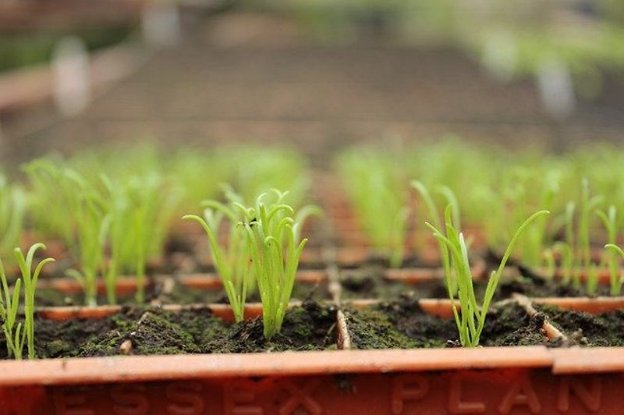

# Announcing a new round of community stake pool delegation
### **We’re using our ada to support operators running single pools helping support the Cardano network and community** 
 1 April 2021[ Ben O'Hanlon](tmp//en/blog/authors/ben-ohanlon/page-1/) 4 mins read

### [**Ben O'Hanlon**](tmp//en/blog/authors/ben-ohanlon/page-1/)
Head of Community Engagement & Insights

Marketing and Communications

- 
- 
- 
- 

As we celebrated in yesterday’s [blog about D=0 day](https://iohk.io/en/blog/posts/2021/03/31/decentralization-to-d-0-day-and-beyond/), block production is now 100% in the hands of the Cardano stake pool operator (SPO) community. Community pools are the lifeblood of the network. And earlier this year we confirmed our [commitment to a vibrant proof-of-stake (PoS) ecosystem](https://iohk.io/blog/posts/2021/01/22/our-new-delegation-strategy-announcing-the-pools-we-are-supporting/) when we delegated over 300M ada to our first cohort of community stake pools.

The number of pools now stands at over 2,000 – responsible for nearly three-quarters of the ada in circulation. Their efforts sustain the network and greatly contribute to the success and recognition of the Ouroboros protocol, setting a clear standard for any [competing PoS protocol.](https://pageviews.toolforge.org/?project=en.wikipedia.org&platform=all-access&agent=user&redirects=0&start=2020-10-29&end=2021-03-29&pages=Cardano_\(cryptocurrency_platform\)%7CPolkadot_\(cryptocurrency\)%7CPeercoin%7CGridcoin%7CNxt%7CEOS.IO%7CTezos%7CTRON_\(cryptocurrency\))

At the start of the year, we committed to making fresh delegations quarterly to help bootstrapping community pools. Running a successful small pool is hard, and needs to be entered into like any other business endeavour, with fixed and variable costs planned, hours needed to operate, reach break even point, plan marketing approach, etc. With each delegation round, our goal is to delegate enough ada to every SPO that they can create blocks, giving them a certain level of financial security while they look to grow their delegation base.

We’re again asking every operator out there to seek delegation from IOHK’s ada funds. We’ve already done a survey of the existing pools to guide our progress, and now we want every pool to fill in our survey to apply. Besides supporting your own application, your answers will help us shape our community delegation approach based on factors such as potential impact and each stake pool’s goals.

We favour operators running single pools, and we ask for details in support of each application. We are also looking for pools with a clear sense of [mission or purpose](https://iohk.io/en/blog/posts/2020/11/24/delegating-with-fresh-purpose/) – pool operators need to be in it for more than just the ada. We also look for an ability to ‘market’ – whether it’s through content creation, clear articulation of mission etc. Evidence of technical commitment to supporting the Cardano system is also likely to influence our decisions, so a clear statement of your pool’s goals and motivation is vital. You may have created educational content; have strong environmental credentials; or run the pool to raise funds for charitable works – tell us about it and provide evidence of your successes. For ease of reference, here’s an outline of what we’ll ask you in the application form.

- Your name
- The **region** and **country** your pool is located in
- Your pool ticker
- When you established your pool
- Details of any SPO group or guild affiliation (e.g., SPOCRA, Guild, SPA etc.)
- Details of your web presence, Twitter handle, Telegram, YouTube, etc. so we can better understand how you market your pool
- Number of pools (we favor operators running single pool)
- Your mission statement and the goals of your pool
- Whether you or your Stake Pool have created **educational content** that is publicly available and the language it is in
- Links to evidence of that content and any successes
- If you host a meetup, what the results have been
- Your pool’s environmental credentials (carbon offset/renewables etc.)
- Whether your stake pool is a charity or runs on behalf of a charity, non-profit, or non-governmental organization, with details
- If your stake pool has ever been bootstrapped or compensated by another organization, including - but not limited to - the Cardano Foundation or EMURGO
- Details of any contribution that you have made to the community or ecosystem not mentioned above that support your application for the delegation (e.g., running a pool on the ITN, technical contribution, GitHub PRs, CIPs, content/marketing contribution etc...)

To apply, you can access the [typeform here](https://input-output.typeform.com/to/Ho4O5enm).

While we ask all SPOs applying to warrant that the information they have supplied is truthful and accurate, we do not ‘police’ pool activity or forensically examine claims for accuracy. We do however expect transparency from every member of the community.

Stake pools can apply for delegation from today; applications will close for this cohort at **midnight UTC on Thursday 15th April**. We will then review all the applications and announce which SPOs will receive delegation, which will be made in early May. We look forward to your applications.
