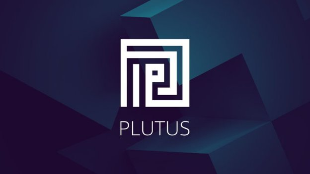

# Everything you need to know about our new Plutus Pioneer Program
### **Learn Plutus and become a certified Plutus Pioneer with our new series of interactive training courses – starting next week**
 1 April 2021[ Niamh Ahern](tmp//en/blog/authors/niamh-ahern/page-1/) 5 mins read

### [**Niamh Ahern**](tmp//en/blog/authors/niamh-ahern/page-1/)
Education Manager

Education

- 
- 
- 
- 

Next week sees the start of the first in a series of our Plutus pioneer training programs where participants can learn the fundamentals of Plutus and help to test the code before the official release of our new smart contract language. This new innovative program aims to recruit and train developers within the ecosystem so that they are fully prepared when Plutus is deployed to the Cardano mainnet later this year.

Since we announced this new course on [March’s Cardano360 show](https://youtu.be/ULBLgPgxtN8?t=3731) we have had a huge expression of interest from our developer community, both from developers who want to create decentralized applications (DApps), and smart contract programmers who want to work with Cardano’s principal development language. This week we have contacted everyone interested (over 2,000) to get a better idea of their experience and expertise. Those of you who have been selected for the first round of this program will hear from us very soon. If you don’t receive an invitation at this stage, don’t worry as we will be running several rounds of this program, so please do stay in touch!
## **Course structure**
The first iteration of the new program starts next week. The cohort joining this program will be true pioneers. As well as being part of a group that will have *early access* to a set of learning modules, your feedback will help us develop and iterate the overall learning experience.

The course will teach you the core principles of how to code in both Haskell and Plutus. The course modules will cover the building blocks of Haskell and Plutus, including functions and data types, type classes, monads, template Haskell, using the [Plutus Playground](https://iohk.io/en/blog/posts/2021/01/25/introducing-the-new-plutus-playground/), the [Extended UTXO model](https://iohk.io/en/blog/posts/2021/03/11/cardanos-extended-utxo-accounting-model/), working with Plutus on and off the chain, minting policies, state machines, the Plutus application framework, as well as some case studies and practical exercises. 

The course will follow a modular approach and will be highly interactive – each week we will be releasing new teaching videos from our director of education, Lars Brünjes, along with a set of practical exercises to complete during the week as part of each module. We will also be holding regular Q&A sessions and you will have access to a dedicated community channel on Discord, created especially to help you to connect with other course participants as you learn. 

Outside the exercises and videos, students will be encouraged to learn at a pace that is right for them and to collaborate with fellow students. As with all learning experiences, the more you put in the more you will get out! We encourage all participants to *engage with each other* and work collaboratively to answer questions and solve problems. 

We will have a small team of moderators who will check in from time to time to help facilitate and assist. They can also help triage issues or questions that may come up in your learning during the week. These moderators are all graduates of the [Mongolia class of 2020](https://iohk.io/en/blog/posts/2020/12/21/online-learning-with-haskell-the-mongolia-class-of-2020/) that completed the Haskell MOOC and are well placed to assist with questions and challenges. At the close of each week, Lars will engage directly with the group to resolve more complex technical questions and provide feedback on the subject matter covered that week. 
## **Prior experience**
As Plutus is based largely on Haskell, having some prior experience with Haskell (or another functional programming language), will be very helpful. At a minimum, you should have some programming experience and a mathematical and technical mindset. You should be as keen to learn as to help us; while we have run a number of successful courses already, this is the first time we have challenged ourselves to teach at this scale. So be prepared for road bumps along the way as we learn and improve, too!

Bear in mind that this course is not for coding beginners. While you do not need to be an expert in formal methods, programming experience and a general aptitude for logical and mathematical thinking are highly desirable. The course will include advanced features like Template Haskell, type-level programming, and effect systems. If you need a refresher or get an introduction to Haskell, we recommend that you read the [Learn You a Haskell guide](http://learnyouahaskell.com/) before you participate in the course. We’ll open several new cohorts this year, so you won’t miss out.
## **When does the course start?**
The course starts next week and will run concurrently for ten weeks through to mid June. It will involve approximately ten hours a week of your time and effort each week. 
## **Will there be other pioneer programs?**
Yes, we are keen to be as inclusive as we can on our path to rolling out smart contracts. We are also developing education programs for both [Marlowe](https://docs.cardano.org/marlowe/learn-about-marlowe) and [Glow](https://developers.cardano.org/en/programming-languages/glow/overview/), so don't feel like you have missed out if this Plutus course is not for you. We’re still keen to have you onboard, so do watch this space for details of these other courses!
## **Certification**
We will reward participants for their efforts in participating in this course and certify those pioneers that complete the entire program and are successful. These Plutus pioneer certificates will be represented as non fungible tokens (on the testnet) and locked by a Plutus contract. Pioneers can demonstrate their knowledge and qualification by constructing an appropriate transaction to unlock their individual token.
## **Ready to start**
We are excited to have so many developers from our ecosystem on board and ready to get started and learn Plutus. You’ll not only be learning yourselves, but acting as a pioneer to help us determine the best way to teach and deliver this course – truly helping pave the way for future cohorts who enroll! We look forward to bringing you on this learning journey before we launch Plutus to the world!
