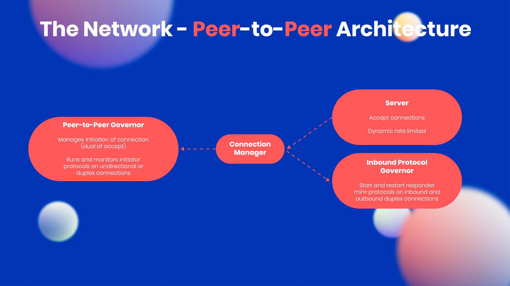

# Boosting network decentralization with P2P
### **Peer-to-peer communication between stake pools will make Cardano more dynamic and more efficient as the network grows**
 6 April 2021[ Olga Hryniuk](tmp//en/blog/authors/olga-hryniuk/page-1/) 7 mins read

### [**Olga Hryniuk**](tmp//en/blog/authors/olga-hryniuk/page-1/)
Technical Writer

Marketing & Communications

- 
- 

The decentralization of Cardano puts responsibility for running the blockchain in the hands of stake pools. An essential element in this is reliable and effective connections between all the distributed nodes, and ensuring that the network is resilient to failure.

With the simpler Byron version of the blockchain, federated (OBFT) nodes controlled by the Cardano Foundation, Emurgo, and IOHK were wholly responsible for managing block production and network connections. This maintained the network, while building up a system of thousands of distributed nodes, operated by stake pools. To achieve decentralization, Cardano has now ended the prevalence of the federated nodes that have supported the system since its creation in 2017. 

On December 6, 2020, we set the [*k* parameter to 500](https://iohk.io/en/blog/posts/2020/11/05/parameters-and-decentralization-the-way-ahead/) to expand the number of ‘viable’ pools and further promote decentralization. We have also [gradually reduced *d*](https://iohk.io/en/blog/posts/2021/03/04/not-long-till-d-0-day/) to put the power of block production entirely into the hands of the community. 100% of blocks are now being produced by the stake pool operator (SPO) community, which means that block production in Cardano is completely decentralized. These parameter changes support long-term chain sustainability and encourage the spreading of stake and potential rewards more evenly among stake pools.

In just over six months, we have evolved from a system reliant upon a handful of federated nodes, into a proof-of-stake system run by the community, with thousands of blocks produced every epoch by over 2,000 stake pools. 
## **The network**
Cardano’s networking layer is a physical infrastructure that combines nodes and their interaction into a unified system. The network distributes information about transactions and block creation among all active nodes. In this way, the system validates and adds blocks to the chain and verifies transactions. Thus, a distributed network of nodes must keep communication delays to a minimum, and be resilient enough to cope with failures, capacity constraints, or hackers.

Under the old federated system, nodes were connected by a static configuration defined in a topology file. Since the introduction of Shelley, the system has been functioning in a hybrid mode, where nodes connect to federated relays and to other SPO’s relays. This connectivity is partially manually constructed, however, SPOs can exchange block and transaction information without relying on federated nodes. 

In his article '[Cardano’s path to decentralization](https://iohk.io/en/blog/posts/2020/07/09/cardanos-path-to-decentralization-by-marcin-szamotulski/)', Marcin Szamotulski discussed the network’s design and explained Cardano’s approach to network decentralization with the advent of Shelley. Now that we have reached full decentralization in terms of block production, it is also essential that the network connectivity is decentralized too. Cardano will achieve this through a shift to peer-to-peer (P2P) connectivity. 
## **P2P networking**
At this point, we should talk about the network ‘stack’, a set of software tools recently enhanced by our engineering team to cope with a larger, more dynamic, and complex network.

P2P communication will enhance the flow of information between nodes, thus reducing (and ultimately removing) the network’s reliance on the federated nodes, and enabling the decentralization of Cardano. To achieve the desired resilience, IOHK’s networking team has been busy improving the network stack with advanced P2P capabilities. These improvements do not require a protocol change, but rather enable automated peer selection and communication. 

The P2P networking is enabled due to the use of the following components:

Figure 1. P2P architecture

Let's take a closer look at the process of how node connections are established and see how the latest developments streamline data exchange between nodes. 

**Mini protocols**

A set of mini protocols enables communication between nodes. Each protocol implements a basic information exchange requirement, such as informing peers of the latest block, sharing blocks, or processing transactions. *Chain-sync*, *block-fetch*, and *tx-submission* protocols have been used to distribute chains of blocks and transactions for node-to-node communication in the network:

- *block-fetch* draws information from the chain database.
- *chain-sync* synchronizes fetched data across the network.
- *tx-submission2* consumes transactions from peer mempools and adds them to the local mempool, which enables peers to submit their transactions to the node. This is a modification of the current *tx-submission* protocol. 

These mini protocols support the Ouroboros consensus protocol. To ensure optimal networking service, the team has implemented additional protocols:

- *keep-alive*: this ensures continuous connection between nodes and minimizes performance faults. 
- *tip-sample*: this provides information about which peers offer better connectivity in terms of performance. 

You can find out more about the network architecture and mini protocol examples on the [Cardano documentation website](https://docs.cardano.org/en/latest/explore-cardano/cardano-network.html).

**Connection management**

The networking service supports Linux, Windows, and macOS, but the number of connections supported by each operating system varies.

To avoid system overloading, a [multiplexer](https://docs.cardano.org/en/latest/explore-cardano/cardano-architecture-overview/connection-management.html#multiplexing) combines several channels into a single Transmission Control Protocol (TCP) connection channel. This offers two advantages: One, bidirectional communication between peers (so any peer can initiate communication with no restrictions as both parties have read and write permissions within the same channel), and enhanced node-to-node communication without affecting performance.

The networking team has implemented a bidirectional-aware ‘connection manager’ that integrates with the P2P governor, which is currently undergoing final testing before deployment. Additionally, the multiplexer’s API has been upgraded to monitor new connections and protocols. This enhancement introduces more efficient connection management and improved issue tracking. 

**P2P governor functionality**

The Cardano network involves multiple peer nodes. Some are more active than others, some have established connections, and some should be promoted to ensure the best system performance. As discussed in '[Cardano’s path to decentralization](https://iohk.io/en/blog/posts/2020/07/09/cardanos-path-to-decentralization-by-marcin-szamotulski/)', peers are mapped into three categories:

- cold peers
- warm peers
- hot peers

To establish bidirectional connections between them, it is crucial that we know which connections are active. 

Figure 2. Peer discovery on Cardano

The [P2P governor](https://input-output-hk.github.io/ouroboros-network/ouroboros-network/Ouroboros-Network-PeerSelection-Governor.html) manages connections and provides information on which peers are active and performing well. This feature promotes peer connections for enhanced system performance and also provides excellent visibility by building and maintaining a connectivity map of the entire network. The governor will simplify the process of connection definitions by handling these automatically so a few central stake pools no longer have to configure them manually. The governor promotes or demotes peers between cold, warm, and hot states, and also interacts with the connection manager to open new connections or reuse existing ones.
## **P2P deployment roadmap**
The IOHK networking team is in the final stages of quality testing the P2P governor integration with the node. After this, the team will extend the network stack with more protocols – *gossip*, in particular, which will provide seamless data exchange between peers and help construct a decentralized communication map. 

These technical upgrades allow us to simplify Cardano node interfaces and improve the system’s configuration. When testing is finalized, all SPOs will be able to update and simplify their configuration preferences for enhanced connectivity. 

This involves the following stages before full P2P deployment:

Figure 3. P2P deployment roadmap

For a walkthrough of the plan from chief architect Duncan Coutts, check out this video from the [March Cardano360 show](https://youtu.be/mXYIQDUitYI). 

*While governance played an important role in the network establishment, maintenance and support, only with decentralization we can achieve true network sustainability to ensure equal opportunities for all stake pools. Thus, the goal of stack improvements is to allow all stake pools to run the same configurations, establishing equal capabilities within a decentralized environment.*

*We’ll keep providing more development updates in this blog, and you can also follow Cardano [status updates](https://roadmap.cardano.org/en/status-updates/) to learn about recent improvements and developments.*
