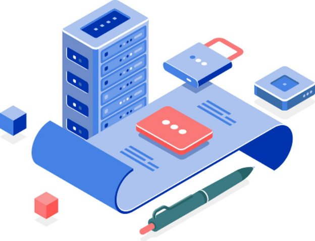

# Smart contracts – here we come
### **Alonzo will build on Cardano’s token upgrades to give developers the tools for crafting business applications**
 8 April 2021[ Olga Hryniuk](tmp//en/blog/authors/olga-hryniuk/page-1/) 6 mins read

### [**Olga Hryniuk**](tmp//en/blog/authors/olga-hryniuk/page-1/)
Technical Writer

Marketing & Communications

- 
- 

At the start of March, we implemented Mary ‒ a multi-asset protocol upgrade that allows users to create unique tokens for transactions on Cardano. With the introduction of [transaction metadata](https://iohk.io/en/blog/posts/2020/10/29/bringing-new-value-and-utility-to-the-cardano-blockchain/), then [token-locking](https://iohk.io/en/blog/posts/2020/12/02/goguen-brings-token-locking-to-cardano/) with Allegra in December, and [native token creation](https://iohk.io/en/blog/posts/2021/02/18/building-native-tokens-on-cardano-for-pleasure-and-profit/), we are laying the foundation to establish Cardano as the leading smart contract platform. 

Alonzo, our next protocol upgrade, will build on these capabilities. Implemented using our hard fork combinator technology, Alonzo will add support for smart contracts – digital agreements – to Cardano about four months from now. It will open up opportunities for businesses and developers, by allowing the creation of smart contracts and decentralized applications (DApps) for decentralized finance (DeFi).

When it came to naming these upgrades, we chose Allegra (Lord Byron's daughter) for token-locking, and Mary (the novelist and wife of Shelley) for multi-asset support. Alonzo comes from a more contemporary figure, Alonzo Church (1903-95). Church was a US mathematician and logician who worked on logic and the foundations of theoretical computer science. He is also known for inventing lambda calculus ‒ a formal system used to prove the unsolvability of the *Entscheidungsproblem*. Later, while working with fellow mathematician Alan Turing, they discovered that the lambda calculus and the Turing machine were equal in capabilities, demonstrating various mechanical processes for computations. One of the reasons for naming our smart contract upgrade after Church is that Plutus Core (the Cardano smart contract language) is a variation of lambda calculus.
## **Why smart contracts?**
Smart contracts mark the next phase in Cardano's evolution as a worldwide distributed ledger. When supporting everyday business, a blockchain must guarantee that individuals can move their funds and pay for products in a secure way.

Smart contracts can be used to settle complex deals, hold funds in escrow, and secure movement of funds under predefined conditions. Cardano will allow DApps to interact with the ledger to record their activities and execute smart contracts. These digital agreements express the story of a transaction, specify where funds should go, and under what conditions they will be sent, executing a deal only when all the conditions are met. Alonzo will lay the foundation for Cardano to support such applications. 
## **Addressing business needs with Alonzo**
While multi-asset support allows users to create unique currencies that fuel business needs, Alonzo introduces a versatile platform for building smart contracts. It will be possible to work with collectibles, crowdfunding, or auctions, for example. 

Areas of exploration might include the deployment of escrow-based decentralized cryptocurrency exchanges (DEX), or the creation of complex applications supporting centralized stablecoins (track-and-trace applications for product provenance within a supply chain, for example). With token-locking, users will be able to issue utility tokens with vesting periods, meaning that a number of tokens can be locked or frozen to be released after a specific time. 
## **The scripting power of Plutus Core**
With Alonzo, we are adding the necessary tools and the infrastructure to allow application development using the Plutus Platform. 

Applying a rigorous approach based on formal methods and verification, Alonzo extends the basic multi-signature scripting language (multisig) used in Cardano Shelley. Multisig will be upgraded to the Plutus Core language for more powerful and secure scripting options. The Alonzo ledger implements the [extended unspent transaction output (EUTXO)](https://iohk.io/en/blog/posts/2021/03/12/cardanos-extended-utxo-accounting-model-part-2/) accounting model, using Plutus Core to provide powerful scripting. 

A smart contract platform must be both secure and reliable. That’s why we chose Haskell as the basis for writing Plutus Core smart contracts. Haskell is a high-level language that developers will use to write code and then [compile it to Plutus Core](https://iohk.io/en/blog/posts/2021/02/02/plutus-tx-compiling-haskell-into-plutus-core/). 

Haskell has been around since 1987, standing out from other programming languages for its high level of trust. Writing in Haskell ensures that smart contracts are programmed to do exactly what they are expected to and can be tested for accuracy before implementation. This means that smart contracts built on Cardano will be straightforward and resistant to vulnerabilities, which is crucial for applications that handle automated trading or move large funds around. 

**Tools and APIs**

Developers will have functional tools to experiment with and customize transaction validation on Cardano. [The API library](https://github.com/input-output-hk/cardano-node/tree/master/cardano-api) will be extended to enable the deployment and operation of the Plutus Core code on Cardano while interacting with wallets and the ledger. 

Deploying Alonzo is a complex process. Once functional smart contracts are running on the mainnet, we will continue improving the off-chain infrastructure to deliver software development kits.
## **Where are we right now?**

Figure 1. Alonzo roadmap. The code will be frozen for four weeks before release

Throughout March and April, the IO Global team has been gradually combining the Alonzo rules with the Cardano node and ledger code. When Alonzo integration with the node is complete, Cardano will provide working API tools and command line interface (CLI) support. 

From mid-April into early May, the team will continue working on Plutus development to launch a private testnet. During this phase, our partners (advanced developers) will be testing out the platform, creating and deploying non-fungible tokens (NFTs), marketplaces, or DApps running smart contracts on Cardano. This process will focus on step-by-step improvements to ensure that everything works efficiently.

In May, we’ll start working with our [Plutus pioneers](https://developers.cardano.org/en/plutus-pioneer-program/). These certified program trainees will continue testing the platform by writing Plutus applications and putting them into production for DApps and DeFi. During this phase, the team will be performing the ledger, node, and wallet backend integration. We will also be preparing and releasing documentation, including specification examples and developer guides. 

May and June will be a time for quality assurance and testing with users, which will be followed by a feature freeze lasting for four weeks. This will provide crypto exchanges and wallets with the time to upgrade and prepare for the Alonzo protocol update. We expect the Alonzo upgrade (hard fork) to happen in late summer, and we will announce a firm date in April’s Cardano360 show. 

For a more detailed roadmap, check out the [March Cardano360 presentation by Charles Hoskinson](https://www.youtube.com/watch?v=ULBLgPgxtN8&t=5805s). 

These are exciting times and we encourage you to stay tuned. The next blog post will delve into the relationship between the Plutus concepts that underpin Alonzo development. Meanwhile, the [developers’ website](https://developers.cardano.org/en/programming-languages/plutus/overview/) has more about programming with Plutus, Marlowe, and Glow.
