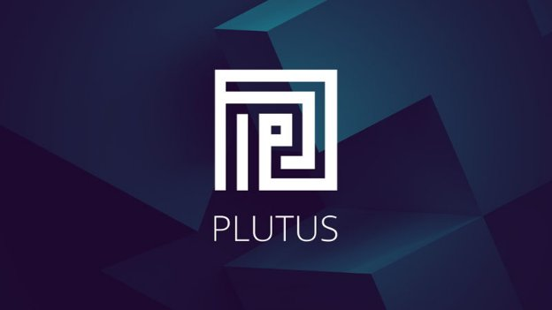

# Plutus: what you need to know
### **Developers are now preparing for the arrival of Cardano smart contracts, enabled by Plutus and the Alonzo protocol upgrade**
 13 April 2021[ Lars Brünjes](tmp//en/blog/authors/lars-brunjes/page-1/) 9 mins read

### [**Lars Brünjes**](tmp//en/blog/authors/lars-brunjes/page-1/)
Education Director

Education

- 
- 
- 
- 

In our previous blog post, we discussed [*Alonzo*](https://iohk.io/en/blog/posts/2021/04/08/smart-contracts-%E2%80%93-here-we-come/) ‒ our name given to the protocol upgrade that will introduce smart contract support on Cardano. Alonzo will establish the infrastructure and add tools for functional smart contract development using Plutus.

The Plutus platform provides a native smart contract language for the Cardano blockchain. To understand and become proficient in Plutus, one has to understand three concepts:

- The *Extended UTXO model (EUTXO)*
- *Plutus Core* ‒ the ‘on-chain’ part of Plutus
- *The Plutus Application Framework (PAF)* ‒ the ‘off-chain’ part of Plutus that enables interaction with smart contracts.

Plutus contracts consist of parts that run on the blockchain (on-chain code) and parts that run on a user’s machine (off-chain or client code). Both the on-chain and off-chain code are written in Haskell, and Plutus smart contracts are effectively Haskell programs. Off-chain code can be written using PAF and this code is then compiled by the GHC (Glasgow Haskell Compiler), whereas on-chain code (written using the Plutus Core) is compiled by the Plutus compiler. 

It is crucial to understand the relationship between these Plutus concepts and native tokens functionality to see how their interaction turns the latter into a more useful and powerful feature.
## **The Extended UTXO model**
Cardano (like Bitcoin) uses the unspent (U) transaction (TX) output (O) accounting model. In the UTXO model, a *transaction* has *inputs* and *outputs*, where the **inputs** are unspent outputs from previous transactions. As soon as an output is used as input in a transaction, it becomes *spent* and can never be used again. The **output** is specified by an *address* (a public key or public key hash) and a *value* (consisting of an ada amount and optional, additional native token amounts). An output’s address determines which transactions are allowed to ‘unlock’ the output and use it as an input. A transaction must be *signed* by the owner of the private key corresponding to the address. Think of an address as a ‘lock’ that can only be ‘unlocked’ by the right ‘key’ ‒ the correct signature.

The EUTXO model *extends* this model in two directions: 

1. It generalizes the concept of ‘address’ by using the lock-and-key analogy. Instead of restricting locks to public keys and keys to signatures, addresses in the EUTXO model can contain arbitrary logic in the form of *scripts*. For example, when a node validates a transaction, the node determines whether or not the transaction is allowed to use a certain output as an input. The transaction will look up the script provided by the output's address and will execute the script if the transaction can use the output as an input.
1. The second difference between UTXO and EUTXO is that outputs can carry (almost) arbitrary data in addition to an address and value. This makes scripts much more powerful by allowing them to carry *state*.

When validating an address, the script will access the data being carried by the output, the transaction being validated, and some additional pieces of data called *redeemers*, which the transaction provides for every input. By looking up all this information, the script has enough context to give a ‘yes’ or ‘no’ answer in what can be highly complex situations and use cases.

To summarize, EUTXO extends the UTXO model by allowing output addresses to contain complex logic to decide which transactions can unlock them, and by adding *custom* data to *all* outputs.

The EUTXO model offers unique advantages over other accounting models. The success or failure of transaction validation depends only on the transaction itself and its inputs, and *not* on anything else on the blockchain. As a consequence, the validity of a transaction can be checked *off-chain*, before the transaction is sent to the blockchain. A transaction can still fail if some other transaction concurrently consumes an input that the transaction is expecting, but if all inputs are still present, the transaction is *guaranteed* to succeed.

This contrasts with an account-based model (as used by Ethereum), where a transaction can fail in mid-script execution. This can never happen in EUTXO. Also, transaction execution costs can be determined off-chain before transmission – another feature impossible on Ethereum.

Finally, because of the ‘local’ nature of transaction validation, a high degree of parallelism is possible: a node could, in principle, validate transactions in parallel, if those transactions do not try to consume the same input. This is great both for efficiency and for reasoning, simplifying the analysis of possible outcomes, and proving that ‘nothing bad’ can happen. You can dive deeper into the [EUTXO model in the previous blog post](https://iohk.io/en/blog/posts/2021/03/12/cardanos-extended-utxo-accounting-model-part-2/).
## **Plutus Core**
To implement the EUTXO model, it is necessary to clearly define the terms *script* and *data*. Scripts require a definite, well-specified scripting language, and it is also important to define the type of data that is attached to outputs and used as redeemers.

This is where *Plutus Core* comes in. Plutus Core is the scripting language used by Cardano. It is a simple functional language similar to Haskell, and a large subset of Haskell can be used to write Plutus Core scripts. As a contract author you don’t write any Plutus Core. All Plutus Core programs are generated by a Haskell compiler plugin.

These scripts will be executed by nodes during transaction validation ‘live’ on the chain. They will either lock UTXOs in the form of *validator scripts* or as *minting policies*, which control the minting and burning of native tokens (see below).

Redeemer data is a simple (algebraic) data type that can be defined easily in Haskell, which is another reason why Haskell is a good option for writing Plutus Core scripts. In practice, a smart contract developer will write validator scripts in Haskell, which will then be automatically [compiled into Plutus Core](https://iohk.io/en/blog/posts/2021/02/02/plutus-tx-compiling-haskell-into-plutus-core/).

Appropriate Haskell libraries simplify writing such validation logic by providing core data types for the inspection of transactions during validation, and by offering many helper functions and higher level abstractions, allowing contract authors to concentrate on the business logic and not have to worry about too many low-level details. 
## **The Plutus Application Framework (PAF)**
The on-chain state of validator scripts can only be modified by transactions that spend and produce script output. When writing a Plutus application, we need to consider not only the on-chain part of the application (the Plutus Core scripts) but also the off-chain part that builds and submits transactions.

The off-chain code is written in Haskell, just like the on-chain code. That way we only need to write the business logic once. Then we can use it in the validator script and in the code that builds the transactions that run the validator script. 

Many applications need to watch the UTXO set for changes to particular addresses, so if we write our contract as a state machine, we need to track the unspent output that represents the current state of the machine and update our local state when the on-chain state changes. Likewise, many apps need to communicate with the wallet backend to access the crypto currency that they are using for transactions.

The PAF provides easy access to services that are commonly used by Plutus applications. Applications deployed using the framework’s libraries can be run on the Plutus application backend, which provides runtime support for access to the blockchain and other concerns such as persistence, logging, and monitoring. Applications written on top of the PAF automatically provide an HTTP and WebSocket interface that can be used to interact with the application from the web browser. 
## **Native tokens**
*Native tokens* became available on Cardano with February’s *Mary* hard fork. Any user can create their own tokens, and tokens can be sent and received freely, just like ada. Each native token comes with its own [*minting policy*](https://docs.cardano.org/en/latest/native-tokens/learn-about-native-tokens.html#minting-policy), which determines the conditions under which tokens can be minted and burnt.

At the moment, these minting policies consist of combinations of simple rules specifying *signatures* and *timelocks*. For example, a policy can state that only transactions that are signed by two out of five possible signatures are allowed to mint or burn tokens. Another policy can allow minting only before or after a specific time slot.

Powerful as these basic building blocks are, they do not cover every conceivable use. It is, for example, possible, but awkward, to model non-fungible tokens (NFTs) using such simple policies. This could be done using a timelock to mint an NFT, by limiting the minting operation to a specific time point. If only one token is minted before that time point is reached, the token is technically non-fungible (because there is only one). But to check this, it is not enough to simply check the minting policy. We’d need to look at the minting history of the token to ensure it had, indeed, only been minted once.

With the deployment of Plutus, users will be able to write minting policies using Plutus core. During minting or burning, the Plutus Core policy script will be executed in the context of the minting or burning transaction, and the script will have to approve or forbid the action. This will further accelerate the growth of NFTs on Cardano by enabling the creation of much more complex minting policies, and allowing the creation of NFTs in a trustless manner.

Alonzo is being gradually deployed to the mainnet via several testnets, so our partners and [Plutus pioneers](https://iohk.io/en/blog/posts/2021/04/01/everything-you-need-to-know-about-our-new-plutus-pioneer-program/) will be able to test Plutus Core by writing applications on Cardano throughout May and June prior to a code freeze. This will also be the period of quality assurance and user acceptance testing by exchanges to ensure that the platform is fully ready at the time of the Alonzo mainnet upgrade. If you are a developer and want to learn more about Plutus, consider joining a [future pioneer cohort](https://developers.cardano.org/en/plutus-pioneer-program/). Alternatively, take a look at [Plutus GitHub](https://github.com/input-output-hk/plutus) repositories, and engage in the discussions about Plutus at [Cardano Forum](https://forum.cardano.org/c/developers/cardano-plutus/148). 

*I’d like to acknowledge Jann Müller for additional input and contribution to this blog post.*
