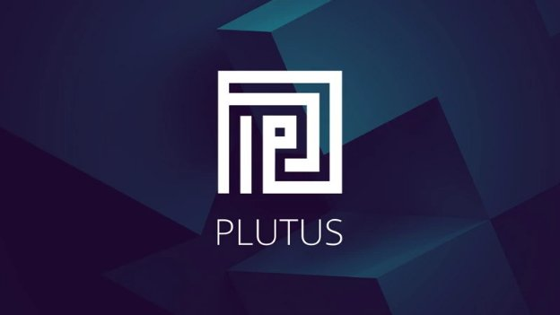

# Strategic partners pave way for Plutus smart contracts
### **Metalamp and Runtime Verification among developers priming Cardano for the age of DeFi** 
 12 May 2021[ Anthony Quinn](tmp//en/blog/authors/anthony-quinn/page-1/) 6 mins read

### [**Anthony Quinn**](tmp//en/blog/authors/anthony-quinn/page-1/)
Editor

Marketing & Communications

- 
- 
- 
- 

The technical infrastructure is being laid for Plutus smart contracts on Cardano. But such infrastructure for decentralized finance (DeFi) is like a road with no cars if there aren’t the developers to write the contracts that will drive platform adoption and usage. 

The [Plutus pioneer program](https://iohk.io/en/blog/posts/2021/04/01/everything-you-need-to-know-about-our-new-plutus-pioneer-program/) was kicked off in April, as part of an evolving scheme for developer education that began over two years ago. The goal? To provide structured training for anyone who wants to learn about functional programming, so they can begin using Haskell and Plutus, and start building their first apps. Alongside this keen and committed group of about 1,500 ‘trainee’ Plutus developers, we’ve also formed partnerships with experienced software development houses to build a number of [decentralized applications](https://github.com/input-output-hk/plutus-use-cases) (DApps) to stress-test the network, provide some early proof-of-concept applications, and assess our processes and support for the army of developers that follow.

The plan for Plutus is to have ‘professional developers complement the work of the pioneer program and help fast-track our quality assurance and testing process towards the Alonzo hard fork,’ says Silviu Petricescu, director of product strategy. 

‘The Cardano community has been integral to us testing, improving and rolling out the network since the days of the incentivized testnet,’ he adds. Professional developers add another element to the process – in terms of expertise, sitting somewhere between the core internal team and the pioneers – ‘to scrutinize everything’, he adds. ‘Starting with documentation, tools and all the support elements that we are going to provide, they are going to be the first to test it all and give us feedback. We will include that in our internal testing and quality assurance processes.’

It’s a two-pronged approach: the pioneer scheme will be training up an army of developers, while the partner scheme will bring in heavyweight expertise to make sure everything works – that way, everyone is ready when Plutus is deployed to the mainnet as the final component of [Goguen](https://roadmap.cardano.org/en/goguen/) on the Cardano roadmap. ‘Having these developers as part of this is a way for us to ensure that our quality of build towards the next hard fork will be at the level that we want,’ says Petricescu.

Gerard Moroney, director of operations, has been bringing these software houses into the scheme. ‘We've been talking to companies that have experience with blockchain, and blockchain consultancies, and others that are not necessarily crypto but know distributed computing. We've also looked at consultancies that have solid Haskell experience.’ Enthusiasm and passion are also part of the equation: ‘We're working with companies that really want to try something new, something innovative and interesting. Fundamentally, we're backing people who want to be brave and be ahead of the curve.’ 

Of course, the blockchain never sleeps and the search has taken him far and wide, holding talks with consultancy companies across Europe, Asia Pacific, and the Americas. ‘Some of them were entirely new to us,’ he says, ‘but they already knew about Cardano and Plutus – and that's been really interesting.’

These are companies that have experience in the finance sector and business so ‘they've all got great ideas’ he adds. ‘We're giving them guidance about what we want them to work against at the beginning, but they're also coming up with new ideas – and that’s a lot of fun.’ 

March’s [Cardano360 show](https://www.youtube.com/watch?v=ULBLgPgxtN8&t=4406s) ran interviews with some of the partner companies. When it comes to software engineering, their expertise soon becomes clear. [Obsidian Systems](https://obsidian.systems/), for example, provided many of the tools and the technical support for the block validators who maintain the Tezos proof-of-stake blockchain. 

On a visit to the [Metalamp](https://en.metalamp.io/) offices, you’d find yourself in the city of Omsk in Siberia among a team that thrives on ‘complex and time-consuming projects’, often built on the Haskell programming language. ‘The company had heard about Cardano and knew that ‘it is one of the most fascinating projects written in Haskell’. Some of their teams had already played with Plutus before the companies came into contact. Metalamp has experience with financial technology and has built applications involving lenders, loans, and ledgers. 

Other companies supporting the rollout include:

- [Eleks](https://eleks.com/): custom software engineering and consulting services since 1991. Based in Ukraine.
- [Node Factory](https://nodefactory.io/): blockchain research and development specialist in Zagreb.
- [MLabs](https://www.mlabs.city/): develops compilers, artificial intelligence, and DevOps applications, mostly in Haskell, Python, and Typescript. 
- [BinarApps](https://binarapps.com/): based in Poland, this developer specializes in projects for the retail and loyalty sectors.

Developers are looking forward to exploring applications involving digital exchanges and online sources called ‘oracles’ that bring information – whether it be commodity prices, exchange rates, airline timetables, or logistics schedules – into blockchains. The [Essential Cardano](https://github.com/input-output-hk/essential-cardano/blob/main/essential-cardano-list.md) page on GitHub maps the Cardano ecosystem and links to a library of resources. 
## **A long time in the making**
Of course, Plutus will be used for complex financial smart contracts. There is a lot of money at stake with these contracts – it is reckoned that $43 billion is already locked into contracts using the Ethereum system. Yet DeFi is still at a very early stage and, as we showed in our recent [#CardanoAfrica](https://africa.cardano.org/) event, there is a whole new market out there for [real world use cases](https://www.youtube.com/watch?v=MhIYXIMJNno&t=1012s) (or RealFi as we call it).

Implementing secure smart contracts for the long term is hard, and software schedules are notoriously difficult! But the progress made by our blockchain engineers and the acceleration in the way the pieces of the Goguen jigsaw are falling into place are clear to see in the Plutus timeline below. The [Plutus Playground](https://playground.plutus.iohkdev.io/) is up and running. We have about 1,500 developers building their skills within the Pioneer program, writing scripts and building prototype apps. A series of Alonzo development testnets will soon begin rolling out – with core functionality at first, followed by a process of fast iteration with new capability and new user groups added in the weeks ahead. All the while, we are advancing steadily towards deployment of Alonzo on the mainnet and the start of smart contracts on Cardano.

It’s going to be an exciting summer as everyone in the Cardano community – partners, pioneers and developers of every stripe – works tirelessly to ensure that the Plutus smart contract platform hits the ground running. The secure, energy-efficient system that decentralized finance has been waiting for.

*We’re in the final stages of preparing the first Alonzo testnet, aiming for the end of the month. Keep an eye on our social channels this week for an update. You can try out the [Plutus Playground](https://playground.plutus.iohkdev.io/) for yourself, and join [Plutus discussions](https://forum.cardano.org/c/developers/cardano-plutus/148) at the Cardano Forum. There is also a [Plutus GitHub](https://github.com/input-output-hk/plutus) repository. You can [register your interest](https://input-output.typeform.com/to/gQ0t9ep5) and join our [Slack community](https://iohkdevcommunity.slack.com/join/shared_invite/zt-mdvb06fr-8Tv8pjl~iR0~lGrimqK_yg#/shared-invite/email).*

