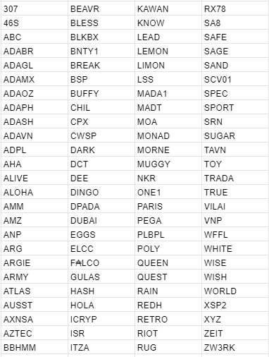

# Announcing new stake pools chosen for our delegation strategy
### **Committing to the health and diversity of the Cardano network, we are now announcing the new round of winners for delegation**
 14 May 2021[ Christian Lindgren](tmp//en/blog/authors/christian-lindgren/page-1/) 9 mins read

### [**Christian Lindgren**](tmp//en/blog/authors/christian-lindgren/page-1/)
Software Engineer

Engineering

- 
- 
- 

Cardano continues to grow, powered by a stake pool operator (SPO) community working toward a vision of an independent, globally decentralized ecosystem. Stake pools have always been the driving force of the Cardano network and we launched our delegation strategy to recognize and bootstrap the promising pools.

To support our long-term vision for Cardano’s growth and network decentralization, we have already delegated the stake from retired IO Global pools to a number of promising stake pools in the ecosystem – to bootstrap their business and support community development goals, technical contributions, and geographical distribution. Our analysis has shown that our contribution helped them to become more stable in the network and attract delegators and community members who share their ideas and development objectives.
## **Diversity & distribution**
Any community ecosystem needs its engineers and entrepreneurs, its technocrats, and its diplomats – globally. Equally, the pool ecosystem needs a balance of larger established players, a strong core, and an inflow of new entrants primed to build further success upon strong fundamentals.

The problem that many stake pools currently face is their recognition within the ecosystem or rather visibility that allows the attraction of community support to ensure stable and consistent pool operation. Running a stake pool is not an easy process; unlike mining, it does not presume straightforward funds earning from just setting up a pool on the machine. You cannot buy your way to success through a better and better kit – indeed, Cardano is designed to be relatively light on computing resources. Stake pool operation is a complex business that has the hallmarks of both a commodity and a distributed market, and requires a blend of skills, persistence, and luck. 

There are many factors that influence the pool’s success and differentiate it from the others. First of all, these are technical factors such as:

- **Parameters**: this includes pledge influence factor, relative pool saturation size, stake delegated to the pool, and stake pledged by the owners.
- **Fiscal**: variable fee, fixed fee, and pledge should be all taken into account to ensure that the pool functions effectively, produces blocks, and earns rewards for its delegators.
- **Performance**: calculated according to the pool’s expected activity as the ratio of the number of blocks a stake pool produces in a given epoch versus the number it was capable of producing.
- **Overall mission**: even if the pool meets all of the above requirements, this does not mean that it becomes totally recognized or drives straightforward attention. With over 2000 active pools in the ecosystem, it is essential to reveal to the community the mission that a certain pool is trying to achieve and explain why this exact choice is beneficial for others.

The ability to differentiate is key, and that is where the **marketing** factor steps in. Just like any business seeking ‘customers’ in a competitive market, no pool will get recognized unless it announces itself, tells a story, builds trust. So, commitment to raising awareness sits alongside vigilance towards node maintenance. Like any small business – and that's what this is – it requires clear objectives, and of course, goals that add value to the community while meeting the bottom line. 
## **Opportunities**
We announced a new stage of application submission earlier in April, and are now committing to redelegate our funds to a new cohort of stake pools and – we hope – help them grow to their potential.

Even though we may *want* every pool to be successful, not every pool will be. With our delegation, we are committing to help those stake pools that ultimately, have not yet reached the desired level of awareness. One of the critical issues a stake pool operator comes across is uncertainty and the inability to rely on consistent rewards. This is like with venture capital investments – stakeholders invest in those projects where they see returns on investment. But what if the mission is highly important and promising, but there is no capital to kick it off? In such cases, many companies receive initial support (investment) in order to boost their development and reach desired goals. 

In the same way, we are willing to support promising stake pools, and help them get established within the ecosystem by evening out more predictable rewards and, thus, attracting a higher number of delegators to support their mission. 

Differentiation is key to success, and we hope that we can provide the chosen stake pools with opportunities to establish themselves and keep sustainable and stable operations without relying on the luckiness factor. We can now share details of the fresh cohort of stake pools chosen to take part in our new delegation round. But first, a closer look into objectives and the process.
## **The process**
Choosing the pools for delegation is always a complex process. Every active pool is making a contribution to the globally decentralized network. Last time, when assessing the pools and their contributions, we have been guided by such factors as their goals and purpose, geographical location, technical contribution, stake & pledge ratio, and community/social media engagement. 

With 700 pools to assess, we were always going to disappoint many pools and some may feel they have been unfairly overlooked. Even after some initial filtering, we had a field of some 300 pools that met many of the criteria we identified. Thanks again to [pooltool.io](https://pooltool.io/) and [adapools.org](https://adapools.org/) for providing additional data sources during the process.

Purpose and mission remain an important part of Cardano so this was again part of the mix. Greater weight this time was also given towards other key aspects such as *geographic distribution*, *social/community activity*, and *support for the lower-middle sized part of the network*. Pragmatically, sustainable support needs to focus on pools that are neither strongest nor weakest. The following delegation distribution was defined:

- 50% of our dedicated stake to the geographically distributed pools 
- 25% to socially active pools with solid technical potential
- 25% to the lower-middle sized pools to even out the network balance

Let’s take a closer look at the factors that influenced our choice to understand the reasoning behind it.

**Geographical distribution**

Cardano is a decentralized, distributed network of nodes that work together to verify block production and transaction validity in the network. Decentralization is key to this process as only independence from governing entities establishes trust and confidence in handling financial activities. To ensure that the network is resilient to connectivity failures, it is essential that stake pool operation nodes are distributed across the globe without significant concentration in one location. This is beneficial for setting up connections between different regions and eliminates a single point of failure. A minimum of two relays was another factor in play as part of this.

**Social/community activity**

Our survey earlier in the year helped us understand that a critical issue SPOs face is the inability to differentiate. For this reason, we used a social impact score from [Pulsar](https://www.pulsarplatform.com/) to help us understand which stake pools were gaining traction across potential delegators. 

As well as ‘ambassadors’ for the network, we have evaluated socially active stake pools that operate to support business goals in their countries or for the betterment of various community activities. We have chosen those pools that have great social presence and community engagement but face difficulties in gaining a stronger position in terms of reward predictability. To be clear, technical performance is still the most important factor – no amount of tweets or Reddit posts is going to make up for missed blocks.

**Network balance**

With such a variety of stake pools all functioning for different purposes, we are also distinguishing potentially strong pools that have been working hard to keep the network activities and support block production and transaction validation. Delegating to these pools, we support smaller-middle size businesses and help their delegators earn stable rewards. 

Due to the security properties of the Ouroboros protocol, the selection process for block production is ultimately randomized, and the probability of creating a block is proportional to the amount of delegated stake.

Such a condition is well-applicable for long-term reward behavior, however, in terms of shorter timespans (one or several epochs), this randomness can yield an unpredictable amount of rewards. This effect increases the smaller amount of delegation the pool has, which in turn might have an undesired side effect disconcerting delegators who expect a predictable amount of return on their stake.
## **Meeting the winners**
Here’s a list of 100 stake pools chosen for our new round of delegation. If you’re interested to find out more about these pools and their mission, you can easily do so at [adafolio.com](https://adafolio.com/portfolio/c5df0868-b4cf-11eb-8c63-0242c0a86003) or [adapools.org](https://adapools.org/delegations/input-output). 

We are aiming to delegate to these pools at the end of May/early June, so SPOs can expect to receive ada from then for a period of three months. 
## **Looking ahead**
As much as we are happy to recognize 100 stake pools that we believe have solid potential in reaching business objectives and supporting ecosystem sustainability, we still understand that there are many more contributors that we are not able to delegate to this time. We would like to thank you for all you do and if you were not selected this time, please note that we’ll have a new delegation round three months from now. 

So, we encourage all pools that missed out to apply again for the fresh cohort during Q3, and we’ll make a new call for applications in June to rotate delegations in July. While technical analysis is the primary way that pools are identified for delegation, we always welcome community feedback on how we can continue to improve the process. We are committed to seeing the Cardano ecosystem go from strength to strength. Together we have created the world’s leading proof-of-stake ecosystem and we want to do what we can to maintain and improve it as it matures.

*Thanks to Ben O’Hanlon, Colin Edwards, Francisco Landino, Sam Leathers, Olga Hryniuk & Tim Harrison for support and additional contributions.*
