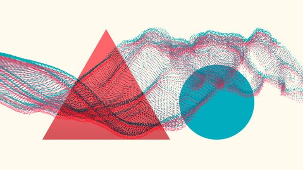
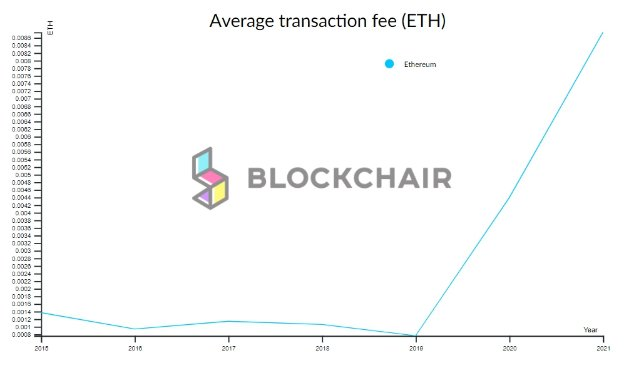

# Bringing ERC20 to Cardano
### **Our new ERC20 converter will allow Ethereum tokens like AGI to run on our proof-of-stake blockchain – coming soon to testnet**
 17 May 2021[ Francisco Landino](tmp//en/blog/authors/francisco-landino/page-1/) 7 mins read

### [**Francisco Landino**](tmp//en/blog/authors/francisco-landino/page-1/)
Project Manager

Commercial

- 
- 

Connecting blockchain protocols and collaborating on applications are essential to achieving the promise of decentralized finance (DeFi) and provide an alternative to the traditional banking system.

According to DeFi Pulse, a tracking website, cryptocurrency to a total value of over ‘[$75 billion is now locked up](https://defipulse.com/)’ in DeFi. A year ago, the total was just $700 million. Most of this value is in the form of crypto-assets based on the ERC20 token standard. 

But Ethereum’s proof-of-work infrastructure is challenged with ever-rising costs. We foresaw this issue and providing an alternative was one of the founding principles we set for Cardano. This is about to come into fruition.

To expand the variety of use cases for application developers and businesses, Cardano will support the ERC20 token migration to its platform. The Alonzo hard fork and Plutus smart contracts are on the way. Once deployed, users of supported Ethereum tokens will be able to bring them over from Ethereum's congested network and take advantage of Cardano's transaction capacity and lower fees, while enjoying enhanced security, reduced cost, and interoperability. 
## **Why ERC20?**
Let’s take a closer look at the nature of ERC20 to understand why this standard fits the market trends in terms of business needs. First, of course, Ethereum brought the concept of smart contracts and ‘programmable money’ to the blockchain in 2015. Since then, tokenization and the ERC20 token have gained popularity because of utility in everyday business transactions. Applications built on a blockchain can provide tokens that can serve as:

- a payment unit
- a transaction unit
- access to digital services
- a reward or incentive 
- a right to vote 
- an investment mechanism

Well-designed ERC20 tokens address many needs, and the more useful they become, the more demand grows and so their value grows accordingly. That is why these tokens are widely used and are so well supported by wallets and exchanges. 
## **Ethereum v Cardano**
The ERC20 standard was invented for Ethereum, and as of today, there are [over 400,000 contracts based on this token standard](https://etherscan.io/tokens) with examples including Binance coin (BNB), Tether (USDT), Uniswap (UNI), and Dai (DAI) to name a few. 

Ethereum is a popular and functional blockchain platform, but it is slowing down and becoming more expensive. As more network participants interact with decentralized applications, the ‘gas’ fees paid for validating transactions are rising sharply (Figure 1).

Figure 1. Ethereum gas fees are increasing

The problems being experienced by Ethereum users have also been identified by a Cointelegraph survey cited in ‘[DeFi Adoption 2020](https://s3.cointelegraph.com/storage/uploads/view/48c6c4e03f85bc722d76f88c2676478b.pdf?_ga=2.42938214.270418488.1602500005-1231871226.1593587737)’:

45% of platforms built on Ethereum name scalability and high gas costs among the top three problems constraining mass DeFi adoption.

Ethereum has not yet resolved these challenges and is unlikely to do so in the short term. So many businesses will want to consider other options. 

*By enabling the migration of ERC20 tokens to Cardano, we focus on delivering a value proposition that leverages Cardano’s advantages over Ethereum. In particular, Cardano's higher capacity for transaction processing and lower fees when compared with Ethereum's high cost and often congested traffic.*
## **Enabled by Ouroboros**
The key to addressing the problem of network congestion and high fees is Cardano’s Ouroboros proof-of-stake consensus mechanism. Compared with Ethereum’s proof-of-work protocol, Ouroboros needs far less energy to process network transactions; it runs using amounts of electricity on the scale of a large house, rather than a small country. Because of this, Ouroboros is not only eco-friendly but also needs far lower fees to process transactions. 

Additionally, Cardano does not require smart contract execution costs as the ledger supports native token functionality with its built-in accounting model. This means that the tracking, transfer, and ownership of different types of assets are handled by the ledger instead of smart contracts. Whereas the creation and transfer of ERC20 tokens on Ethereum require the manual modification of the standard contract type, the logic for this is built into Cardano, which also eliminates the risk of errors and vulnerabilities.
## **How the ERC20 converter works**
Cardano currently supports ada and [native tokens](https://iohk.io/en/blog/posts/2021/02/18/building-native-tokens-on-cardano-for-pleasure-and-profit/), which have proven successful with over 160,000 tokens minted. We are now launching an ERC20 converter to ensure better interoperability in the future as well as lay a solid background for extended business opportunities.

Our ERC20 converter is a tool that will allow issuing organizations and their users to handle ERC20 token migration to Cardano. It is designed for token issuers (organizations that wish to enable the migration of their tokens to Cardano), and their users (token holders) to use the tool to move their ERC20 tokens to the Cardano network.

Users can convert their Ethereum tokens in just a few clicks, and when moved across, these tokens will be ‘translated’ into a special native token on Cardano that has the same value and works just like an ERC20. Additionally, if the user wishes to do so at a later stage, they can move their tokens back to the source network by burning them on Cardano. Two-way convertibility is baked in. 

We’ll soon spin up a version of the ERC20 converter tool on a dedicated testnet. IO Global is currently working with partners for migration to Cardano, and [SingularityNET](https://singularitynet.io/) will be the first of these. The ERC20 converter will introduce a new [SingularityNET AGIX token](https://blog.singularitynet.io/singularitynet-phase-ii-launch-sequence-activated-agi-token-to-be-hard-forked-to-10ede4b6c89), the deployment of which marks the first milestone in the SingularityNET to Cardano migration plan. The initial testnet will allow users to assess the process of migration while working with AGIX tokens both in Cardano and Ethereum Kovan testnets.

It will be possible to authenticate an account using Metamask (an extension for the Chrome browser) with more options to come later. Users will also need to add their Daedalus testnet address so they can migrate their tokens to Cardano and easily track balances and transactions. 

When users log into their ERC20 converter account, they will see SingularityNET tokens listed and available for migration, and, by clicking on a token ‒ details such as token balance. They will just need to select the token, indicate the amount they would like to convert, and then migrate them by specifying a Cardano address. When tokens migrate to the address, it will be possible to use them for payments and transactions from the Daedalus wallet. All the activities will be visible both within Etherscan and the Cardano Explorer. 

Figure 2. ERC20 converter dashboard

At later stages, users will see different types of tokens within the dashboard. Tokens available for migration will be listed first, and if not yet eligible – it will be possible to subscribe for updates about any changes.
## **A glance ahead**
As the number of ERC20 converter partnerships increases, the range of token types supported will grow. Currently, our partners need to be custodians of their tokens, however, we will achieve greater interoperability while onboarding organizations when Plutus smart contracts operate on mainnet. 

Our goal is to support many tokens to create possibilities for business deals. So, further down the road, with a variety of tokens, the ERC20 converter will act as a bridge between blockchains, and this will promote effective cross-chain communication. 

*The ERC20 converter testnet is now in the final stages of quality assurance testing before the public launch. This stage will allow us to test the user journey and improve their experience along with fixing any occurring issues. We will also soon provide the dedicated testnet environment with relevant documentation and instructions on how users can test the converter capabilities.*

*We’ll share an update on May’s Cardano360 show. Meanwhile, stay tuned and follow our [Twitter announcements](https://twitter.com/InputOutputHK?ref_src=twsrc%5Egoogle%7Ctwcamp%5Eserp%7Ctwgr%5Eauthor) to find out more in due course!*
