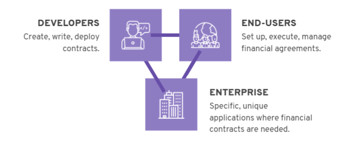

# Reimagining peer to peer finance with Marlowe
### **Marlowe decentralizes financial tools allowing anyone to create and execute peer-to-peer financial agreements**
 26 May 2021[ Shruti Appiah](tmp//en/blog/authors/shruti-appiah/page-1/) 6 mins read

### [**Shruti Appiah**](tmp//en/blog/authors/shruti-appiah/page-1/)
Head of Product

Engineering

- 
- 

A while ago, I logged in to my stock trading platform to buy some exchange-traded funds (ETFs). Alas, the platform was down! It turned out that the surge in the GameStop stock had forced quite a few trading platforms to shut down temporarily. We weren’t in the middle of a financial crisis, and I never expected that my bank or brokerage would block me from using my own funds without warning. I had assumed that I would always be able to access my funds, place trades, and reap profits or losses – a service for which I pay a handsome fee. 

In the following days, several other stock brokers and trading platforms began blocking their users from performing trades that didn’t favour the brokers’ own agenda. Robinhood – which positions itself as the platform that *democratizes* finance – completely censored its users from buying GameStop stock. Are we ever truly in control of our money?

Almost all of us have given custody of our funds to some third-party, leaving us at their discretion to decide if and when those funds can be accessed, used, or even viewed. The commonality between these third-party banks and brokers is that there is a central point of control. In the case of Robinhood and GameStop, we have seen how this centralization can lead to failure. The central point of control can be influenced, attacked, or manipulated by an external self-interested actor, making it the antithesis of *democratized* finance.

This is the core motivator of decentralized finance, commonly known as DeFi. DeFi offers a similar set of financial tools offered by Wall Street such as lending, escrows, derivatives, swaps, and securities. What makes DeFi platforms stand out is their ability to offer these financial instruments without the need for central market makers, banks, or brokers. Each financial agreement is represented as a smart contract on the blockchain, and is settled algorithmically. Their decentralized nature makes them far more resilient to market manipulation or the failure of a centralized system. 

We are currently developing a suite of Marlowe products to democratize finance and enable easy access to financial agreements. This includes **Marlowe Run**, a new product that will allow users to seamlessly execute off-the-shelf financial agreements with friends or clients in a secure fashion, and on their own. With added automation features and no need for third-parties, this peer-to-peer solution will be cost-effective, and more importantly, *democratizing*.
## **What is the Marlowe suite?**
With Marlowe, we aim to democratize finance by facilitating peer-to-peer agreements that run on a blockchain. We seek to empower people to create their own financial instruments and set up agreements with anyone with whom they want to interact. Marlowe will offer a suite of products, each product serving a different function and set of users. Marlowe’s overarching product strategy comprises three streams – *Marlowe for developers*, *Marlowe for end users*, and *Marlowe for enterprise*. 

## **Marlowe for developers**
Marlowe for developers includes **Marlowe Build** and **Marlowe Play** (also called the [Marlowe Playground](https://alpha.marlowe.iohkdev.io/#/)) as well as the input to the **Marlowe Library**. Marlowe Build and Marlowe Play together enable end-to-end financial smart contract development. 

Developers can compose smart contract code on *Marlowe Build*. Then, they can perform preliminary iterative design using simulations, and formally verify and test smart contracts on *Marlowe Play*. These capabilities – paired with a purpose-built domain-specific language (DSL) for finance – ensure that the contracts are easy and straightforward to build, as well as being secure, verifiable, and rigorously tested. Once built and tested, developers may contribute them to our open-source smart contract template library, the *Marlowe Library*. 
## **Marlowe for end users**
Marlowe for end users will bring an intuitive, straightforward, and seamless interface for users to execute financial agreements with their friends, colleagues, or clients on the blockchain. This includes **Marlowe Run** and gives access to a variety of templates for financial instruments from the Marlowe Library. We’re designing these products with the user in mind. To make financial agreements on the Marlowe Run, the user does not need to know the ins and outs of blockchain, or how to write smart contracts. Every step of the contract is explained in non-technical language, and each action is performed only with the user’s explicit authorization. Our team has built a suite of rigorously tested and verified financial tools including escrows, debt securities, and swaps that can be used on the Marlowe Run. These – and many more verified open-source contracts – are made available through the Marlowe Library. 
## **Marlowe for enterprise**
Marlowe for enterprise aims to expand DeFi beyond individual users, helping enterprises to access the tangible benefits of smart contracts. This will include a bespoke, customizable suite of capabilities and financial agreements that are tailored to a commercial use case, with the provision of smart contract templates that adopt Algorithmic Contract Types Unified Standards [(Actus)](https://www.actusfrf.org/) for financial contracts.
## **Implementing Marlowe on Cardano**
In 2020, we rolled out the [Marlowe Playground Alpha](https://alpha.marlowe.iohkdev.io/#/). This provided the ability to write contracts in JavaScript, in addition to Haskell, or directly in Marlowe itself. This also included proof-of-concept oracles, with the ability to access external data such as price, directly from a stock market ‘ticker’ or, in the future, data feeds such as Coinbase. To support the rollout, we published tutorials to guide developers. We have since been building on this work, continuing to improve the user experience, and building, testing, and validating more smart contract templates.

As a part of the Goguen rollout, we are now in the process of completing the implementation of Marlowe on Cardano, giving users and organizations the opportunity to execute DeFi contracts they have written themselves or downloaded from a contract repository. Marlowe will run first of all on the Cardano blockchain, but it is blockchain-agnostic so could run on other blockchains to reach an even broader audience in the future.
## **What comes next?**
Marlowe for end users will come online in stages throughout 2021. First, is the prototype of Marlowe Run, where users can demo and try out their own financial agreements. This will include a suite of financial smart contract templates that users can customize to their needs. This prototype will allow users to explore the experience of making financial agreements in a decentralized fashion, all in a peer-to-peer manner without requiring a value-extracting third party. To use the Marlowe Run prototype, users don’t need to own any real tokens, so they may try the demo before they onboard. This rollout will include a suite of template financial instruments, built by our in-house developers. These templates can be used to execute test agreements on Marlowe Run. We’ll share a demo of Marlowe Run on this month’s Cardano360 show (airs May 27) so join us for that.

We are committed to delivering this suite of products for the Marlowe ecosystem that empower people across the globe to build, control, and execute their own financial instruments on their terms. 

*We are planning a series of webinars on decentralized finance with Marlowe (starting June 3rd), you can [register on our website](https://webinar.marlowe-finance.io/) for these webinars now!*
