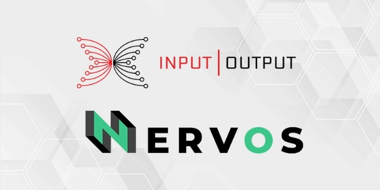

# Nervos partnership to build the first cross-chain bridge with Cardano
### **Our new collab lets Cardano and Nervos token holders transmit their value across both platforms while building interoperability across the crypto space**
 2 June 2021[ Eric Czuleger](tmp//en/blog/authors/eric-czuleger/page-1/) 3 mins read

### [**Eric Czuleger**](tmp//en/blog/authors/eric-czuleger/page-1/)
Senior Content Editor

Marketing & Communications

- 
- 
- 

IOHK and Nervos are teaming up to build a bridge of interoperability between Cardano and the Nervos Network. Once completed, this pioneering cross-chain bridge will enable users to transact assets between the two blockchains. The end goal is to foster greater interoperability while expanding the global reach and utility of both Nervos and Cardano.

The Nervos ‘Common Knowledge Base’ ([CKB](https://coinmarketcap.com/currencies/nervos-network/historical-data/)) is a permissionless, layer 1, open-source, proof-of-work blockchain protocol focused on creating the foundations for an interoperable universal public network. It allows any crypto asset to be kept in a secure, immutable, and permissionless environment with the added benefit of smart contracts and layer 2 scaling. 

Nervos is developing this robust network through three key components. Together, these make up the Universal Passport, Nervos’ approach to next generation interoperability. 

- **PW Core** – enables developers to build applications on all chains
- **Nervos’ Polyjuice** – an Ethereum-compatible layer that allows developers to port a smart contract from Ethereum to Nervos
- **Force Bridge** – a trustless bridge that enables cross-chain transactions between Nervos and a spectrum of blockchains. Nervos will use Force Bridge to connect directly to Cardano, which means that users will be able to transact using their existing Cardano wallets.
## **Bridging blockchains with transportable tokens**
So what does this mean in practice? Holders of Nervos CKByte (CKB) and ada will be able to transact both currencies interchangeably. Nervos users will also be able to take advantage of Cardano's native asset standard to create tokens that can be ported and used across both networks. On top of this, the bridge enables developers on both chains gain access to services and features to expand their DApp ecosystem and user bases. 

[Mousebelt](https://www.mousebelt.com/), a full-service blockchain accelerator, will build the bridge with financial support from Nervos. The Cardano team will contribute expertise and resources to connect Cardano to the bridge. Development work is already underway and it is expected to be completed in the next six weeks. 

'Using the Force Bridge to link the Nervos Network and Cardano is especially exciting given the relationship we have already built with IOHK,' said Kevin Wang, co-founder of Nervos. 'We have been growing our research and development partnership, but we will soon have a tangible bridge that will also showcase the power of the Force Bridge and push us further along the road to a functional and interoperable network.'

This bridge is just part of our collaboration with Nervos. 'We share a vision of a world that works on a ‘constellation’ of interoperating blockchains,' says Romain Pellerin, CTO at Input Output. 'We believe that academic research is also fundamental to advancing the entire crypto space. Together we will also be co-authoring academic papers to pioneer improvements to the UTXO model, explore universal accounting standards, and contribute to the future development of decentralized technology through open-source research.'

Blockchain technology will only achieve mainstream acceptance when end users are not locked into one blockchain or standard, but can seamlessly access value and utility, regardless of which blockchain they are using. 'Bridges like this are an absolute necessity in order to ensure that users have a seamless experience,' continued Pellerin. ‘By connecting our communities and finding innovative new ways to work together, as we have been doing with Nervos, we can ensure that blockchain lives up to its promises of creating a fairer and more efficient global financial operating system.'

*Check out the [Nervos website](https://www.nervos.org/) for more information on upcoming partnerships and research initiatives.*
