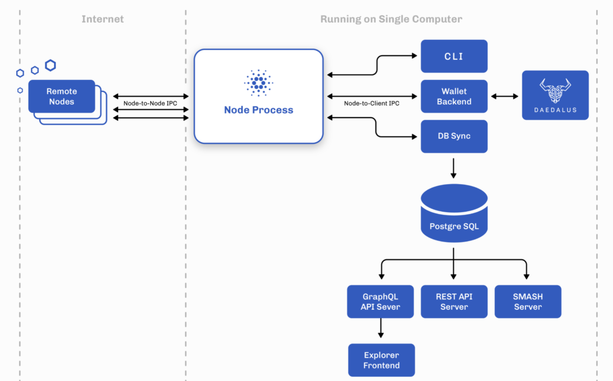
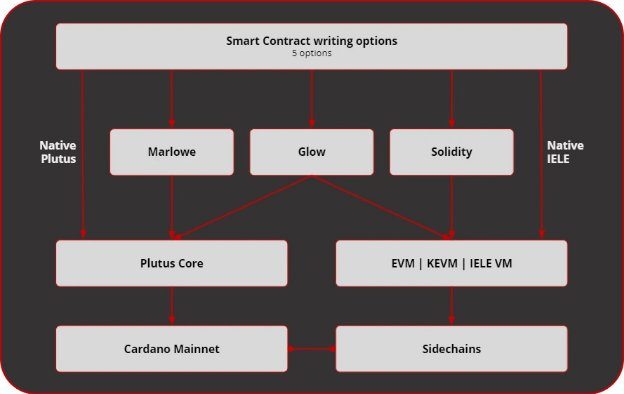

# A close look at the software running Cardano
### **Learn about the ‘stack’ of components that interact to run the blockchain platform**
 8 June 2021[ Niamh Ahern](tmp//en/blog/authors/niamh-ahern/page-1/) 5 mins read

### [**Niamh Ahern**](tmp//en/blog/authors/niamh-ahern/page-1/)
Education Manager

Education

- 
- 
- 
- 

Cardano has been designed in modules, with linked components that can be used in various ways. These components form the Cardano ‘platform stack’. They work together under the hood to support the construction and use of the live Cardano blockchain.

We are currently in the early testnet phase on the way to the Alonzo hard fork, which will bring full smart contract capability to Cardano. This process is highly complex, requiring the steady upgrade of the different elements which make up the Cardano platform, and their careful integration and testing. So, it is a good time to revisit these components, explain some of the terminology, and discover how they interact within the ‘platform stack’.
## **Elements of the Cardano platform stack**

**Figure 1. Components that communicate with the Cardano node**

The platform stack for Cardano includes these core components:

- Cardano node (and associated processes)
- Cardano wallet
- Wallet command line interface (CLI)
- DB Sync (synchronizes blockchain data with a relational database)
- PostgreSQL database (which interacts with GraphQL, REST API, and Smash)
- Smash server
- Rosetta API (blockchain communication protocol)

Note that the Daedalus wallet is not part of the core stack, but does communicate with the components (Figure 1). 
### **The node and the networking layer**
First, let's take a look at the [Cardano node](https://github.com/input-output-hk/cardano-node). This software runs on your computer and underpins the network, enabling everyone to participate in the decentralized blockchain. The node integrates the consensus, ledger, and networking sub-components, providing top-level configuration, API, CLI, logging, memory management, and monitoring capabilities that can be used by other Cardano components or by skilled users. Daedalus is a full-node wallet, so if you are running that on your local machine, you are effectively helping to run the network. 

*The networking layer*

Next, we have the networking layer. This links each Cardano node into a distributed system that manages the blockchain and associated services. The network consists of a collection of nodes that communicate with each other to maintain the distributed ledger, support transaction submission, and interact with user wallets and other services. The core of the network is built around the decentralized nodes – the stake pools – that collectively validate blocks, and add new blocks to the chain. They are supported by dedicated relay nodes that manage network connections and establish the structure of the network as a whole. The dedicated consumer nodes that are run by the Daedalus wallet and other services connect to this network to track and submit transactions on-chain.

Cardano nodes maintain connections with their peers. A set of mini-protocols enable communication between the nodes. Each mini-protocol implements a basic information exchange requirement, such as informing peers of the latest block, sharing blocks as needed, or sharing new transactions around the Cardano network. For connection purposes, mini-protocols are determined by the version of the network protocol. 
### **Cardano wallet backend**
The [Cardano wallet](https://github.com/input-output-hk/cardano-wallet) backend component supports the graphical user interface of the Daedalus wallet. It is used to send and receive ada. Behind the scenes, the wallet runs a full Cardano node. Unlike a light client wallet, it loads the entire shared ledger and validates all transactions, thus bolstering the security of the blockchain for everyone.
### **Wallet command line interface (CLI)**
The wallet command line interface (CLI) supports interactions with the actual blockchain. More technically advanced users can use the CLI to work with a collection of tools for generating keys, constructing transactions, creating certificates, and performing other tasks. It is organized in a hierarchy of subcommands, and each level comes with its own built-in documentation of command syntax and options.
### **DB Sync**
[DB Sync](https://github.com/input-output-hk/cardano-db-sync) is a component that follows the activities on the Cardano chain and stores blocks and transactions in PostgreSQL. As a ‘middleware’ component, it powers [cardano-graphql](https://github.com/input-output-hk/cardano-graphql). DB Sync stores blockchain data fetched from [cardano-node](https://github.com/input-output-hk/cardano-node) in an intermediate database to enable higher-level interfaces for blockchain exploration. It also provides a number of queries to fetch Cardano blockchain data from the PostgreSQL, and supports services such as the [Cardano Explorer](https://explorer.cardano.org/en.html), a graphical user interface that reflects the blockchain data in a straightforward way. Cardano GraphQL is a cross-platform API for the GraphQL data query language. 
### **Rosetta API**
The Rosetta application programming interface provides a high-level interface that aims to make the integration process easier, faster, and more reliable so that you can build once and integrate your blockchain everywhere. We have created a unique [cardano-rosetta](https://github.com/input-output-hk/cardano-rosetta) implementation to simplify the process of integration with Cardano. This interface is particularly useful for exchanges, since they can interact with the Cardano chain using the same interface that they use with other blockchains.
### **Looking forward**
With [smart contracts](https://iohk.io/en/blog/posts/2021/04/08/smart-contracts-%E2%80%93-here-we-come/) coming to Cardano soon, this means that [Plutus](https://iohk.io/en/blog/posts/2021/04/13/plutus-what-you-need-to-know/), the native smart contract language, and other smart contract development languages like [Marlowe](https://iohk.io/en/blog/posts/2021/05/26/reimagining-peer-to-peer-finance-with-marlowe/) for finance and [Glow](https://glow-lang.org/) for DApps will be integrated into the Cardano stack. IO Global’s engineers will provide new and extended components to compile Plutus, Marlowe, and Glow scripts, submit them on-chain, and interact with them (Figure 2).

**Figure 2. Plutus, Marlowe, Glow, Solidity, and IELE can all be used to write Cardano smart contracts**

The [Alonzo protocol upgrade](https://iohk.io/en/blog/posts/2021/04/08/smart-contracts-%E2%80%93-here-we-come/) will build on recent token upgrades and is being deployed to the mainnet via several testnets. Our Plutus partners and Plutus Pioneers will help us to test Plutus Core and will be part of the user acceptance phase before mainnet deployment. At this point we will officially add the Plutus and Marlowe components, such as both interpreters, to Cardano’s platform stack. 

*To keep up to date with the Alonzo rollout, please check our social channels and blog page.*
