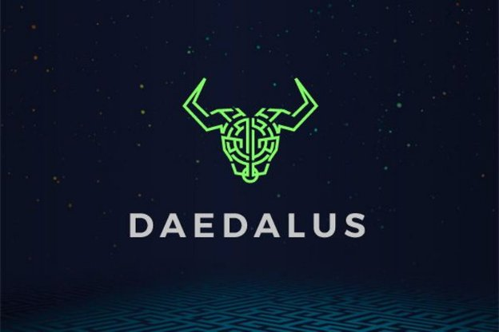

# Daedalus: from launch to Flight and beyond...
### **Daedalus has come a long way since its debut with Cardano in 2017. And as Cardano grows and evolves, so will our full-node wallet**
 16 June 2021[ Darko Mijić](tmp//en/blog/authors/darko-mijic/page-1/) 5 mins read

### [**Darko Mijić**](tmp//en/blog/authors/darko-mijic/page-1/)
Product Manager

Operations

- 
- 

As an ‘official’ Cardano’s wallet (alongside Yoroi’s browser and mobile offer) Daedalus offers a ‘window to the world’ of Cardano. While outwardly its UI may look just like an ‘app’, it is of course a full-node client. Every Daedalus instance is a live node connected to the Cardano network. Each instance executes the Cardano Ouroboros consensus protocol and plays its own part in the successful running of the Cardano network. This enables Daedalus to operate in a completely trustless fashion without relying on any centrally hosted servers. 

It also makes Daedalus a highly complex product, since it integrates and is dependent on core Cardano components and the Cardano codebase. As well as a wallet, Daedalus is a ‘console’ for the Cardano blockchain.

Daedalus launched in 2017 with the Cardano mainnet launch. It offered a groundbreaking GUI wallet with presale redemption functionality since the first day of the Cardano network’s existence. Back then, it was common to launch a cryptocurrency with CLI wallets. Daedalus offered a graphical user interface (GUI) from the get-go and a much better user experience than the industry standard. It had its share of issues, of course, reflecting the immaturity and shortcomings of the early Cardano codebase. With the Byron reboot, we completely rebuilt the code. This had a corresponding impact on Daedalus, delivering a much more robust and reliable product.

Cardano has come a very long way since 2017, and especially since the Byron reboot. We have moved from a federated to a decentralized proof-of-stake system, with thousands of active pools run by a passionate community. We now have staking and delegation, with fully decentralized block production. We also launched our successful Daedalus Flight program, bringing new features to the mainnet early for power users to help us test and iterate. Most recently, we have added native token capability and Project Catalyst voting registration. Soon we shall enter the era of smart contracts. It's been an incredible journey and we’re just getting started.

This growing functionality on the blockchain has brought additional challenges, creating a product environment with a complex web of interdependencies. The corresponding technical and resource impact makes any fresh development especially challenging. So as we evolve the offering, it is increasingly important we focus on core capabilities, while also ensuring we get better at integrating the ‘voice of the customer.’
### **Surveying the community**
Earlier this year, we reached out to the community with a comprehensive survey to help us map the landscape and chart our path ahead, both in terms of short-term improvements and longer-term product strategy. 

In total, **we have had 5,544 responses**. We’re publishing the report [here](https://input-output.typeform.com/report/FXTY6788/kxOCO8QzSYLDbktt). --daedalus-survey-iframe--

We encourage you to dive into the data. The results have provided us with some valuable insights, which continue to inform our strategic approach to product development. It shows a high level of satisfaction overall (average rating of 4.2 out of 5). The survey also identified some clear pain points. It was also clear that, while delegators are happy with their choices, the ranking system is a significant pain point for smaller stake pool operators. 

The survey data also fed into a number of ideation sessions to follow up, dig deeper, and identify a number of specific areas for improvement. Top ranked in desirability were:

1. A simpler and easier-to-understand ranking system that is more inclusive and ranks most stake pools, and does not depend on the amount of stake to be delegated as an input.

a. The **new ranking system** will be **configurable**, allowing users to more easily balance their delegation choices between established, saturated pools (with predictable rewards) alongside less established, smaller pools with their potentially larger (but less reliable) rewards.

b. **Encourage and promote community-curated SMASH servers** to provide different criteria for selecting pools, e.g., small and promising pools, pools from developing countries, charity or mission-driven pools, green and eco-friendly pools, etc.

c. Looking at the feasibility of having importable, **community-curated** ranking calculations.

2. **Delegation portfolios / multi-pool delegation** – the ability to delegate a wallet to several pools and the ability to share delegation portfolios.
2. More **information** on delegation, and using Daedalus in general, through improved UX and content.
2. More detail on **earned rewards**, and **improved graphical representation**. 
2. A complete **display and export of earned rewards per epoch for tax** and accounting purposes in both Daedalus and exportable CSV file.

Other changes suggested for the future include: enabling communications between SPOs and delegators; improved wallet creation and restoration with wallet fingerprints; more fiat/crypto conversions for displaying wallet balances; a mobile and light version; and better help. In the longer term, improvements being looked into include a multicurrency wallet; a better news feed; and more multilingual versions.
### **Community intelligence and insights**
The survey results have been a [valuable source of intelligence](https://ucarecdn.com/1fda65be-63cb-42a9-b98b-1cee01b314b5/execsummaryspos.pdf). All these suggestions have been taken fully on board and given due consideration. In recent months, the team’s focus has been on core native token capability, alongside functionality to support voting in Project Catalyst, hardware wallet support and more. And with Alonzo smart contracts around the corner, every team across the company continues to be very focused on core Goguen capability. However, the Daedalus team is now finalizing its approach to Daedalus enhancements with UX and UI specialists. This needs to be clearly set in the context of ongoing engineering priorities and work from the research team (to be shared soon) around elements such as rewards, fees, and parameters.

Given these interdependencies, some elements present significant challenges. Equally, we have identified a number of ‘quick wins’. We’ll be convening further consultation and ideation sessions in July this summer– including exploring ideas around a more collaborative development model – to sanity check a few of the quick wins and explore the more nuanced challenges with the community that Daedalus is here to serve.
