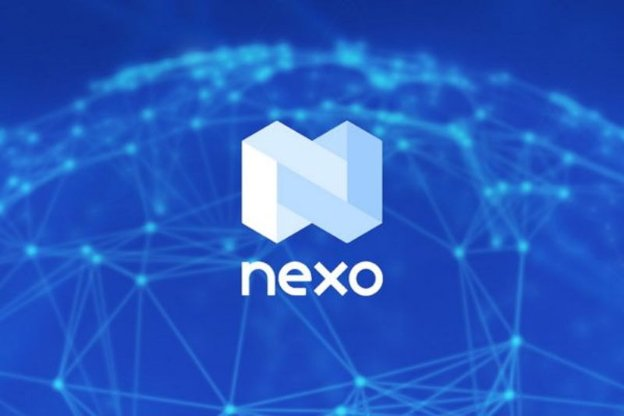

# Digital lending platform Nexo integrates Cardano, enabling ada holders to borrow and earn from a diverse crypto portfolio
### **This latest partnership with a leading crypto company further expands the Cardano ecosystem and exposes new users to ada**
 30 June 2021[ Eric Czuleger](tmp//en/blog/authors/eric-czuleger/page-1/) 3 mins read

### [**Eric Czuleger**](tmp//en/blog/authors/eric-czuleger/page-1/)
Senior Content Editor

Marketing & Communications

- 
- 
- 

Nexo kicks off a landmark collaboration with IOHK to fully integrate Cardano into its platform. This will allow ada holders to buy, borrow, lend, and sell crypto on the Nexo Exchange, while also earning up to 8 percent interest on their holdings, or accessing ada-backed credit. This partnership increases ada’s utility and enhances Cardano’s value and reach.

As we move towards the Alonzo upgrade, IOHK is establishing strategic partnerships with organizations like [Orion](https://iohk.io/en/blog/posts/2021/06/23/orion-to-bring-one-stop-crypto-marketplace-to-cardano/) and [Nervos](https://iohk.io/en/blog/posts/2021/06/02/nervos-partnership-to-build-the-first-cross-chain-bridge-with-cardano/) to expand the Cardano ecosystem. Now, we’re adding Nexo to our growing list of collaborators. Nexo is a leading institution for building value in the decentralized finance (DeFi) space. The Cardano integration comes from increasing demand from both Nexo clients and ada holders. Adding Cardano to Nexo’s [Earn on Crypto & Fiat Suite](https://nexo.io/earn-crypto) and Instant Crypto Credit Lines™ brings their total serviceable assets to 20.

This is only the second time that Nexo has brought an asset on board via their new integrations system. The goal is to cater to client needs while fulfilling demand for exposure to cryptocurrencies. Increased interest in blockchain technology led Nexo to work closely with projects like Cardano, while making it easy for everyone to invest in both digital and traditional assets.

Antoni Trenchev, co-founder and Managing Partner of Nexo, says: 

Blockchain organizations like Nexo and Cardano have a lot of potential to give each other a serious leg-up in digital finance and it thrills me to see that happening. Nexo’s business creates added utility for ada, reducing selling pressure, boosting its value, and creating an influx of users, including people who might just be starting out in crypto. Reciprocally, Cardano broadens our total addressable market and expands existing clients’ options when investing funds via our platform.

This falls in line with the vision of IOHK’s Chief Technical Officer, Romain Pellerin, who views interoperability as essential to mainstream adoption of cryptocurrencies and blockchain technology. He says:

Bringing Nexo into our growing ecosystem will give the Cardano community even more options and utility for ada. Working together with Nexo to make this process user-friendly for those who are new to crypto will only encourage wider adoption, and Nexo’s unique offering is a clear match for IOHK.

Nexo is a leading regulated digital asset enterprise with a mission to maximize the value and utility of cryptocurrencies. They provide instant exchange, trading, over-the-counter capabilities, and a spectrum of other services backed by custodial insurance and the military-grade security of the Nexo Wallet. Learn more about Nexo at their official [website](https://nexo.io).
