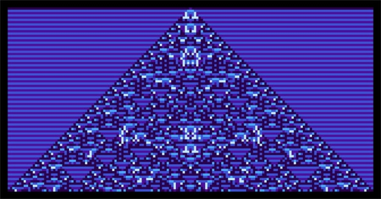

# Wolfram and Cardano build communities with NFTs and liveminting
### **An inspiring look at the role of NFTs from Wolfram Blockchain Labs CEO Jon Woodard**
 22 July 2021[ Jon Woodard](tmp//en/blog/authors/jon-woodard/page-1/) 5 mins read

### [**Jon Woodard**](tmp//en/blog/authors/jon-woodard/page-1/)
CEO (Wolfram Blockchain Labs)

Guest author

- 

As we emerge from the darkness of the pandemic, we can reconnect with our communities and re-focus on a shared vision for the future. We are at the cusp of a technological renaissance heralding new ways of forging strong connections. At Wolfram Blockchain Labs (WBL), we foresee a future where important moments can be forged, stored, and shared in real time to bring more communities together. The inspiration came from my recent trip to Bitcoin Miami 2021 where I attended the Cardano Meetup.

One of the best parts of my job as CEO of [Wolfram Blockchain Labs](https://www.wolframblockchainlabs.com/) is interacting with community members of our blockchain collaborators. When considering how the WBL ecosystem can become truly global and decentralized, I realized that decentralization is not just about changing technology. It is about changing how we interact with our communities while enabling new kinds of collaboration . 

We can now connect communities through global networks, while working independently and collectively towards a shared future. This was on full display at the Cardano Meetup in Miami. In that room, I saw Cardano supporters united by a shared belief. Communities like this will become the rule rather than the exception in the future. 

I was moved by everyone’s emphasis on building a global system to help individuals achieve financial independence for their families and communities. After witnessing the power of Cardano’s global community, I realized that this feeling of ‘togetherness’ is crystalized by non-fungible tokens (NFTs). Let me explain what I mean by this and what we’re going to do about it:

**Experiencing NFTs**

NFTs have sparked the global imagination in a way initial coin offerings (ICO)’s hype never did. Although the focus has largely been on speculation and cash value, the discussion has prompted the world to take a second look at decentralized systems, services, and applications. NFTs might feel like a fad, a bubble akin to tulip mania. However, at their heart, they are immutable, intractable representations of value and a unique identity.

Collectibles are a remarkable way of showing what one considers valuable while connecting the individual with their global community, the same way everyone at the Cardano Meetup was connected. This is hugely powerful. While many models currently celebrate the ephemeral and the transient, NFTs are about the timeless. When we enable communities to record and celebrate milestones like birthdays, graduations, or weddings we can draw people together around common goals and look towards a common future.

**Liveminting with Wolfram Language and Cardano**

Since January of 2021, WBL has been learning the nuances of Cardano and integrating the Cardano blockchain into the Wolfram Language. One of the most exciting places that we’re working with IOHK is in implementing NFT tools and auctions to bring [LiveMinting.com](https://www.liveminting.com/) to life, powered by Cardano. 

In an upcoming [livestream event](https://youtu.be/pMfrRFNCKhE) taking place on July 27th at 1:00 PM CT, Stephen Wolfram (CEO of Wolfram Research) and a panel of cultural critics will bring experiential NFTs to life in one of the world’s first ‘liveminting’ events — the process of minting (or processing) NFTs in real time on the Cardano blockchain. Liveminting will turn Wolfram’s Cellular Automata (items from the computational universe) into bespoke pieces of artwork certified into NFTs in real time. This will create a first-of-its-kind NFT.

This is only the beginning of the solutions from the work of WBL and IOHK. WBL will soon introduce the MintNFT function into the Wolfram Language, which uses the Cardano blockchain integration. You can get a more detailed explanation of the exciting work we have done in Wolfram Language by reading my [Wolfram blog post](https://blog.wolfram.com/2021/07/21/liveminting-nfts-with-the-wolfram-language-on-the-cardano-blockchain/).

**NFT analytics, communities, creators, and brands**

We believe that NFT makers and marketplaces will begin to thrive once they become generally accessible and understood. So, we are working on formalizing specific indicators and functions that will highlight analytics such as NFT performance and sales within a specific community. These analytics will not only give insight into the popularity of an NFT type, but also show how different types of NFTs can serve to draw community members together through shared experiences.

We see a future where creators of all types will be able to hold captivating liveminting events to highlight amazing experiences for their communities. Meanwhile, traditional brands increase connection and bolster a sense of belonging in the communities forming around their products. All of this will be powered by the Cardano blockchain and the Wolfram Language.

**An incentive for belonging**

Experiential NFTs and the inherent feeling of belonging will undoubtedly spur Cardano community members to create NFT experiences for others outside Cardano. Much like we have seen with the immediate impact of NFTs on popular culture, these experiences will serve to draw more people into our community. 

I’m excited that WBL is among the first to create these new NFT experiences. I am also excited to see what happens as we democratize these NFT tools so everyone can join in the fun. We believe that this will drive a global and social connection where users have more control over their creations, which will carry over as we democratize financial services.
